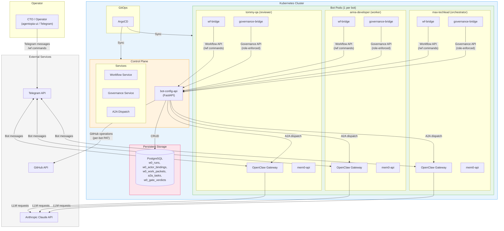
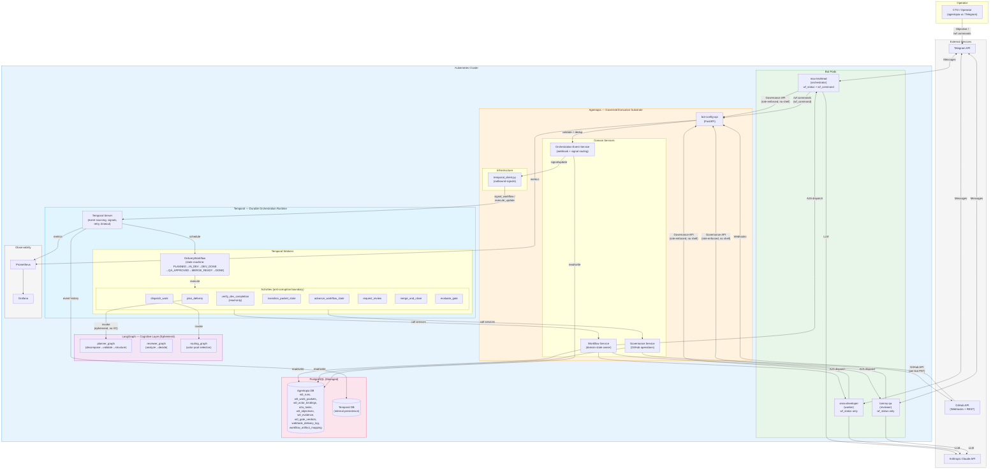
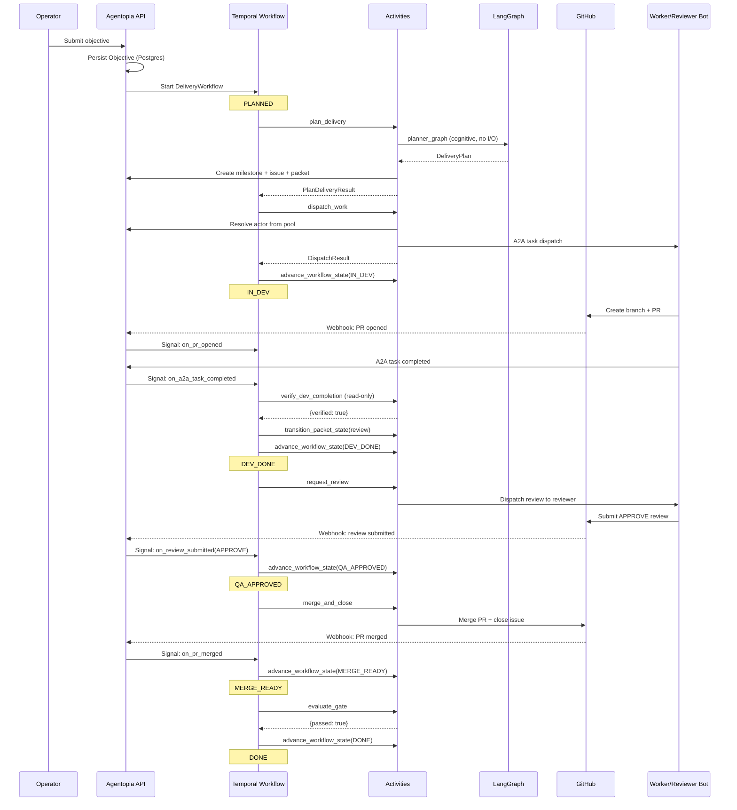

# Agentopia A2A Solution Protocol

> Canonical CTO architecture document for Agentopia multi-bot delivery.
> Last updated: 2026-03-17.
>
> Approved wave deliverables: `docs/wave-a-deliverables/` through `docs/wave-d-deliverables/`
>
> This document defines the verified current system, the production target,
> the hybrid architecture, the architectural gaps, and the implementation program.

---

## 1. Purpose

This document is the single architecture baseline for Agentopia's multi-bot delivery system.

It defines:
- the verified current system,
- the production target,
- the hybrid architecture decision,
- the architectural gaps between current state and target,
- the implementation program that SA drives before broader dev execution.

This document separates:
- what is real now,
- what is only foundation,
- what must be built before Agentopia can be called production-ready.

---

## 2. Executive Summary

Agentopia today is:
- a real multi-agent execution platform,
- with working workflow, governance, and A2A subsystems,
- but without a fully integrated closed-loop delivery control plane.

Agentopia today is **not** yet:
- a fully autonomous multi-bot delivery system,
- a production-ready delivery orchestrator,
- a system that can prove strong multi-bot specialization without operator steering.

The core problem is not missing tools.
The core problem is missing convergence across: planning, task graph, routing, execution, review, event reconciliation, persistence, and hardened execution boundaries.

The strategy is not to rewrite the platform.
The strategy is to connect the existing subsystems into one canonical delivery machine using a **hybrid stack: Agentopia + Temporal + LangGraph**.

---

## 3. Current Architecture (MVP1)



### 3.1 What Is Already Real

1. **Workflow command and state-machine foundation**
   - `/wf` commands are real and deterministic: `start`, `assign`, `submit`, `approve`, `accept`, `close`.
   - State progression persisted via Postgres run store.

2. **Governance execution surface**
   - 28 governance API tools with role-based enforcement.
   - Backend-side authorization and anti-spoof enforcement.

3. **Dynamic role resolution**
   - Gateway resolves role per-request via backend binding API.
   - Backend binding is the source of truth.

4. **A2A transport foundation**
   - Client/server, skills, task store, direct delivery, discovery, and thread tools.
   - `/wf assign` creates a packet and dispatches over A2A.

5. **SA orchestration foundation**
   - Real orchestration loop with monitor, review, downstream dispatch, and release gate.

6. **Role contracts**
   - Orchestrator, worker, and reviewer permissions explicitly encoded.

### 3.2 What Is Only Partial

1. **Planning and decomposition** — Orchestrator service exists but is not the canonical product path.
2. **Routing** — Works only when exactly one actor is bound per role.
3. **Review loop** — Evaluation exists but not driven by a production event loop.
4. **Tool boundary** — Governance tools are governed, but shell/raw HTTP still broadly available (being hardened in Round 1).

### 3.3 What Is Not Real Yet

1. Autonomous SA planning from rough objective.
2. Event-driven workflow advancement (A2A/GitHub events → workflow state).
3. Pool-aware routing across multiple workers/reviewers.
4. Durable work-item and orchestration memory (being fixed in Round 1).
5. Closed-loop release orchestration without operator steering.

### 3.4 Verified Code Anchors

| Subsystem | Key Files |
|---|---|
| Workflow command/control | `w0_protocol/workflow_command.py`, `services/workflow_service.py`, `routers/workflow.py` |
| Governance execution | `routers/governance.py`, `governance/role_contracts.py`, `gateway/extensions/governance-bridge/index.ts` |
| A2A transport | `a2a_protocol/server.py`, `w0_protocol/a2a_dispatch.py`, `gateway/extensions/relay/index.ts` |
| Orchestration foundations | `w0_protocol/orchestration_loop.py`, `services/orchestrator.py` |
| Persistence (gaps) | `w0_protocol/work_item_store.py`, `w0_protocol/evidence_store.py`, `w0_protocol/gate_engine.py` |
| Runtime tool boundary | `openclaw-infra/charts/agentopia-bot/templates/configmap-config.yaml` |

---

## 4. Production Target Definition

A production-ready autonomous multi-bot delivery system must support all eight capabilities:

| # | Capability | Current Status |
|---|---|---|
| 1 | Autonomous ideation and decomposition | Partial foundation |
| 2 | Autonomous task routing | Partial (single-actor only) |
| 3 | Autonomous worker execution | Partial (command-driven completion) |
| 4 | Autonomous reviewer loop | Partial foundation |
| 5 | Closed-loop orchestration | Weak (requires external triggers) |
| 6 | Event-driven workflow advancement | Missing |
| 7 | Durable operational memory | Incomplete (Round 1 in progress) |
| 8 | Controlled execution surface | Incomplete (Round 1 in progress) |

If these eight capabilities are not met, Agentopia should not be described as production-ready autonomous delivery.

---

## 5. Hybrid Architecture Decision

### 5.1 Three-Layer Stack

The production target is achieved through a hybrid architecture:

| Layer | Runtime | Owns | Does NOT Own |
|---|---|---|---|
| **Agentopia** | FastAPI + Gateway | Domain state (Postgres), role contracts, governance auth, GitHub execution, bot runtime | Orchestration durability, planning decisions, long-running coordination |
| **Temporal** | Temporal Server + Workers | Durable orchestration lifecycle, signal/update handling, retry/timeout, activity scheduling | Business rules, domain state, GitHub artifacts, LLM reasoning |
| **LangGraph** | Python within Temporal activities | Planning decisions, multi-agent reasoning, supervisor routing (ephemeral cognitive state) | Durable execution, domain persistence, orchestration lifecycle |

**Why hybrid:** Agentopia excels at governed execution but is not designed for durable long-running coordination or LLM-based planning. Temporal provides durable event-driven orchestration. LangGraph provides cognitive multi-agent reasoning. Building all three inside Agentopia would mean reinventing these runtimes.

### 5.2 Layer Ownership Model

```
┌─────────────────────────────────────────────────────────────┐
│                    OWNERSHIP MODEL                           │
├──────────────┬──────────────────────────────────────────────┤
│              │                                              │
│  AGENTOPIA   │  Domain state (canonical):                   │
│  (Postgres)  │  - Objectives, Workflows, Packets            │
│              │  - Bindings, Evidence, Gate Verdicts          │
│              │  - A2A Tasks, Artifact Mapping                │
│              │  Role contracts + governance enforcement      │
│              │  GitHub API execution (per-bot PAT)           │
│              │                                              │
├──────────────┼──────────────────────────────────────────────┤
│              │                                              │
│  TEMPORAL    │  Orchestration lifecycle (durable):           │
│  (Event      │  - Workflow state machine execution           │
│   History)   │  - Signal/update handling                     │
│              │  - Timer/timeout management                   │
│              │  - Activity scheduling + retry                │
│              │  - Event sourcing (replay-safe)               │
│              │                                              │
├──────────────┼──────────────────────────────────────────────┤
│              │                                              │
│  LANGGRAPH   │  Cognitive decisions (ephemeral):             │
│  (In-memory, │  - Planning decomposition                    │
│   no persist)│  - Review analysis                           │
│              │  - Actor routing selection                    │
│              │  - Runs ONLY inside Temporal activities       │
│              │  - NO I/O, NO service imports                 │
│              │                                              │
├──────────────┼──────────────────────────────────────────────┤
│              │                                              │
│  GITHUB      │  External artifacts (source of truth):       │
│  (External)  │  - Issues, PRs, Reviews, Milestones          │
│              │  - CI/CD check results                        │
│              │  - Webhook events → Agentopia → Temporal      │
│              │                                              │
└──────────────┴──────────────────────────────────────────────┘
```

### 5.3 Integration Boundaries

Two distinct integration patterns:
- **Inbound (Temporal → Agentopia):** Activities in `integration/temporal/` call Agentopia services. Anti-corruption boundary for data translation and idempotency.
- **Outbound (Agentopia → Temporal):** `infrastructure/orchestration/temporal_client.py` signals running Temporal workflows (e.g., webhook received).

LangGraph runs exclusively inside Temporal activities. No direct service calls. Pure cognitive: receives data, returns decisions.

---

## 6. Target Architecture (Hybrid — Post Wave D)



---

## 7. Autonomous Delivery Lifecycle



---

## 8. Canonical Delivery Object Model

13 objects with single canonical owner each. Full detail in `docs/wave-a-deliverables/a02-canonical-object-model.md`.

| # | Object | Owner | Store | Durable? |
|---|---|---|---|---|
| 1 | Objective | Agentopia | Postgres `w0_objectives` | Yes |
| 2 | Planning Context | LangGraph | Ephemeral (in activity) | No |
| 3 | Workflow | Agentopia | Postgres `w0_runs` | Yes |
| 4 | Run | Agentopia | Postgres `w0_runs` + `w0_run_events` | Yes |
| 5 | Work Packet | Agentopia | Postgres `w0_work_packets` | Yes |
| 6 | Assignment | Agentopia (state owner), Temporal (execution actor) | Postgres bindings + Temporal workflow | Yes |
| 7 | A2A Task | Agentopia | Postgres `a2a_tasks` | Yes |
| 8 | GitHub Issue | GitHub | GitHub | External |
| 9 | Pull Request | GitHub | GitHub | External |
| 10 | Review Decision | GitHub | GitHub | External |
| 11 | Evidence Bundle | Agentopia | Postgres `w0_evidence` | Yes |
| 12 | Orchestration Action | Temporal | Temporal event history | Yes |
| 13 | Release Gate Result | Agentopia (state owner), Temporal (execution actor) | Postgres `w0_gate_verdicts` | Yes |

Key rules:
- Objective is **durable Agentopia domain state** — not LangGraph ephemeral.
- Planning Context is **ephemeral cognitive state** — not canonical truth.
- A2A task completion is **transport truth**, not delivery truth.
- Each object has one **canonical state owner** and optionally an **execution actor**.

---

## 9. Main Architectural Gaps

### 9.1 Missing Canonical Task Graph
Workflow state, work packets, A2A tasks, GitHub issues, PRs, reviews, evidence, and release decisions are managed across separate stores without one canonical graph.

### 9.2 Missing Event Plane and Reconciler
Workflow progression depends on explicit commands. A2A completion and GitHub events do not reconcile into workflow state. Designed in Wave B.

### 9.3 Role-to-Actor Routing Model Is Too Weak
Single-actor-per-role model does not scale to production pools. Designed in Wave C.

### 9.4 Persistence Model Is Not Production-Safe
Work items, evidence, orchestration audit, command audit, and gate verdicts need durable persistence. Round 1 implementation in progress.

### 9.5 Controlled Execution Surface Is Not Tight Enough
Runtime still permits shell/file tool groups. Round 1 hardening in progress.

---

## 10. Production-Ready Definition

Agentopia may be called production-ready autonomous delivery only when all eight capabilities (Section 4) are met. Until then: "guided multi-bot execution platform" or "semi-manual delivery orchestration foundation."

Production readiness gate: 8 criteria with 5 HARD-FAIL. Full detail in `docs/wave-a-deliverables/a04-production-readiness-gate.md`.

---

## 11. Implementation Program

### 11.1 SA-First Model

SA delivers architecture, contracts, issue packs, and verification plans first. Dev implements only after CTO accepts the wave outputs. All implementation must respect the hybrid stack.

### 11.2 Wave Summary

| Wave | Name | Status | Deliverables | Milestone |
|---|---|---|---|---|
| **A** | Architecture Freeze and Hybrid Object Model | **APPROVED** | 6 docs (a01-a06) | #17 |
| **B** | Temporal Event Plane and Reconciliation Design | **APPROVED** | 7 docs (b01-b07) | #18 |
| **C** | LangGraph Supervisor/Planner and Closed-Loop Design | **APPROVED** | 4 docs (c01-c04) | #19 |
| **D** | Production Hardening and Execution Program | **APPROVED** | 4 docs (d01-d04) | #20 |

### 11.3 Implementation Rounds (from D-04)

| Round | Scope | Status |
|---|---|---|
| **1** | Persistence migration (M1-M3) + execution surface hardening | **COMPLETE** |
| 2 | Remaining persistence + structural refactor + Temporal infrastructure | Blocked on Round 1 |
| 3 | Webhook pipeline + activity implementation | Blocked on Round 2 |
| 4 | DeliveryWorkflow + LangGraph + actor pool | Blocked on Round 3 |
| 5 | Integration testing + production ops | Blocked on Round 4 |

---

## 12. Wave A — Architecture Freeze

> **Status: CTO APPROVED (2026-03-17)**
> Deliverables: `docs/wave-a-deliverables/a01-a06`
> Milestone: #17, Issues: #267-#272

**Goal:** Freeze the hybrid architecture baseline, canonical 13-object model, 4-layer state ownership, production gate, structural refactor direction, and integration contracts.

**Issues:**
- A-01 — Current-State Architecture Audit (Hybrid Baseline)
- A-02 — Canonical Delivery Object Model (13 objects, single owner each)
- A-03 — Source-of-Truth and State-Ownership Matrix (4-Layer)
- A-04 — Production Readiness Gate (8 criteria, HARD-FAIL/SOFT-FAIL)
- A-05 — Structural Refactor with Hybrid Integration Boundaries
- A-06 — Hybrid Integration Contract (Agentopia + Temporal + LangGraph)

---

## 13. Wave B — Temporal Event Plane and Reconciliation Design

> **Status: CTO APPROVED (2026-03-17)**
> Deliverables: `docs/wave-b-deliverables/b01-b07`
> Milestone: #18, Issues: #273-#279

**Goal:** Design Temporal-based event-driven orchestration replacing manual `/wf` commands as the primary state advancement mechanism.

**Issues:**
- B-01 — Event Inventory and Taxonomy (24 events, 5 sources)
- B-02 — Temporal Workflow Reconciler Spec (18-row decision table)
- B-03 — GitHub Integration Event Contract
- B-04 — A2A Completion to Workflow Contract
- B-05 — Rework Loop Contract
- B-06 — Temporal Workflow Design Spec (DeliveryWorkflow + E2E diagram)
- B-07 — Activity and Signaling Contract Inventory (12 activities)

---

## 14. Wave C — LangGraph Supervisor/Planner and Closed-Loop Design

> **Status: CTO APPROVED (2026-03-17)**
> Deliverables: `docs/wave-c-deliverables/c01-c04`
> Milestone: #19, Issues: #280-#283

**Goal:** Design LangGraph cognitive layer for planning, routing, and review. Make multi-bot specialization real.

**Issues:**
- C-01 — Actor Pool and Routing Policy (4-concern split, two-step routing)
- C-02 — Orchestrator Planning Product Path (planner + reviewer graphs)
- C-03 — Closed-Loop Handoff Policy (5 handoffs, 4-level escalation)
- C-04 — Autonomous Delivery Evaluation Pack (4 UAT scenarios, 7 anti-fake criteria)

---

## 15. Wave D — Production Hardening and Execution Program

> **Status: CTO APPROVED (2026-03-17)**
> Deliverables: `docs/wave-d-deliverables/d01-d04`
> Milestone: #20, Issues: #284-#287

**Goal:** Define persistence migration, execution hardening, Temporal deployment, and dev execution pack.

**Issues:**
- D-01 — Persistence Architecture Spec (15 stores, 7-phase migration)
- D-02 — Execution Surface Hardening Spec (role-based tool matrix, shell/HTTP disabled)
- D-03 — Production Operations, Temporal Deployment, and SLO Spec
- D-04 — Dev Execution Pack and Rollout Program (12 slices, 5 rounds)

---

## 16. SA Operating Rules

- No new autonomy claim without mapping it to canonical delivery truth.
- No milestone proposal without acceptance criteria and a gate.
- No dev prompt before the wave design is accepted.
- No report that treats transport success as delivery success.
- No report that treats operator-driven sequencing as autonomous orchestration.
- No production-ready claim before Wave D gate is passed.
- No Temporal or LangGraph code added without following hybrid integration boundaries (A-05, A-06).
- SA must critically evaluate CTO requests and pushback when technically unsound.

---

## 17. Current Status

| Item | Status |
|---|---|
| Wave A | APPROVED |
| Wave B | APPROVED |
| Wave C | APPROVED |
| Wave D | APPROVED |
| Round 1 (S1 + S4) | IN PROGRESS — dev implementing persistence migration + execution hardening |
| Rounds 2-5 | BLOCKED — pending Round 1 gate |
| PR #288 | Docs package ready for merge |
