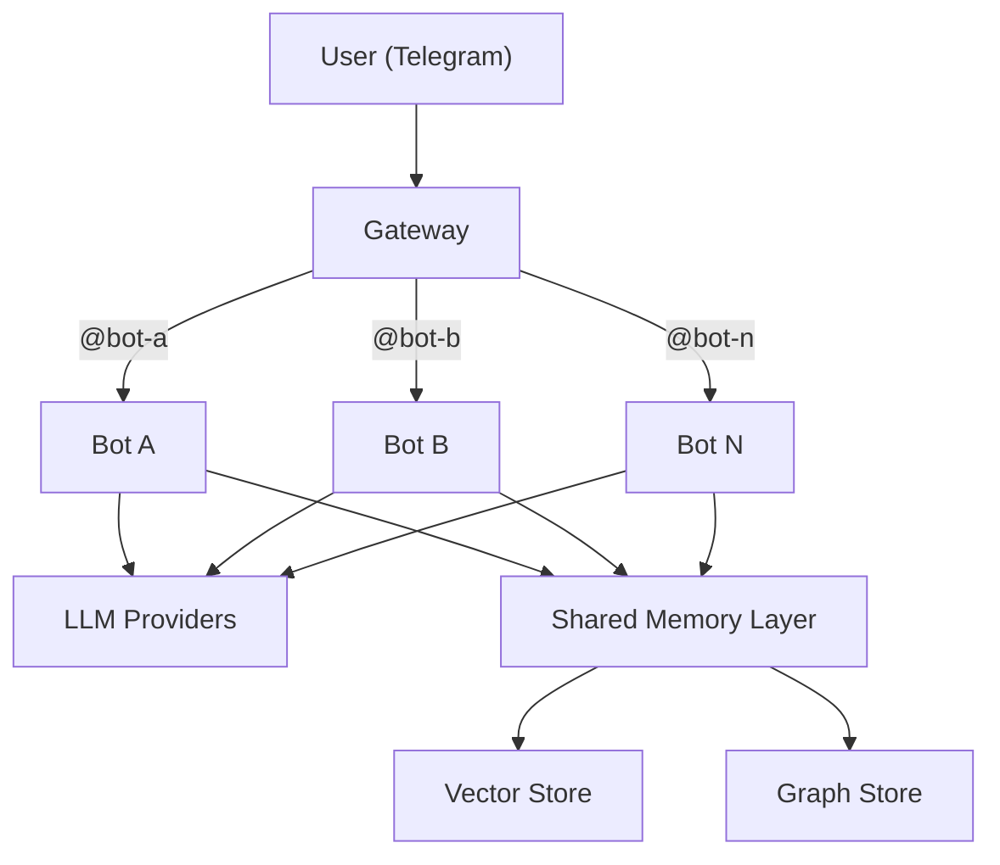

Agentopia is a self-hosted AI agent gateway that routes messages to multiple AI bots. Each bot has its own identity, model, and role, but shares a common knowledge base and memory infrastructure.

**Design goals:**

- Multiple bots, multiple groups, single deployment
- Cross-bot context sharing without token bloat
- New bots inherit all shared knowledge from day one
- Memory survives session compaction
- Simple enough to operate without deep infrastructure knowledge

---

## How It Works

The gateway receives messages, identifies which bot is being addressed, and routes the conversation to the correct agent. Each bot maintains its own workspace and identity while reading from a shared knowledge layer.

---

## Memory Architecture

Agentopia uses a three-layer memory model that balances identity isolation with knowledge sharing.

### Layer 1 -- Identity (per-bot, static)

Each bot has its own personality, role definition, and communication style. These files are set once and define who the bot is. Bots do not modify their own identity -- only an administrator can change these.

### Layer 2 -- Knowledge (shared, persistent)

All bots share a common knowledge base through two mechanisms:

- **Semantic memory**: Facts are automatically extracted from every conversation and stored in a vector database. Before each response, the most relevant facts are recalled and injected into context. This happens transparently -- no manual effort required.
- **Shared documents**: A shared directory contains the canonical user profile, architecture decisions, project status, and team protocols. Bots access these on demand via search.

Because knowledge is shared, a new bot immediately has access to everything learned by every other bot.

### Layer 3 -- Session (per-bot, ephemeral)

Each bot writes daily summaries and curated notes from its conversations. These are private to the bot and provide continuity between sessions. When a session is compacted to save tokens, the bot flushes important context to its daily log first.

### What Survives Compaction

| Data | Persists | Source |
|------|----------|--------|
| User identity and preferences | Yes | Layer 1 + Layer 2 |
| Bot identity and role | Yes | Layer 1 |
| Conversation facts | Yes | Layer 2 (semantic memory) |
| Project status and decisions | Yes | Layer 2 (shared documents) |
| Daily summaries | Yes | Layer 3 |
| In-progress discussion context | No | Must be flushed before compaction |

---

## Request Flow

When a user sends a message, the system follows this sequence:

**Before responding:**

1. Load the bot's identity and workspace files
2. Load recent daily logs for session continuity
3. Recall relevant facts from semantic memory (non-blocking, with timeout)
4. Optionally search shared documents if the bot determines it needs more context

**After responding:**

5. Extract new facts from the conversation and store them in semantic memory
6. If the session is approaching its token limit, flush key context to the daily log before compaction

This flow ensures every response is informed by the bot's identity, shared knowledge, and recent context -- without loading everything into the token window.

---

## Bot Isolation and Sharing

Each bot operates in its own workspace with its own identity files. The sharing boundary is controlled by **scopes**:

- Bots in the **same scope** share one knowledge store and one set of shared documents
- Bots in **different scopes** are fully isolated -- separate memory, separate documents
- Bots with **no scope** have only their own workspace, no shared memory

This allows flexible topologies: a team of collaborating bots that share context, alongside independent bots that operate in isolation.

---

## Group and Topic Context

Bots adapt their behavior based on where a conversation happens. Context is resolved in priority order:

1. **Topic-specific context** -- if the conversation is in a specific forum thread, the bot loads role and rules for that topic
2. **Group-wide context** -- if no topic-specific context exists, the bot falls back to group-level settings
3. **Default identity** -- if neither exists, the bot operates from its base role definition

When a user assigns a role or scope in a particular context, the bot writes the appropriate context file. All subsequent sessions in that context automatically load it.

---

## Adding a New Bot

The process for adding a new bot:

1. **Describe what you need** -- provide a plain-text description of the bot's purpose, audience, and preferred language
2. **Generate configuration** -- the system uses an LLM to produce the bot's identity, user profile, and deployment manifest from your description
3. **Review and deploy** -- review the generated files, then provision the bot. It immediately inherits all shared knowledge from existing bots

No manual onboarding of past context is needed. The shared memory layer ensures the new bot has access to everything from day one.

---

## Model Flexibility

Each bot can use a different LLM provider and model. If a bot's primary model is unavailable, it falls back through a configurable chain:

1. Bot's primary model
2. Bot's explicit fallback models (if configured)
3. Global default model for the deployment

This allows mixing providers -- one bot on a reasoning model for architecture review, another on a fast model for quick answers, a third on a code-optimized model for implementation.

---

## Security Model

The platform provides multiple layers of protection:

- **Workspace isolation** -- file access can be restricted to the bot's own workspace directory
- **Command allowlisting** -- shell access can be limited to explicitly approved tools
- **Log redaction** -- sensitive patterns are automatically stripped from logs
- **Credential elimination** -- cloud credentials are provided via instance roles rather than files, so there is nothing for a bot to read
- **Process isolation** -- the gateway can run as a restricted user with no access to system credentials

These layers are independent and can be adopted incrementally based on the deployment's security requirements.
