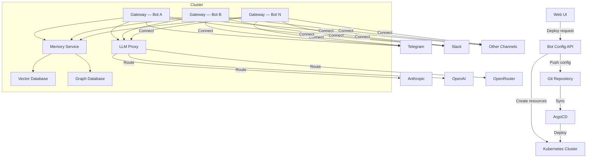
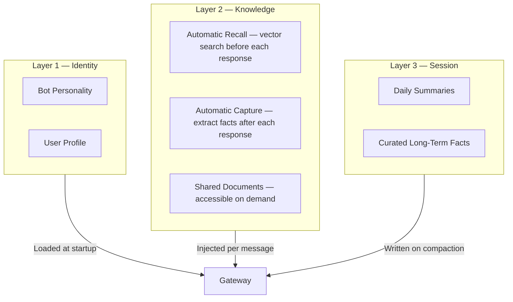
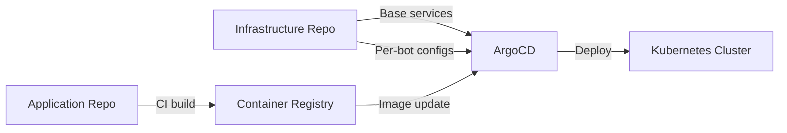

Agentopia is a self-hosted AI chatbot platform that lets organizations deploy multiple specialized AI bots with shared knowledge, long-term memory, and GitOps-native infrastructure on Kubernetes.

## Key Capabilities

- **Zero-code bot creation** — Describe what you want in natural language; the platform generates a complete bot configuration and deploys it automatically.
- **Shared knowledge across bots** — Bots within the same scope share a common memory store and knowledge base.
- **Persistent memory** — A three-layer memory architecture ensures no context is lost, even across long conversations.
- **Extensible without forking** — A plugin SDK and LLM proxy pattern enable new capabilities without modifying the core gateway.
- **GitOps-native** — Every change is tracked in Git and deployed through a continuous delivery pipeline.

---

## System Overview

### Core Services

| Service | Role |
|---------|------|
| **Bot Config API** | LLM-powered bot provisioning, lifecycle management, and orchestration |
| **Gateway** | AI agent runtime — routes messages between channels, LLMs, and plugins |
| **Memory Service** | Fact extraction and semantic memory backed by vector and graph databases |
| **LLM Proxy** | OpenAI-compatible proxy that routes requests to multiple LLM providers |
| **Vector Database** | Stores semantic embeddings for memory recall |
| **Graph Database** | Stores entity relationships for structured knowledge |
| **Secret Store** | Centralized credential management for API keys and tokens |

---

## Bot Provisioning

When a user creates a bot through the web UI, the platform executes an automated pipeline:

1. **Generate** — An LLM produces a complete bot personality, user profile, and runtime configuration from a natural-language description.
2. **Create Resources** — Kubernetes resources (configuration, secrets) are created in the cluster.
3. **Push to Git** — The bot configuration is committed to the infrastructure repository for audit and reproducibility.
4. **Deploy** — ArgoCD detects the change and renders all Kubernetes resources for the new bot.
5. **Monitor** — The system polls until the bot is healthy and connected to its messaging channel.

### Token Security

Sensitive credentials such as messaging platform tokens never appear in Git. The repository stores a placeholder value; the real token is injected directly into the Kubernetes cluster object. The continuous delivery system is configured to ignore differences on secret fields, preventing accidental overwrites.

---

## Memory Architecture

Agentopia uses a three-layer memory system to give bots both identity and long-term recall.

| Layer | Scope | Persistence |
|-------|-------|-------------|
| **Identity** | Per bot, static | Loaded at every session start |
| **Knowledge** | Shared across bots in a scope | Stored in vector and graph databases |
| **Session** | Per bot, rolling | Written before context compaction |

### Scope-Based Isolation

Bots can be grouped into scopes. Bots in the same scope share memory and knowledge; bots in different scopes are fully isolated.

---

## Multi-Channel Support

The gateway runtime natively supports over 15 messaging channels. Adding a new channel is a configuration change, not a code change.

**Supported channels include:** Telegram, Slack, Discord, WhatsApp, Microsoft Teams, Signal, Matrix, WebChat, Google Chat, LINE, Facebook Messenger, Twilio SMS, REST API, and Server-Sent Events (SSE).

Each bot can be bound to multiple channels simultaneously, allowing the same agent to serve users across different platforms.

---

## Plugin System

The gateway exposes a plugin SDK that enables extending bot behavior without modifying the core runtime.

**Extension points:**

| Hook | Timing | Use Case |
|------|--------|----------|
| `before_agent_start` | Before the LLM call | Inject context, filter input, route to specialists |
| `agent_end` | After the LLM response | Capture data, log conversations, collect metrics |
| Background services | Continuous | Run long-lived processes alongside the bot |

**Examples of what plugins can do:**
- Semantic memory recall and fact capture
- Audit logging of all conversations
- Knowledge base retrieval (RAG)
- Content filtering and PII detection
- Metrics and token usage tracking
- Multi-agent routing and delegation

---

## MCP Tool Integration

Bots can use external tools — such as code repositories, databases, and file systems — through the Model Context Protocol (MCP). Integration is handled by a bridge plugin that:

1. Connects to configured MCP servers
2. Discovers available tools from each server
3. Registers tools with the gateway runtime
4. Enforces per-bot permission policies (allowed and denied tool lists)

Credentials for MCP servers are managed per bot through the web UI. Each bot can use different credentials independently, and raw tokens are never exposed through the API.

---

## LLM Proxy

A lightweight, OpenAI-compatible proxy sits between bots and LLM providers, handling provider routing by model name, provider-specific authentication, and exposing a unified API to all internal services. Supported providers include Anthropic (Claude), OpenAI, and OpenRouter.

---

## GitOps and Deployment

All infrastructure and bot configurations are managed through Git and deployed via ArgoCD.

- **Infrastructure repository** — Helm charts for base services (memory, databases, proxy, config API) and per-bot gateway deployments.
- **Application repository** — Source code for all services, built and pushed to a container registry by CI.
- **ArgoCD** — Watches both repositories and reconciles the desired state with the cluster continuously.

---

## Platform Roadmap

Agentopia is actively expanding across several areas: multi-agent orchestration for collaborative task delegation, knowledge base ingestion with RAG, per-bot analytics and cost management, governance with audit logging and content filtering, a bot template marketplace, and multi-tenant SaaS with usage-based billing.
