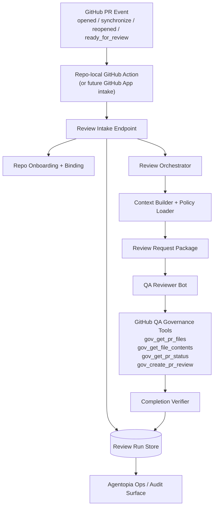

# Bot-Based Governed PR Review Workflow

> Product architecture for an Agentopia-native pull request review workflow.
> Execution actor: QA reviewer bot inside Agentopia.
> Last updated: 2026-03-28

---

## 1. Purpose

Agentopia should not ship a second, parallel review engine inside `bot-config-api`.

The intended product shape is:
- GitHub PR events trigger a governed workflow
- Agentopia platform handles intake, onboarding, dedupe, orchestration, and audit
- a QA reviewer bot performs the review using existing GitHub governance tools
- the system persists review state and verifies completion

This keeps governed PR review consistent with the current Agentopia bot model.

---

## 2. Product Positioning

### 2.1 What this feature is

Agentopia PR Review is a bot-based governed review workflow with:
- GitHub-triggered intake
- repo-aware review policy
- governed reviewer permissions
- incremental re-review on PR updates
- persistent run tracking and auditability
- low-noise, structured review output

### 2.2 What this feature is not

It is not:
- a generic AI comment bot
- a backend-only review engine
- an auto-approve or auto-merge system
- a style-only nitpick tool
- a replacement for human ownership or release gates

### 2.3 Differentiators vs Copilot / CodeRabbit

The differentiators remain essential:
1. governed permissions
2. repo-aware policy
3. multi-lane review
4. incremental re-review
5. persistence and audit
6. low-noise synthesis

The correction is architectural:
- these differentiators must be implemented through a bot-based review workflow
- not through a separate service-side LLM review engine inside `bot-config-api`

---

## 3. Core Requirement

The QA reviewer bot is the execution actor.

Correct execution model:
1. GitHub PR event is received
2. Agentopia intake validates onboarding and dedupes the event
3. Agentopia creates or updates a persisted review run
4. Agentopia dispatches a review task to a QA reviewer bot
5. the QA reviewer bot uses existing GitHub QA governance tools to inspect the PR
6. the QA reviewer bot publishes the PR review to GitHub
7. Agentopia verifies completion and persists the final result

This feature must extend the current bot workflow model, not bypass it.

---

## 4. Architecture Overview

---

## 5. Execution Planes

### 5.1 Control Plane — Agentopia platform

Control-plane responsibilities:
- GitHub intake
- repo onboarding
- repo-to-reviewer-bot binding
- dedupe and review-run lifecycle
- policy loading
- context packaging
- dispatching review task to reviewer bot
- completion verification
- audit/query APIs

Primary home:
- `bot-config-api`

### 5.2 Execution Plane — QA reviewer bot

Execution-plane responsibilities:
- inspect PR using governed GitHub tools
- reason over code and policy
- apply review lanes logically
- synthesize low-noise findings
- publish review back to GitHub

Primary actor:
- reviewer bot in Agentopia dev / target environment

### 5.3 Repository Integration Plane

Repo-side requirements:
- GitHub Action trigger
- `.agentopia/review-policy.yml`
- secret to call Agentopia intake
- optional future GitHub App installation path

---

## 6. Core Components

### 6.1 GitHub Intake

Responsibilities:
- accept PR lifecycle events
- validate repo onboarding
- reject unsupported events
- create dedupe key using `repo + pr + head_sha`
- create or update review run record
- hand off to the orchestrator

### 6.2 Repo Onboarding and Reviewer Binding

Responsibilities:
- record onboarded repositories
- bind each onboarded repository to a reviewer bot actor
- persist policy location / repo metadata
- support future onboarding of additional repos without architecture changes

Minimum persisted fields:
- `repo_owner`
- `repo_name`
- `enabled`
- `reviewer_actor_id`
- `policy_ref`
- `created_at`
- `updated_at`

### 6.3 Review Run Store

Responsibilities:
- persist each review run
- link re-reviews to prior runs
- persist final status, verdict, and failure reason
- store GitHub review identifiers and timestamps

Minimum persisted fields:
- `review_run_id`
- `repo_owner`
- `repo_name`
- `pr_number`
- `base_sha`
- `head_sha`
- `event_type`
- `status`
- `prior_run_id`
- `reviewer_actor_id`
- `verdict`
- `review_url`
- `failure_reason`
- `started_at`
- `completed_at`

### 6.4 Review Orchestrator

Responsibilities:
- determine first review vs re-review
- fetch the correct reviewer binding
- build review package for the bot
- dispatch review request to the reviewer bot
- coordinate completion verification

The orchestrator is a workflow coordinator, not the primary review brain.

### 6.5 Context Builder

Responsibilities:
- fetch PR metadata
- fetch changed files and patches
- apply repo policy filters
- summarize prior findings / prior reviews for re-review
- assemble a review request package for the reviewer bot

This component improves bot context.
It does not replace the reviewer bot.

### 6.6 Repo Review Policy

The repo review policy remains essential.

Examples of policy influence:
- stack hints
- ignore paths
- high-risk patterns
- severity guidance
- review lane focus
- maximum inline comments
- draft / large diff handling rules

The policy should shape the review request sent to the QA bot.

### 6.7 Reviewer Bot Contract

The reviewer bot must remain the canonical executor.

Required behavior:
1. inspect changed files
2. read relevant code
3. evaluate against repo policy and review expectations
4. publish review on GitHub
5. return or expose enough state for completion verification

Required GitHub tools:
- `gov_get_pr_files`
- `gov_get_file_contents`
- `gov_get_pr_status` if needed
- `gov_create_pr_review`

### 6.8 Multi-Lane Review

Multi-lane review remains a differentiator, but the lanes are logical review concerns inside the bot workflow.

Example lanes:
- Security/Auth
- Schema/Migration
- API/Behavior
- CI/CD + Ops

MVP should start with 1-2 lanes only.

Important:
- lanes do not need to be implemented as a separate backend engine
- they can be executed as structured review protocol inside the reviewer bot

### 6.9 Low-Noise Synthesis

Low-noise synthesis remains a differentiator.

Canonical responsibility:
- the reviewer bot produces a concise summary and limited inline comments

Platform-level constraints may still enforce:
- max inline comment count
- severity threshold
- run-state dedupe

### 6.10 Completion Verification

Responsibilities:
- verify that the reviewer bot actually posted a GitHub review
- reconcile review result with the review run record
- detect completed / failed / timed-out runs
- support re-review tracking across PR updates

MVP options:
1. bot callback to Agentopia after review submission
2. backend verification via GitHub API using known bot identity

---

## 7. MVP Scope

### 7.1 In scope

1. repo-local GitHub Action trigger
2. repo onboarding and reviewer binding
3. review intake endpoint
4. dedupe and review run persistence
5. repo policy loading
6. context package generation
7. dispatch to QA reviewer bot
8. completion verification
9. non-blocking behavior
10. audit/query visibility for runs

### 7.2 Out of scope

1. backend lane-review engine as canonical execution path
2. backend direct LLM review as primary path
3. backend direct GitHub publisher as primary path
4. auto-approve or auto-merge
5. required branch protection on first release
6. GitHub App as required MVP architecture
7. autonomous patch generation

---

## 8. Mapping Differentiators to the Bot-Based Model

| Differentiator | Correct home in architecture |
|---|---|
| Governed permissions | reviewer bot role contract + GitHub QA governance tools |
| Repo-aware policy | policy loaded by platform, injected into review request package |
| Multi-lane review | structured review protocol executed by reviewer bot |
| Incremental re-review | dedupe + prior-run linkage in review run store, prior context in bot request |
| Persistence / audit | review run store + completion verification |
| Low-noise synthesis | reviewer bot output discipline + platform comment thresholds |

---

## 9. Initial Rollout

### Phase A — Architecture reset
- align docs and issues to bot-based execution
- stop expanding service-side review engine path

### Phase B — Intake, onboarding, and run tracking
- repo onboarding
- reviewer binding
- intake endpoint
- dedupe and persistence

### Phase C — Reviewer bot execution contract
- review request payload
- bot prompt / role contract
- GitHub QA tool requirements
- completion verification contract

### Phase D — First onboarded repo activation
- onboard first repo privately
- add policy file and workflow
- configure secrets
- trigger real PR review
- verify QA bot posts GitHub review

### Phase E — E2E validation
- PR opened
- PR updated / re-review
- duplicate trigger handling
- failure isolation
- audit trail verification

---

## 10. Architectural Guardrails

1. There must not be two competing review architectures.
2. `bot-config-api` must not become the primary reviewer brain.
3. Reviewer reasoning and review publication stay in the reviewer bot flow.
4. Platform services handle orchestration, tracking, verification, and audit.
5. Public artifacts must not leak the hidden pilot repo name.

---

## 11. Open Follow-Up

The current feature track should be re-planned to align with this architecture before further implementation continues.
