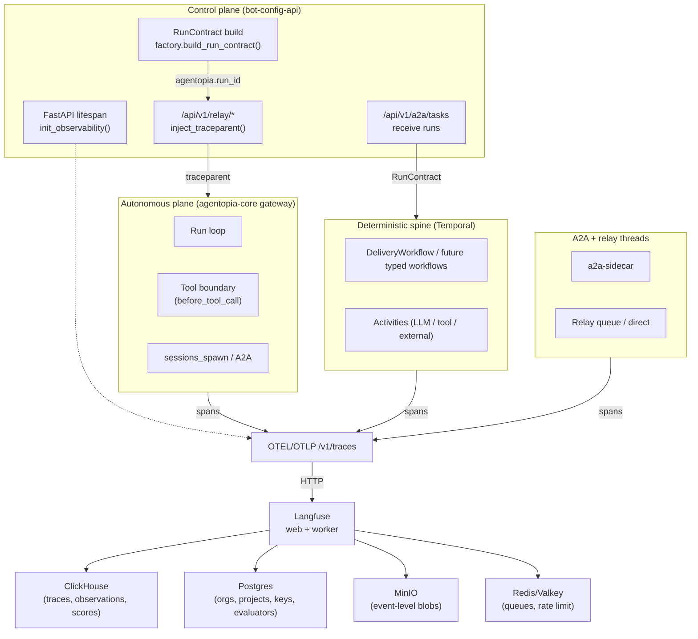
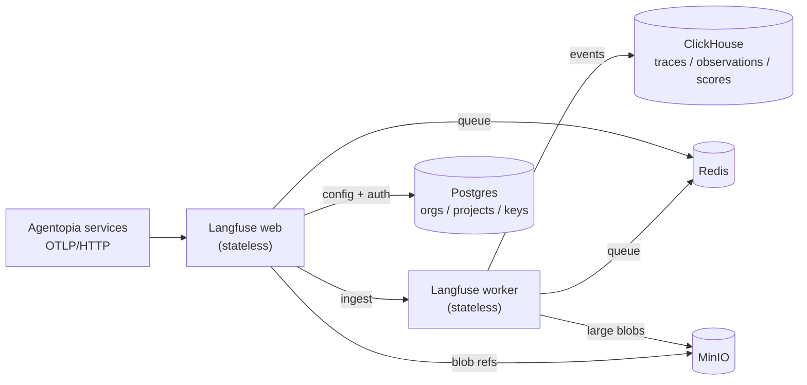

# H3 Observability — Production Design

**Status:** **Draft.** Phase-α deployment shape is specified and ready to implement. Production steady-state target architecture is specified with open gaps called out in §14 and §16. Not yet promoted to Accepted.
**Date:** 2026-04-23
**Owner:** Platform Architecture
**Scope:** Design of the Agent Harness trace/eval subsystem in two explicitly separated architecture states — the phase-α deployment shape we land now, and the production steady-state target architecture we commit to converging on.
**Binding inputs:**
- [Harness Architecture](./harness-architecture.md) (B1)
- [ADR-015 — Trace Backend Selection: Langfuse](../../adrs/015-h3-02-trace-backend-langfuse.md) (backend decision)
- [Agent Harness Implementation Plan](../../milestones/agent-harness-implementation-plan.md) Phase H3
- `ai-agentopia/agentopia-protocol` groundwork PR [#487](https://github.com/ai-agentopia/agentopia-protocol/pull/487) (merged 2026-04-23)

This document specifies how the selected backend is deployed, integrated, and operated as a production service within Agentopia — at phase α and at the production steady state. It does **not** re-debate the backend choice.

### Two architecture states

This document intentionally specifies **two** architectures, not one:

| State | Definition | Binding? |
|---|---|---|
| **Phase α** | What we deploy first. Non-HA, single-replica, on `local-path` storage. Dev / staging / early production on the current single-node cluster. Chosen for operational simplicity at current volume (§11.1). Single-node loss is an acceptable outage in this state. | Yes, on the phase-α rollout. Superseded — not merely extended — by the steady-state target. |
| **Production steady state** | Where the subsystem must converge before we call observability "production-hardened." HA for durable data backends, replicated storage class, multi-node failure domain, automated PITR, and explicit SLO commitments (§14). **Single-node loss is NOT acceptable in this state.** | Yes. Gaps called out with explicit open questions in §14 and §16 are blockers on promotion, not aspirations. |

Every §§5–13 section below either applies to both states or is split into a "Phase α" / "Production steady state" pair. §14 consolidates the steady-state commitments — HA, storage class, failure domain, backup target, single-node-loss stance — so a reviewer can read that section alone and understand the target.

---

## 1. Executive Summary

The Agent Harness emits OpenInference-tagged OTLP spans keyed to a single `RunContract` envelope. ADR-015 selected **Langfuse (MIT core)** as the self-hosted trace/eval backend. This document turns that selection into a two-state service design: a phase-α deployment shape we can land now, and a production steady-state target architecture we commit to reaching before the subsystem is considered production-hardened.

The observability subsystem is not a Helm chart. It is a contract with four parts: (1) a storage topology whose components each serve a distinct data class; (2) a tenancy model that maps Langfuse's organization/project primitives onto Agentopia's capability-class and lane structure; (3) an integration surface that every Agentopia plane — control-plane, autonomous-plane, deterministic spine, A2A threads — plugs into through the same `RunContract` identity; and (4) an operational model with explicit retention, backup, and SLO commitments. Helm renders the deployment; it does not own any of the four parts above.

Rollout is three phases. **Phase α** deploys the service in internal-only, single-replica form on `local-path` storage and wires the already-landed protocol-side groundwork to it — single-node loss is an accepted outage in this state. **Phase β** extends emission across `agentopia-core`, Temporal, and A2A boundaries without changing the deployment shape. **Phase γ** is the hardening round that converges the deployment on the production steady-state target (§14): HA backends, replicated storage class, multi-node failure domain, automated PITR. Promotion to production-hardened requires phase γ completion; phase α + β alone is **not** the production target.

---

## 2. Scope and Status

### In scope
- Production topology for the Langfuse-based trace/eval surface.
- Tenancy mapping from Agentopia concepts (bots, capability classes, lanes) onto Langfuse primitives.
- Retention, backup, access, and scaling policy that the subsystem must satisfy.
- Integration points with every existing and in-flight Agentopia plane.
- Boundary between Helm rendering and architectural policy.

### Out of scope
- Re-deciding the backend (see ADR-015).
- Concrete Helm `values.yaml` content (lives with `ai-agentopia/agentopia-infra#163`).
- Exact chart versions (infra PR pins them).
- Eval-harness algorithms (WP-H3-03, separate work package).
- Checkpoint-policy contract shape (WP-H3-04..07, separate work package).
- `agentopia-core` instrumentation implementation (core-side work package, not this round).
- Multi-region / cross-cluster disaster recovery.

### Status of constituent work

| Area | State | Reference |
|---|---|---|
| Backend decision | Landed | ADR-015 |
| Protocol-side emission primitives | Landed | [PR #487](https://github.com/ai-agentopia/agentopia-protocol/pull/487) (merged 2026-04-23) |
| FastAPI lifespan bootstrap | Landed | `bot-config-api/src/observability/bootstrap.py` |
| Langfuse deployment | **Pending** | [`agentopia-infra#163`](https://github.com/ai-agentopia/agentopia-infra/issues/163) |
| `agentopia-core` span wiring | **Pending** | Core-side WP under [`agentopia-protocol#467`](https://github.com/ai-agentopia/agentopia-protocol/issues/467) umbrella |
| Temporal / A2A / relay span wiring | **Pending** | Sub-WPs under #467 umbrella |
| Eval harness integration | **Pending** | [`#469`](https://github.com/ai-agentopia/agentopia-protocol/issues/469) (WP-H3-03) |
| Checkpoint policy integration | **Pending** | [`#468`](https://github.com/ai-agentopia/agentopia-protocol/issues/468) (WP-H3-04..07) |

---

## 3. Selected Backend and Boundary

Langfuse (MIT core only) is the trace/eval backend. The boundary between what Langfuse owns and what Agentopia owns is fixed by two rules:

1. **Agentopia owns the wire format.** Spans leave every service as OTLP with OpenInference semantic conventions (`openinference.span.kind = AGENT|CHAIN|LLM|TOOL`) and Agentopia-native attributes (`agentopia.run_id`, `agentopia.intent`, `agentopia.lane`, `agentopia.execution_class`, `agentopia.capability_class`, `agentopia.run_contract.version`). This is the reversibility guarantee from ADR-015 — swapping backends is a deployment change, not a code rewrite. The wire format is defined in `bot-config-api/src/observability/semconv.py` and is binding on every future Agentopia service that emits traces.
2. **Langfuse owns storage and query.** Ingestion, schema, querying, UI, and score/eval APIs are Langfuse's responsibilities. Agentopia does not extend Langfuse's schema or fork its UI. Custom attributes are displayed as-is; they are not modeled as first-class dimensions.

The `ee/` modules of Langfuse (covered by the Langfuse Enterprise License) are **never enabled**. This constraint is binding at deploy time (`langfuse.licenseKey` unset) and at change-review time (no PR may introduce a dependency on an EE-gated feature).

---

## 4. Integration with Current Agentopia System

The observability subsystem is not a new lane. It is a silent observer attached to every existing plane through a single correlation identity: `RunContract.run_id`. Every plane produces spans; Langfuse correlates them into one trace per run.

### 4.1 Topology overlay

### 4.2 Integration points per plane

| Plane | Today | With observability | Owned by |
|---|---|---|---|
| `bot-config-api` (control plane) | RunContract built in `domain/run_contract/factory.py`; observability bootstrap on FastAPI lifespan | Emits lifespan span + RunContract build span; `relay.py` injects `traceparent` into outgoing calls to gateway | **Landed** (PR #487) |
| `agentopia-core` gateway (autonomous plane) | Runs per-turn loop; plugin hook `before_tool_call`; R1/R2/R3 rails | Emits run span (parent), tool-call spans (`openinference.span.kind=TOOL`), LLM spans (`openinference.span.kind=LLM`). R1/R2/R3 block events are span attributes, not separate spans | **Pending** (subsequent PR) |
| Temporal workflows | `DeliveryWorkflow`, future typed workflows | Workflow-start activity extracts inbound `traceparent` from RunContract; each activity is a child span. Workflow IDs appear as span attributes, not span IDs | **Pending** |
| A2A / relay threads | `a2a-sidecar` + `a2a_protocol/` mounts; relay direct + queue | `extract_traceparent()` on inbound; `inject_traceparent()` on outbound calls; thread checkpoint events are spans with `agentopia.checkpoint.outcome` | **Pending** (primitives exist; call sites pending) |
| `sessions_spawn` subagents | Bounded child executions (only final message returns) | Child span under parent run span; spawn boundary carries `agentopia.parent_run_id` to disambiguate | **Pending** |
| Future eval harness (WP-H3-03) | — | Scores written to Langfuse's `/api/public/scores` API keyed by `RunContract.run_id`; evaluator is an out-of-band process reading the trace surface | **Pending** |
| Future checkpoint/approval (WP-H3-04..07) | Three existing insertion points (DeliveryWorkflow, work-item, A2A thread) | Each checkpoint decision is an attribute on the span at whichever boundary fires; the policy matrix does not unify them into a single span type | **Pending** |

### 4.3 Correlation model

- **Primary key: `agentopia.run_id`.** Carried by every span. Set on RunContract construction. Every service reads it off the contract rather than minting its own.
- **W3C `traceparent`** carries the trace ID across process boundaries. Extracted and validated on ingress; injected on egress. Validation (`extract_traceparent`) drops malformed values rather than propagating — a bad upstream cannot corrupt downstream correlation.
- **Attribute-based grouping** replaces schema extension. Langfuse's `trace` dimension is `run_id`; its `tag` filters are keyed on `agentopia.intent`, `agentopia.lane`, `agentopia.capability_class`. We do not add tables, columns, or custom trace types.
- **What is NOT a span.** Checkpoint outcomes, R1/R2/R3 block events, and R3 loop-detection warnings are **attributes on the span that triggered them**, not standalone span types. This keeps the trace narrative clean: one span per executed action.

### 4.4 Emission contract (what every Agentopia service must do)

1. Read `OTEL_EXPORTER_OTLP_ENDPOINT` from env. No hard-coded URLs.
2. Call `init_observability()` (Python) or the TypeScript equivalent on process boot.
3. Tag every span with `agentopia.*` attributes from the current `RunContract`.
4. Honor `traceparent` on ingress; inject it on egress.
5. Drop emission silently when the endpoint is unset. Observability is **never** a hard dependency of a user-facing code path.

---

## 5. Storage Topology

Langfuse has four storage backends, each serving a distinct data class. The architectural rule is that no data class moves between backends without a design change here.

### 5.1 Component inventory

Two columns: the phase-α deployment shape and the production steady-state target. Phase β does **not** change either column — it only extends emission coverage; deployment shape remains phase-α until phase γ.

| Component | Purpose | Phase α (ship now) | Production steady-state target (§14) |
|---|---|---|---|
| Langfuse web | UI + REST/OTLP ingest + scores API | Stateless; 1 replica | Stateless; ≥ 2 replicas behind Service; `topologySpreadConstraints` across nodes |
| Langfuse worker | Async ingestion, batch insert to ClickHouse, score processing | Stateless; 1 replica | Stateless; ≥ 2 replicas; drain-safe shutdown |
| Postgres | Orgs, projects, users, API keys, datasets (config), prompts, evaluator configs | Single instance, `postgresql.architecture: standalone`, `local-path` PVC | **HA via CNPG operator** (or equivalent): primary + 1 streaming replica, WAL archiving to object store, automated failover |
| ClickHouse | Traces, observations, scores (high-volume event data) | **Chart default 3 replicas overridden to 1 replica**; chart default does not schedule on current cluster size | ReplicatedMergeTree with ≥ 2 replicas + ClickHouse Keeper quorum (3 Keeper nodes); PVCs on replicated storage class OR per-node replicas with pod-anti-affinity |
| Redis / Valkey | Ingestion queues, rate limits, cache | `architecture: standalone`, 1 replica | Sentinel topology (1 primary + 2 replicas + 3 Sentinel). Acceptable alternative: stay standalone if OTLP client-side retry is verified to absorb full Redis outages without span loss — decision in §14.2 |
| MinIO | Event-level blob storage (large prompt/completion bodies exceeding inline threshold); future trace exports | Single node, standalone, `local-path` PVC | MinIO distributed mode (≥ 4 drives for erasure-coding quorum) OR external S3-compatible object store with its own replication |

### 5.2 Why this split

- Langfuse's schema separation between Postgres (transactional / configuration) and ClickHouse (append-only event) is load-bearing. **Do not collapse these** into a single backend even if operationally tempting; doing so erases the performance characteristics the backend was designed around.
- ClickHouse is the single heavy tenant. It is the dominant disk consumer, the slowest to back up, and the likely source of operational incidents. Sizing and monitoring attention concentrates here.
- Redis is ephemeral. No backup target. Loss of Redis drops the current queue window but does not lose committed traces.
- MinIO is the escape hatch for data that doesn't belong in either relational or column-store backends. Agentopia uses it for large payload blobs; long-term, it also holds retention-exported ClickHouse parts (see §8).

### 5.3 What runs where (at a glance)

---

## 6. Data Placement Model

This is the rule a reviewer can apply without reading the Langfuse codebase: given a new piece of data, which backend does it go into?

| Data class | Backend | Rationale |
|---|---|---|
| Spans, observations, scores (high-volume, append-only, queried analytically) | ClickHouse | Columnar; TTL-native; this is what it's for |
| Organizations, projects, API keys, users (small, transactional, consistency-critical) | Postgres | ACID; foreign-key integrity; auth surface |
| Dataset definitions, evaluator configs, prompt templates, score definitions (config, not events) | Postgres | Versioned; joined with RBAC; rarely queried |
| Per-run large prompt/completion bodies (bytes, not metadata) | MinIO | Object-sized blobs don't belong in ClickHouse rows |
| In-flight ingestion events, UI session caches, rate-limit counters (ephemeral) | Redis | TTL-native; loss is tolerable within seconds |
| Exported ClickHouse parts for long-term retention | MinIO | §8 cold tier target |
| Langfuse EE features (SCIM, audit logs, retention automation) | **N/A — not enabled** | License boundary |

Agentopia **does not** add tables to Langfuse's Postgres, indexes to its ClickHouse, or buckets to its MinIO outside the chart's defaults. Anything that needs custom storage lives elsewhere in Agentopia (e.g., the H2 artifact store, which is separate from traces — see [WP-H2-02](../../milestones/agent-harness-implementation-plan.md)).

---

## 7. Tenancy and Isolation Model

Langfuse's MIT core provides multi-organization and multi-project tenancy out of the box. Fine-grained project-level RBAC roles are Enterprise-gated; coarse project-level isolation is not. Agentopia maps its own primitives onto these two levels as follows:

### 7.1 Mapping rule

| Agentopia concept | Langfuse concept | Cardinality | Reason |
|---|---|---|---|
| Agentopia deployment (the cluster as a whole) | **Organization** | 1 | One ops boundary; no cross-deployment sharing |
| Agentopia lane × class (e.g., `autonomous/worker`, `deterministic/admin`) | **Project** | ~6–8 | Each project gets its own API key set; blast radius of a leaked key is bounded |
| Specific bot | **Trace tag** (`agentopia.bot_id`) | N | Tag, not project — avoids project-explosion as bot count grows |
| Specific run | **Trace** (primary key `run_id`) | N | One trace per `RunContract` instance |

### 7.2 Why project-per-lane-class, not project-per-bot

Per-bot projects look clean but have two problems at scale: (1) Langfuse's UI lists projects flat; dozens of bots become unnavigable. (2) API-key rotation is a per-project operation; per-bot keys multiply rotation cost linearly with bot count. Per-lane-class projects cap the project count at the class ladder size, keep navigation finite, and still isolate blast radius at the meaningful boundary (a leaked Worker-class key cannot post as an Admin-class run).

Agentopia retains bot-level grouping via the `agentopia.bot_id` trace attribute. Langfuse filters traces by tag, so "show me all traces for bot X" remains a one-click operation without requiring its own project.

### 7.3 Isolation limits we accept

- **No fine-grained RBAC within a project** in the MIT build. Anyone with VIEWER on the Worker project sees all Worker-lane traces. This is acceptable because Agentopia's operator population is already a small trusted set; if that changes, the decision is to add project splits (architecture change), not to enable `ee/` RBAC.
- **No audit log in MIT core.** Access events to Langfuse itself are not recorded. Mitigation: restrict Langfuse UI access to operators and emit the restriction via NetworkPolicy + ingress rules; operator actions inside Langfuse are not individually attributable.
- **No protected prompt labels.** Prompt template versioning works, but "only admins may publish production" is not enforced. Process-level controls apply (reviewer in PR), not system-level.

### 7.4 Organization and project bootstrap

Project creation is a **one-time operator action**, not an automated CRD. The bootstrap set is fixed at §7.1; it does not grow with bot count. Subsequent bot additions do **not** create new projects — they produce traces in the correct existing project based on their capability class and lane.

---

## 8. Retention and Lifecycle Policy

Langfuse OSS has no automatic retention. Agentopia implements retention as a three-tier policy enforced at the ClickHouse layer.

### 8.1 Tiers

| Tier | Duration | Where | How it gets there | How it leaves |
|---|---|---|---|---|
| Hot | 0–30 days | ClickHouse (primary) | Live ingest | ClickHouse `TTL` clause on event tables |
| Warm | 30–90 days | ClickHouse (same disk, marked cold) | `TTL ... TO DISK 'cold'` if dedicated cold volume exists; else stays on primary but lower-priority | Auto-drop at 90 days |
| Cold / archive | 90 days – 2 years | MinIO (exported parts) | Scheduled `BACKUP TABLE` export per week | Lifecycle rule auto-deletes at 2 years |

The TTL values above are the architectural targets; the Helm chart does not set them natively. See §13.

### 8.2 Scoped exceptions

- **Deterministic lane traces** (workflow-bound runs that feed audit surfaces) get 180 days hot, not 30. `agentopia.lane = deterministic` drives the retention override via a separate ClickHouse table or TTL condition.
- **Traces with `openinference.span.kind = AGENT` at the root** representing top-level user-visible runs get the same 180-day treatment even in the autonomous lane — this is what a user asking "what did the bot do last quarter?" needs to resolve.
- **Score-carrying traces** (anything with an attached score from the eval harness) get 1 year hot-path retention because the score is part of the eval corpus.

### 8.3 What gets purged vs what persists

- Spans + observations purge per §8.1.
- Scores and dataset runs **persist in Postgres** (not ClickHouse) at Langfuse's discretion. Those rows are configuration-like and do not grow unboundedly.
- Prompt templates persist indefinitely (versioned Postgres rows).
- MinIO blobs inherit the lifecycle of the ClickHouse part that referenced them — they must be GC'd when the parent tier expires. A reconcile job verifies no orphaned blobs remain.

### 8.4 Open question

- Exact ClickHouse TTL SQL — whether to use `TTL ... TO DISK 'cold'` (requires a second storage class) or `TTL ... DELETE` with weekly export — is a deploy-time decision. The architectural invariant is: **no trace is silently lost before 30 days, and no trace persists past 2 years without explicit legal hold.**

---

## 9. Backup and Restore

### 9.1 Per-component policy — phase α

Phase-α RPO/RTO targets are deliberately looser than the production steady-state target; they reflect "observability is not on the user critical path at current volume" and will tighten in phase γ (§14.5).

| Component | Backed up? | Method (phase α) | RPO | RTO | Restore cost |
|---|---|---|---|---|---|
| Postgres | **Yes** | `pg_dump` nightly + WAL archiving to MinIO | 15 min (WAL) | 30 min | Low — standard restore |
| ClickHouse | **Yes** | `BACKUP TABLE` to MinIO weekly + `BACKUP INCREMENTAL` nightly | 24 hr | 2 hr | Medium — depends on data volume |
| Redis | **No** | — | N/A | N/A | Queue state is rebuilt from next-day traffic |
| MinIO | **Yes** | `mc mirror` to offsite target weekly | 7 days | Manual | Medium — re-sync |
| Langfuse secrets (encryption key, NEXTAUTH secret) | **Yes** | Vault path `secret/langfuse/*` | Vault-backed | Immediate | Zero data loss; keys never leave Vault |

### 9.1.1 Per-component policy — production steady-state target

At the steady state, the failure mode "single-node down" must not depend on backups — HA covers that case (§14). Backups cover corruption, deletion, and catastrophic loss, and their targets tighten accordingly:

| Component | Production target RPO | Production target RTO | Notes |
|---|---|---|---|
| Postgres | **≤ 1 min** | **≤ 5 min (automated failover); ≤ 30 min (backup restore)** | WAL streaming to HA replica for RPO; object-store WAL archive enables PITR for corruption cases |
| ClickHouse | **≤ 1 hr** | **≤ 1 hr** | Replicated MergeTree + scheduled `BACKUP` to off-cluster target; restore tested monthly, not quarterly |
| Redis | RPO irrelevant (ephemeral queue, re-emitted by OTLP retry) | **≤ 30 s** (Sentinel failover) | OR standalone with documented span-loss tolerance proved out; decision in §14.2 |
| MinIO | **≤ 1 hr** | **≤ 30 min** | Distributed-mode object durability; offsite mirror for region-failure equivalent |
| Vault-backed secrets | 0 | Vault-restart scoped | Unchanged from phase α — Vault is already HA per cluster baseline |

### 9.2 Why these RPOs

- Postgres is the RBAC and configuration source of truth. Losing 15 minutes of config changes is tolerable; losing 24 hours means re-adding API keys manually. The WAL-archiving target keeps the second case out.
- ClickHouse is event data, append-only. A 24-hour gap loses one day of traces but does not corrupt existing traces. Traces are not a critical path to user-facing function; a 24 hour RPO is the right economic trade-off.
- Redis is pure queue. Its RPO is **irrelevant** — any in-flight span batches lost on Redis failure are re-emitted by the client's retry path (OTLP clients default to exponential retry on 5xx).

### 9.3 Restore rehearsal

Phase α: **quarterly**, against a restore target namespace `observability-restore-test`. Production steady state: **monthly**, same target; non-completion for two consecutive months is a production incident. The rehearsal measures actual RTO, confirms MinIO → Postgres → ClickHouse restore sequencing, and validates that traces ingested post-restore correlate with the historic traces.

### 9.4 Vault dependency

Backup encryption keys live in Vault under `secret/langfuse/*`. Restore requires Vault to be up. A Vault outage during a restore is a **known risk** with no workaround — it inherits the Vault-is-dependency-of-many-things property Agentopia already accepts (gateway reads LLM API keys from Vault; per project CLAUDE.md).

---

## 10. Access Control and Internal Exposure

### 10.1 UI access

- **Phase α authentication:** Langfuse's built-in email+password, gated to a fixed operator allowlist. Acceptable at the current operator set size.
- **Production steady-state target:** OIDC (Google or an internal SSO), email+password disabled at the Langfuse `auth.*` level. Operator allowlist enforced through the identity provider, not through a local user table. SAML is Enterprise-only and therefore not a target.
- **Authorization (both states):** OWNER / MEMBER / VIEWER at the project level. Default grant for a new operator is VIEWER on all projects and MEMBER on the project matching their primary lane. OWNER role is reserved for platform admins.
- **Exposure:** **Internal-only in both states.** Reached via cluster VPN or Traefik IngressRoute restricted by NetworkPolicy. **No public DNS entry in either state.** An operator tunnels via `kubectl port-forward` or the VPN; the Mintlify docs site does **not** link to the UI.

### 10.2 Service-to-service authentication

- Each project has two API keys (public + secret). Emitter services read the secret key from a K8s Secret sourced from Vault (`secret/langfuse/<project>-secret-key`).
- **One key per project, not per service.** Agentopia services emit into projects keyed by their lane × class, not by identity. A leaked `bot-config-api` key does not escalate privilege over the lane boundary because all services in that lane share the same scope.
- Rotation: quarterly by ops, or immediately on suspected leak. Rotation = new key in Vault, pod restart — the chart does not need to re-render.

### 10.3 Network policy

- Ingress: NetworkPolicy allows traffic to Langfuse web pod only from (a) operator VPN range, (b) in-cluster services that emit traces.
- Egress from Langfuse: allowed to its own Postgres/ClickHouse/Redis/MinIO; denied to the public internet by default (no outbound LLM calls, no webhook exports without explicit policy grant).
- OTLP ingest endpoint (`/api/public/otel`) is **cluster-internal only**. Services resolve it via `http://langfuse-web.agentopia.svc.cluster.local:3000/api/public/otel`.

### 10.4 Secret surfaces

| Secret | Storage | Consumed by |
|---|---|---|
| Langfuse encryption key | Vault `secret/langfuse/encryption-key` | Langfuse web + worker |
| Langfuse NEXTAUTH secret | Vault `secret/langfuse/nextauth` | Langfuse web |
| Project secret API keys | Vault `secret/langfuse/<project>-secret-key` | Each Agentopia emitter service |
| Postgres / ClickHouse / MinIO passwords | Chart-generated on first install, stored in K8s Secrets | Langfuse web + worker internally |

---

## 11. Scaling Assumptions and Capacity Notes

### 11.1 Working baseline

Estimated span volume at current bot count:

- Bots: ~10 active, ~20 in catalog
- Turns per active bot per day: ~100 (autonomous) + ~50 (deterministic)
- Spans per turn: ~20 (1 run + 5 tool + 10 LLM + 4 A2A/child)
- **Daily span ingest: ~30k**
- Observations per span: ~1.5 (some spans have no observation; some have several)
- **Daily observation ingest: ~45k**

This fits comfortably in a single-replica ClickHouse + single-replica Postgres on `local-path` storage.

### 11.2 Capacity triggers

The architecture holds until one of the following is breached:

| Trigger | Current ceiling | Action |
|---|---|---|
| Sustained daily span ingest | 500k | Raise ClickHouse replicas to 2 (no HA, but parallel ingest) |
| ClickHouse disk usage | 85% of PVC | Extend PVC or tighten hot-tier TTL |
| Postgres row count on high-churn tables | 10M | Review indexing; no replica change needed yet |
| Redis sustained memory | 80% of `maxmemory` | Increase Redis memory or shard; not expected before a 10× traffic event |
| Ingest latency p99 | 5s | Investigate worker saturation first; replicate before sharding |
| Concurrent UI operators | 10 | Raise Langfuse web replicas (stateless) |

These triggers are **observed-then-act**, not pre-emptive. We do not over-provision on day one.

### 11.3 What explicitly does not scale horizontally at phase α (but MUST at production steady state)

This subsection is scoped to **phase α**. Every single-replica choice listed here is reversed as part of the production steady-state target in §14 — do **not** mistake "what we ship now" for "what production looks like."

- **ClickHouse** is single-replica in phase α. Scaling to ≥ 2 replicas without HA is an ingest-parallelism move, not a durability move; true HA requires Keeper (ClickHouse's equivalent of ZooKeeper) and is the steady-state target, not phase α.
- **Postgres** is single-replica in phase α. Streaming replication + automated failover is the steady-state target.
- **MinIO** is single-node in phase α. Distributed-mode MinIO (or external S3) is the steady-state target.

### 11.4 Capacity-driven scaling path (phase α → extended phase α)

Distinct from the steady-state transition (§14). If Agentopia grows to 100+ active bots **before** phase γ lands, these triggers fire inside phase α: (1) ClickHouse replica increase for ingest parallelism, (2) Postgres read replica for query load, (3) Redis sizing. None of these constitutes HA — they are load-handling steps that remain inside phase-α's single-failure-domain model. HA is achieved only at phase γ through the §14.2 component targets.

---

## 12. SLO / Ownership / Operational Model

### 12.1 SLOs

Two targets per dimension: a looser **phase-α** target acceptable during initial rollout, and a tighter **production steady-state** target that promotion to production-hardened depends on. Only when steady-state targets are met for ≥ 30 continuous days does the subsystem exit draft status.

| Dimension | Phase α | Production steady state | Rationale |
|---|---|---|---|
| Langfuse web availability (ingest endpoint reachable) | **99.0%** over 30 days | **99.5%** over 30 days | Observability is not on the user critical path, but at steady state it should not be the weak link either |
| Span ingest success rate (5xx-free over 30 days) | **99.5%** | **99.9%** | Dropped spans silently degrade investigations |
| Ingest latency p99 (OTLP request → persisted) | **5 seconds** | **2 seconds** | Ingest is async; steady-state tightens to match HA ingest path |
| UI query p95 (single-trace load) | **2 seconds** | **1 second** | Operator responsiveness during incidents |
| Backup completion (Postgres nightly) | **99% of days** | **100% of days** (continuous WAL streaming at steady state) | No silent backup gaps at steady state |
| Backup completion (ClickHouse) | **99% of weeks** (weekly full) | **99% of days** (daily incremental) | Tighter RPO (§9.1.1) |
| Time-to-detect data loss | **< 24 hours** | **< 1 hour** | Steady state requires active ingest-health alarm, not passive daily check |
| Single-node-loss tolerance | Outage acceptable | **Zero user-visible impact** | §14.6 invariant |

### 12.2 Error budget

Observability has an explicit **1% monthly error budget** for availability. When burned, the response is to freeze non-urgent Langfuse changes (chart upgrades, retention-policy changes), **not** to escalate load shedding.

### 12.3 Ownership

- **Platform team** owns the subsystem end-to-end. No separate observability team.
- **On-call rotation** is shared with the gateway/runtime rotation. Observability does not have its own pager. Page-worthy conditions are limited to: (a) ingest failure > 5% over 10 min; (b) ClickHouse disk > 90%; (c) Postgres replication lag (once read replicas exist).
- **Change review**: any PR that changes retention, tenancy mapping, or the emission contract requires the same reviewer as the `bot-config-api` observability module.

### 12.4 Runbook surface

- Dashboard: Langfuse's built-in UI is the trace runbook. No custom Grafana dashboards are added for trace-level signals.
- Infrastructure signals (disk, CPU, queue depth) go into the existing cluster observability surface (Prometheus / existing Grafana), **not** into Langfuse itself — Langfuse is the subject, not the monitor. Circular dependency is forbidden.
- Incident response doc: lives at `docs/operations/observability-incident-response.md` (to be authored alongside the first deploy, not in this round).

---

## 13. Deployment Boundary (Helm vs Architecture)

The Helm chart is a **renderer**. It takes architectural policy and produces YAML. It does not own policy. The split is strict.

### 13.1 What Helm renders

- Image tags, resource requests/limits, replica counts (subject to the ceilings in §11).
- Service ports, probes, init containers.
- Secret mount paths.
- PVC sizes.
- Subchart toggles (`clickhouse.enabled`, `redis.enabled`, `s3.deploy`).
- Ingress objects (once phase β permits a restricted ingress).

### 13.2 What architecture owns

- The **selection** of Langfuse as the backend (ADR-015).
- The **tenancy mapping** from Agentopia primitives to organizations/projects (§7).
- The **retention TTL targets** (§8) — applied via post-install ClickHouse DDL or an init-job, **not** chart values.
- The **emission contract** (§4.4) — binding on every Agentopia service, enforced by PR review of the observability module.
- The **API-key-per-project** scope rule (§10.2) — project-key allocation is manual and one-time.
- The **no-license-key invariant** — `langfuse.licenseKey` MUST remain unset. Any chart upgrade that changes this default requires architectural review.
- The **no-public-ingress invariant** — binding on every deploy environment including production.

### 13.3 Values reconciliation rule

When a new chart version introduces a value, the rule is:
1. If the default aligns with an architectural policy here, accept the default.
2. If the default deviates (example: `clickhouse.replicaCount: 3`), override in our values file and add a comment referencing the §11.3 rationale.
3. Never accept a new default that conflicts with the license boundary (§3) or the no-public-ingress invariant (§10.3) without updating this document first.

---

## 14. Production Steady-State Target Architecture

This section consolidates every commitment that defines "production-hardened" for the observability subsystem. A reviewer can read this section alone and understand what the target state is and how far phase α is from it. Anything specified here that conflicts with a phase-α choice in §§5–13 is the target; phase α is the waiver.

### 14.1 Why this section is separate

The previous revision of this document mixed phase-α trade-offs with production target commitments in the same paragraphs, creating the risk that a single-replica / single-node choice would be read as the production target. It is not. Phase α is the pragmatic shape we ship now — on a single-node k3s cluster, with `local-path` storage, with no HA backends — because current span volume and operator count justify the simplicity. **None of those choices is the production target.** This section is the production target.

### 14.2 HA and replication expectations (per component)

Every stateful backend that holds durable data has an explicit HA requirement at the steady state. Stateless services scale horizontally; stateful services replicate.

| Component | Steady-state HA requirement | Acceptable implementation(s) | Hard minimum |
|---|---|---|---|
| Langfuse web | Active-active | ≥ 2 stateless replicas behind a Service, `topologySpreadConstraints` across nodes | 2 replicas |
| Langfuse worker | Active-active | ≥ 2 stateless replicas; idempotent ingest path; drain-safe shutdown | 2 replicas |
| Postgres | Primary + streaming replica with automated failover | CloudNativePG (CNPG) operator, or Patroni, or equivalent K8s-native Postgres HA operator | 1 primary + 1 replica |
| ClickHouse | Replicated MergeTree with quorum coordination | ReplicatedMergeTree engine + ClickHouse Keeper (3 Keeper nodes for quorum) on separate failure domains | 2 CH replicas + 3 Keeper nodes |
| Redis / Valkey | Sentinel-based HA **or** documented standalone waiver | Sentinel (1 primary + 2 replicas + 3 Sentinels) **or** standalone after proving OTLP client retry absorbs full outages | Decision tracked as open question §16.2 |
| MinIO / object store | Erasure-coded quorum **or** external S3-compatible | MinIO distributed mode (≥ 4 drives across ≥ 4 hosts) **or** external S3 / compatible with provider-side replication | 4-drive distributed mode |
| Vault (external dependency) | Already HA at cluster baseline | Unchanged | Inherits cluster baseline |

Rules that bind these choices:

- **No "HA by backup."** A daily backup is not an HA story. HA means live replication, automated failover, no operator-in-the-loop for single-component failure.
- **Coordination quorum is non-optional for ClickHouse.** Running ReplicatedMergeTree without a proper Keeper quorum is worse than single-replica. The choice is "1 replica, no Keeper" (phase α) or "≥ 2 replicas with 3-node Keeper" (steady state) — not a middle configuration.
- **Stateless services scale **because they are stateless**.** A second web / worker replica without proper liveness + readiness + graceful drain is not HA.

### 14.3 Storage class expectations

Phase α uses `local-path` because that is what the k3s cluster ships with and because the cluster is a single node. The steady state cannot use `local-path` as its primary durable storage class for replicated databases.

| Concern | Phase α | Steady-state target |
|---|---|---|
| StorageClass for Postgres PVC | `local-path` | Replicated block storage (Longhorn, OpenEBS Mayastor, Rook-Ceph block) **or** external storage with snapshot support |
| StorageClass for ClickHouse PVC | `local-path` | Same replicated block storage — **or** per-node `local-path` PVCs with strict pod-anti-affinity across replicas (data replication done at the CH layer, not the storage layer) |
| StorageClass for MinIO PVC | `local-path` | Per-node `local-path` with MinIO distributed-mode erasure coding across drives — this is the native MinIO HA pattern and does not require a replicated storage class |
| StorageClass for Redis | `local-path` | `local-path` acceptable if Sentinel topology is deployed; Redis HA is a process-level concern, not a volume-level one |

The **choice between replicated-storage-class HA and application-level HA** (anti-affinity + native replication) is an open question tracked in §16 — it depends on cluster operator preference and the operational maturity of available K8s-native storage operators. Both are acceptable steady states; hybrid (some components one way, some the other) is also acceptable.

What is **not** acceptable at steady state: putting any component's only durable copy on a single-node `local-path` volume.

### 14.4 Failure-domain assumptions

The failure domains Agentopia currently has are:

- **Phase α:** one failure domain — the single cluster node. Any node outage is a full subsystem outage. Acceptable at phase α.
- **Production steady state:** **node-level** failure domain. The target cluster has ≥ 3 worker nodes. Stateful replicas must be spread across nodes via `topologySpreadConstraints` or `podAntiAffinity`. Node-loss must not produce data loss.

What is explicitly **out of scope** for this document's steady-state target:

- **Zone-level / rack-level / region-level failure domain.** Agentopia does not currently operate across zones or regions. If that changes, the observability subsystem follows whatever cluster-level design is chosen; this document does not pre-commit to multi-zone HA.
- **Cross-cluster replication.** MinIO offsite mirror (§9) addresses catastrophic loss; live multi-cluster replication is not a steady-state target here.

### 14.5 Backup/restore target state

The §9.1.1 table specifies the steady-state RPO/RTO targets. They are repeated here as the single binding reference for promotion:

- **Postgres:** RPO ≤ 1 min, RTO ≤ 5 min (automated failover), RTO ≤ 30 min (PITR restore from backup).
- **ClickHouse:** RPO ≤ 1 hr, RTO ≤ 1 hr.
- **Redis:** RPO N/A; RTO ≤ 30 s via Sentinel failover, or standalone with proven OTLP client resilience.
- **MinIO:** RPO ≤ 1 hr, RTO ≤ 30 min.
- **Restore rehearsal cadence:** monthly (vs quarterly at phase α).

Additionally at steady state:

- **WAL archiving to object store must be continuous, not scheduled.** Missed WAL segments are an incident.
- **Backup encryption keys** live in Vault. The restore path must be tested against a Vault-up and a Vault-recently-restored scenario.
- **Off-cluster backup target** for ClickHouse and MinIO is non-negotiable at steady state. Backing up a cluster to itself is not a backup.

### 14.6 Single-node-loss acceptability

Explicit position, by state:

| State | Single-node loss | User-visible impact |
|---|---|---|
| Phase α | **Acceptable** | Full observability subsystem outage until the node returns or is replaced. Trace ingest during the outage is dropped (OTLP clients retry but eventually give up). Post-recovery, traces from the outage window are not reconstructed. |
| Production steady state | **NOT acceptable** | Zero user-visible impact. A single-node failure must be absorbed by HA replication (Postgres failover, ClickHouse replica takeover, MinIO drive-erasure-coding, Redis Sentinel failover, stateless-replica spread). Ingest continues; UI remains available (possibly degraded). |

This row in §12.1 is the SLO formalization of the steady-state stance. Promotion to production-hardened requires demonstrating a controlled single-node drain in the steady-state deployment that produces zero user-visible impact.

### 14.7 Promotion criteria (draft → accepted)

This document exits "Draft" status and becomes "Accepted — production-hardened" only when **all** of the following are true:

1. Phase γ deployment has landed.
2. §14.2 HA topologies are in place for Postgres, ClickHouse, Langfuse web, Langfuse worker, and (if not waived) Redis.
3. §14.3 storage-class choice is implemented and documented.
4. §14.4 multi-node failure domain is in place (cluster has ≥ 3 worker nodes).
5. §14.5 backup targets are met for ≥ 30 days continuous.
6. §14.6 single-node-drain exercise has been executed successfully on the steady-state deployment.
7. §12.1 production steady-state SLO targets have been met for ≥ 30 continuous days.
8. All §16 open questions marked "blocks promotion" have been resolved.

Until every item is satisfied, any document or issue claiming that observability is "production-ready" is overstating the state.

---

## 15. Rollout Plan

Three phases. All sit under the [`#467`](https://github.com/ai-agentopia/agentopia-protocol/issues/467) umbrella. Each ships as its own PR(s); no cross-phase bundling.

### Phase α — Deploy + protocol ingest (infra issue #163)

Pragmatic, non-HA, single-node. Acceptable because of current volume (§11.1) and operator count.

1. Infra PR lands the Helm Application in ArgoCD with the non-HA values from ADR-015 and §11.3.
2. Operator bootstraps organizations + projects per §7.1. **One-time manual step.**
3. Project secret keys stored in Vault, mounted into `bot-config-api` pod.
4. `OTEL_EXPORTER_OTLP_ENDPOINT` set on `bot-config-api` deployment — the existing groundwork (PR #487) starts ingesting.
5. Operator validates: one RunContract construction produces one trace visible in the Langfuse UI, tagged with the right project.
6. Retention DDL applied post-install to ClickHouse event tables per §8.1.

**Exit criterion for phase α:** traces from `bot-config-api` are visible in the Langfuse UI, tagged by project, with correct `agentopia.*` attributes. **Phase α does NOT exit into production-hardened** — it exits into phase β.

### Phase β — Extend emission across planes

Phase-α deployment shape is unchanged. What changes is emission coverage.

1. `agentopia-core` gateway instrumentation lands in a core-side PR — run loop, tool boundary, LLM call, A2A / `sessions_spawn` boundaries.
2. Temporal activity context propagation — `traceparent` extracted on workflow start, injected into outgoing activity RPCs.
3. A2A sidecar + relay path use the already-landed `extract_traceparent` / `inject_traceparent` primitives.
4. Operator validates: a single trace spans gateway → plugin → Temporal → A2A per the H3 acceptance bar in the implementation plan.
5. Capacity review against §11.2 triggers. If no trigger fires, no scaling action — and no HA work.

**Exit criterion for phase β:** end-to-end trace across all planes observable in the Langfuse UI. Phase β does NOT exit into production-hardened either — it exits into phase γ.

### Phase γ — Production steady-state hardening

This is the phase the previous revision of this document left implicit. It is the transition from phase-α deployment shape to the §14 target. Non-negotiable before promotion.

1. Cluster expansion to ≥ 3 worker nodes (infrastructure-level prerequisite, not subsystem-level).
2. Replicated storage class chosen and deployed cluster-wide (§14.3) — OR the application-level HA path chosen instead and documented.
3. Postgres HA operator (CNPG or equivalent) deployed; Langfuse Postgres migrated under its control.
4. ClickHouse reconfigured to ReplicatedMergeTree + Keeper quorum.
5. MinIO reconfigured to distributed mode (or swapped to external S3) per §14.2.
6. Langfuse web + worker scaled to ≥ 2 replicas with topology spread.
7. Redis HA decision executed per §16.2 outcome.
8. SSO migration per §10.1.
9. Backup targets tightened to §14.5; restore rehearsal cadence moves to monthly.
10. Single-node-drain exercise per §14.6 executed; zero user-visible impact confirmed.
11. 30-day SLO burn-in at steady-state targets (§12.1).

**Exit criterion for phase γ:** all §14.7 promotion criteria met. This document moves from Draft to Accepted.

### Deferred (explicit, across all phases)

- Any ingress beyond cluster-internal.
- `ee/` enablement.
- Multi-zone / multi-region / multi-cluster architecture.
- Eval harness (WP-H3-03) — separate rollout under issue #469.
- Checkpoint policy integration (WP-H3-04..07) — separate rollout under #468.

---

## 16. Risks and Open Questions

### 16.1 Risks

- **Phase α storage fragility.** ClickHouse / Postgres / MinIO on `local-path` with no replication; disk failure loses the instance. Backup mitigates but does not prevent a weekly full-backup gap. **Accepted at phase α; unacceptable at steady state** — §14 mandates the resolution.
- **No in-cluster replication for any backend at phase α.** A single-node Kubernetes scheduler blip takes Langfuse down. Inherits the cluster-level reliability at phase α; resolved by phase γ per §14.
- **Langfuse ownership change (ClickHouse acquisition, 2026-01-16).** License unchanged so far. If a future release relocates features from MIT core to `ee/`, we may need to pin the last-MIT version indefinitely. Reversibility clause in ADR-015 applies.
- **ClickHouse schema changes between Langfuse versions.** Chart upgrades run migrations automatically. A bad migration can make the backup incompatible. Mitigation: pin chart versions, test upgrades in the restore-test namespace first.
- **Trace explosion from runaway runs.** A bot that fails R1/R2/R3 could emit thousands of spans per run. Mitigation inherits from the harness rails themselves (which already cap per-turn calls); additionally, Langfuse's per-project API rate limit caps ingest.
- **Observability emission as a hidden dependency of startup.** The groundwork bootstrap never fails startup, but a future change could inadvertently block lifespan on the exporter. Mitigation: the emission contract §4.4 forbids this.
- **Phase γ cluster prerequisite.** §14.4 requires ≥ 3 worker nodes. Phase γ cannot complete until cluster expansion happens. This is an infra dependency external to this subsystem and is not currently scheduled.

### 16.2 Open questions — blocks promotion to Accepted

Questions in this list must be resolved before the document exits Draft (§14.7 promotion criteria):

1. **Storage-class choice for replicated backends.** Replicated block storage class (Longhorn / OpenEBS Mayastor / Rook-Ceph) vs application-level HA (per-node `local-path` with strict anti-affinity + backend-native replication). Cluster operator preference + operational maturity drives the call.
2. **Redis HA vs standalone waiver.** Keep Redis standalone only if we prove, with measurements, that full Redis outages do not drop spans at the OTLP client. Otherwise Sentinel is required at steady state.
3. **Postgres HA operator choice.** CNPG vs Patroni vs another K8s-native operator. Must be compatible with Vault-managed credentials and with the `langfuse-k8s` chart's Postgres hand-off.
4. **Off-cluster backup target.** What specifically — another MinIO instance, an external S3 provider, cold storage? Non-negotiable at steady state; unresolved today.
5. **Cluster expansion to ≥ 3 nodes.** Tracked outside this document but gating phase γ. Scheduled owner and target date unknown.

### 16.3 Open questions — tracked, not blocking promotion

1. **ClickHouse TTL implementation shape** — `TTL ... TO DISK 'cold'` vs weekly export-and-delete. Decide at deploy time.
2. **Exact retention thresholds for score-carrying traces** — 1 year is the current architectural target; revisit once WP-H3-03 defines eval corpus requirements.
3. **Trace sampler at emitter** — accept 100% sampling or reduce to `parentbased_traceidratio=0.5` on the autonomous lane. Phase β measurements drive the decision.
4. **Incident runbook ownership** — `docs/operations/observability-incident-response.md` does not yet exist. Owned by whoever lands the infra PR on `#163`.
5. **UI auth phase-β timing** — SSO migration is on the phase-γ critical path; earlier adoption is allowed but not required.

### 16.4 Not open — already decided

- **Backend choice.** ADR-015. Do not reopen.
- **License boundary.** MIT core only. Do not reopen.
- **Per-project API key scope.** §10.2. Do not reopen.
- **Single-node-loss acceptability at steady state.** §14.6. Not acceptable; do not renegotiate.

---

## 17. Final Recommendation

Proceed with the three-phase rollout in §15 against the phase-α architecture in §§5–13 and the steady-state target in §14. The observability subsystem is treated as a real system — with storage classes, retention commitments, backup obligations, access boundaries, and a capacity model — rather than as a Helm chart wrapped around a product choice. Helm renders; architecture owns.

This document is currently **Draft**. It becomes **Accepted — production-hardened** only when the §14.7 promotion criteria are met. Until then, any external reference that calls observability "production-ready" is overstating the state; the accurate status is "phase-α design specified, steady-state target specified, promotion gated on §14.7."

Acceptance for this document is a dry run: a reviewer unfamiliar with Langfuse should be able to read this document plus ADR-015 and answer, without reading the chart: **"what data lives where in phase α vs at steady state, who can see it, how long does it live, who gets paged when it breaks, how does the subsystem survive single-node loss at steady state, and how do Agentopia's existing services plug in?"** If any of those questions cannot be answered from this document alone, the document is incomplete and a follow-up PR is required.
