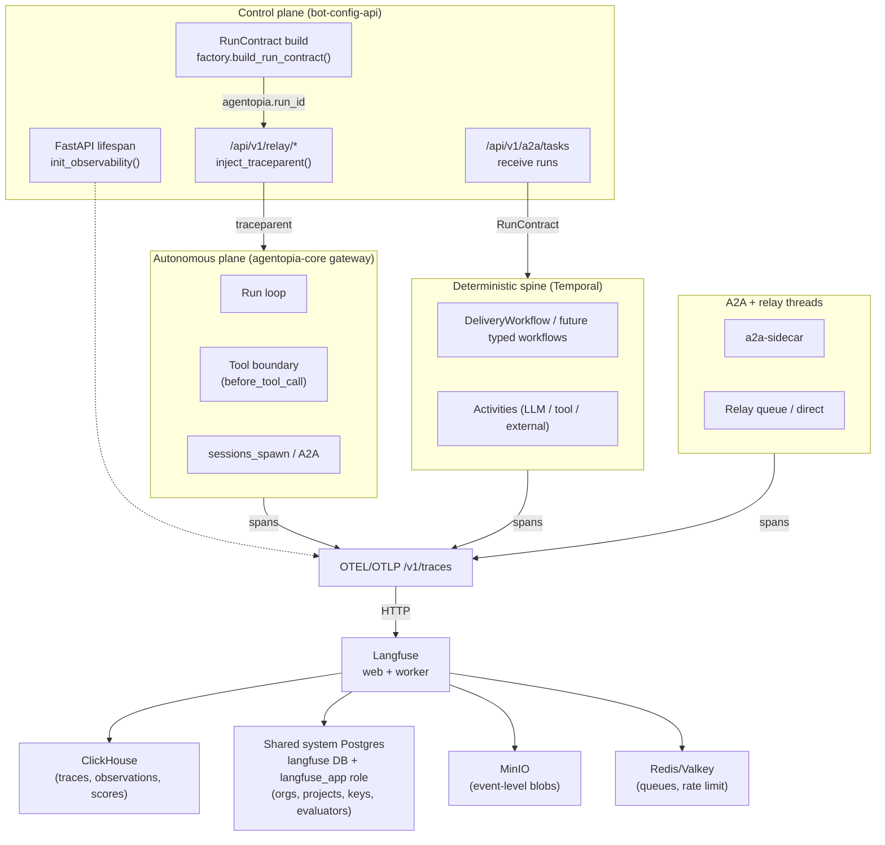
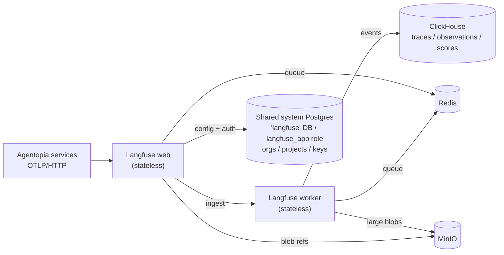

# H3 Observability — Production Design

**Status:** **Draft.** Phase-α deployment shape is specified and ready to implement. Production target is single-node (same deployment shape as phase α), with off-cluster backup/restore as the primary durability strategy. Single-node loss is an accepted outage at production. HA is explicitly deferred. Promotion criteria are in §14.5. Promotion is tracked at [ai-agentopia/docs#34](https://github.com/ai-agentopia/docs/issues/34).
**Date:** 2026-04-23 (revised 2026-04-24 — HA target removed; production = single-node + backup contract; 2026-04-24 — Postgres model fixed: external shared system Postgres, not subchart)
**Owner:** Platform Architecture
**Scope:** Design of the Agent Harness trace/eval subsystem in two explicitly separated architecture states — the phase-α deployment shape (dev/staging) and the production target (single-node, restore-from-backup, operationally hardened).
**Binding inputs:**
- [Harness Architecture](./harness-architecture.md) (B1)
- [ADR-015 — Trace Backend Selection: Langfuse](../../adrs/015-h3-02-trace-backend-langfuse.md) (backend decision)
- [Agent Harness Implementation Plan](../../milestones/agent-harness-implementation-plan.md) Phase H3
- `ai-agentopia/agentopia-protocol` groundwork PR [#487](https://github.com/ai-agentopia/agentopia-protocol/pull/487) (merged 2026-04-23)

This document specifies how the selected backend is deployed, integrated, and operated as a production service within Agentopia — at phase α and at the production steady state. It does **not** re-debate the backend choice.

### Two architecture states

This document intentionally specifies **two** architecture states, not one:

| State | Definition | Binding? |
|---|---|---|
| **Phase α** | What we deploy first. Non-HA, single-replica, on `local-path` storage. Dev/staging on the current single-node cluster. Chosen for operational simplicity at current volume (§11.1). Single-node loss is an accepted outage. Not yet production. | Yes, on the phase-α rollout. |
| **Production (single-node)** | The production target. **Same deployment topology as phase α** — single-node, `local-path`, single-replica for every backend. The distinction from phase α is **operational, not topological**: retention policy is enforced, off-cluster backup contract is active and rehearsed, auth is hardened, sizing is validated, all planes are emitting spans. **Single-node loss is still an accepted outage in production.** HA is explicitly deferred and is not part of this document's production target. | Yes. Gaps in §14 and §16 are blockers on promotion, not aspirations. |

**HA is not the production bar.** The previous revision of this document set an HA steady state as the production target. That target has been rescoped. Restore-from-backup is the durability strategy; automated failover is deferred. §14 consolidates the production commitments — backup contract, retention enforcement, auth, accepted risk register — so a reviewer can read that section and understand what production means here.

---

## 1. Executive Summary

The Agent Harness emits OpenInference-tagged OTLP spans keyed to a single `RunContract` envelope. ADR-015 selected **Langfuse (MIT core)** as the self-hosted trace/eval backend. This document turns that selection into a two-state service design: a phase-α deployment shape we can land now, and a production target (same single-node topology, operationally hardened) we commit to before calling the subsystem production-ready.

The observability subsystem is not a Helm chart. It is a contract with four parts: (1) a storage topology whose components each serve a distinct data class; (2) a tenancy model that maps Langfuse's organization/project primitives onto Agentopia's capability-class and lane structure; (3) an integration surface that every Agentopia plane — control-plane, autonomous-plane, deterministic spine, A2A threads — plugs into through the same `RunContract` identity; and (4) an operational model with explicit retention, backup, and SLO commitments. Helm renders the deployment; it does not own any of the four parts above.

Rollout is two phases followed by a production promotion gate. **Phase α** deploys the service in internal-only, single-replica form on `local-path` storage and wires the already-landed protocol-side groundwork to it. **Phase β** extends emission across `agentopia-core`, Temporal, and A2A boundaries without changing the deployment shape. **Production promotion** is the operational hardening gate (§14.5): retention enforced, backup contract active with verified off-cluster target, auth hardened, sizing validated, 30-day SLO burn-in. The deployment shape does not change at promotion — it is the operational commitments that gate it. HA hardening is explicitly deferred and is not on this rollout's critical path.

---

## 2. Scope and Status

### In scope
- Production topology for the Langfuse-based trace/eval surface.
- Tenancy mapping from Agentopia concepts (bots, capability classes, lanes) onto Langfuse primitives.
- Retention, backup, access, and scaling policy that the subsystem must satisfy.
- Integration points with every existing and in-flight Agentopia plane.
- Boundary between Helm rendering and architectural policy.

### Out of scope
- Re-deciding the backend (see ADR-015).
- Concrete Helm `values.yaml` content (lives with `ai-agentopia/agentopia-infra#163`).
- Exact chart versions (infra PR pins them).
- Eval-harness algorithms (WP-H3-03, separate work package).
- Checkpoint-policy contract shape (WP-H3-04..07, separate work package).
- `agentopia-core` instrumentation implementation (core-side work package, not this round).
- Multi-region / cross-cluster disaster recovery.

### Status of constituent work

| Area | State | Reference |
|---|---|---|
| Backend decision | Landed | ADR-015 |
| Protocol-side emission primitives | Landed | [PR #487](https://github.com/ai-agentopia/agentopia-protocol/pull/487) (merged 2026-04-23) |
| FastAPI lifespan bootstrap | Landed | `bot-config-api/src/observability/bootstrap.py` |
| Langfuse deployment | **Pending** | [`agentopia-infra#163`](https://github.com/ai-agentopia/agentopia-infra/issues/163) |
| `agentopia-core` span wiring | **Pending** | Core-side WP under [`agentopia-protocol#467`](https://github.com/ai-agentopia/agentopia-protocol/issues/467) umbrella |
| Temporal / A2A / relay span wiring | **Pending** | Sub-WPs under #467 umbrella |
| Eval harness integration | **Pending** | [`#469`](https://github.com/ai-agentopia/agentopia-protocol/issues/469) (WP-H3-03) |
| Checkpoint policy integration | **Pending** | [`#468`](https://github.com/ai-agentopia/agentopia-protocol/issues/468) (WP-H3-04..07) |

---

## 3. Selected Backend and Boundary

Langfuse (MIT core only) is the trace/eval backend. The boundary between what Langfuse owns and what Agentopia owns is fixed by two rules:

1. **Agentopia owns the wire format.** Spans leave every service as OTLP with OpenInference semantic conventions (`openinference.span.kind = AGENT|CHAIN|LLM|TOOL`) and Agentopia-native attributes (`agentopia.run_id`, `agentopia.intent`, `agentopia.lane`, `agentopia.execution_class`, `agentopia.capability_class`, `agentopia.run_contract.version`). This is the reversibility guarantee from ADR-015 — swapping backends is a deployment change, not a code rewrite. The wire format is defined in `bot-config-api/src/observability/semconv.py` and is binding on every future Agentopia service that emits traces.
2. **Langfuse owns storage and query.** Ingestion, schema, querying, UI, and score/eval APIs are Langfuse's responsibilities. Agentopia does not extend Langfuse's schema or fork its UI. Custom attributes are displayed as-is; they are not modeled as first-class dimensions.

The `ee/` modules of Langfuse (covered by the Langfuse Enterprise License) are **never enabled**. This constraint is binding at deploy time (`langfuse.licenseKey` unset) and at change-review time (no PR may introduce a dependency on an EE-gated feature).

---

## 4. Integration with Current Agentopia System

The observability subsystem is not a new lane. It is a silent observer attached to every existing plane through a single correlation identity: `RunContract.run_id`. Every plane produces spans; Langfuse correlates them into one trace per run.

### 4.1 Topology overlay



### 4.2 Integration points per plane

| Plane | Today | With observability | Owned by |
|---|---|---|---|
| `bot-config-api` (control plane) | RunContract built in `domain/run_contract/factory.py`; observability bootstrap on FastAPI lifespan | Emits lifespan span + RunContract build span; `relay.py` injects `traceparent` into outgoing calls to gateway | **Landed** (PR #487) |
| `agentopia-core` gateway (autonomous plane) | Runs per-turn loop; plugin hook `before_tool_call`; R1/R2/R3 rails | Emits run span (parent), tool-call spans (`openinference.span.kind=TOOL`), LLM spans (`openinference.span.kind=LLM`). R1/R2/R3 block events are span attributes, not separate spans | **Pending** (subsequent PR) |
| Temporal workflows | `DeliveryWorkflow`, future typed workflows | Workflow-start activity extracts inbound `traceparent` from RunContract; each activity is a child span. Workflow IDs appear as span attributes, not span IDs | **Pending** |
| A2A / relay threads | `a2a-sidecar` + `a2a_protocol/` mounts; relay direct + queue | `extract_traceparent()` on inbound; `inject_traceparent()` on outbound calls; thread checkpoint events are spans with `agentopia.checkpoint.outcome` | **Pending** (primitives exist; call sites pending) |
| `sessions_spawn` subagents | Bounded child executions (only final message returns) | Child span under parent run span; spawn boundary carries `agentopia.parent_run_id` to disambiguate | **Pending** |
| Future eval harness (WP-H3-03) | — | Scores written to Langfuse's `/api/public/scores` API keyed by `RunContract.run_id`; evaluator is an out-of-band process reading the trace surface | **Pending** |
| Future checkpoint/approval (WP-H3-04..07) | Three existing insertion points (DeliveryWorkflow, work-item, A2A thread) | Each checkpoint decision is an attribute on the span at whichever boundary fires; the policy matrix does not unify them into a single span type | **Pending** |

### 4.3 Correlation model

- **Primary key: `agentopia.run_id`.** Carried by every span. Set on RunContract construction. Every service reads it off the contract rather than minting its own.
- **W3C `traceparent`** carries the trace ID across process boundaries. Extracted and validated on ingress; injected on egress. Validation (`extract_traceparent`) drops malformed values rather than propagating — a bad upstream cannot corrupt downstream correlation.
- **Attribute-based grouping** replaces schema extension. Langfuse's `trace` dimension is `run_id`; its `tag` filters are keyed on `agentopia.intent`, `agentopia.lane`, `agentopia.capability_class`. We do not add tables, columns, or custom trace types.
- **What is NOT a span.** Checkpoint outcomes, R1/R2/R3 block events, and R3 loop-detection warnings are **attributes on the span that triggered them**, not standalone span types. This keeps the trace narrative clean: one span per executed action.

### 4.4 Emission contract (what every Agentopia service must do)

1. Read `OTEL_EXPORTER_OTLP_ENDPOINT` from env. No hard-coded URLs.
2. Call `init_observability()` (Python) or the TypeScript equivalent on process boot.
3. Tag every span with `agentopia.*` attributes from the current `RunContract`.
4. Honor `traceparent` on ingress; inject it on egress.
5. Drop emission silently when the endpoint is unset. Observability is **never** a hard dependency of a user-facing code path.

---

## 5. Storage Topology

Langfuse has four storage backends, each serving a distinct data class. The architectural rule is that no data class moves between backends without a design change here.

### 5.1 Component inventory

Two columns: the phase-α deployment shape and the production target. Phase β does **not** change either column — it only extends emission coverage; deployment shape is unchanged at production promotion.

**Both columns use the same single-node topology.** The production column is not a topology upgrade — it records the operational commitments that must be active at production (retention DDL, off-cluster backup, auth, sizing validation). HA is deferred and does not appear in either column.

| Component | Purpose | Phase α (ship now) | Production target (§14) |
|---|---|---|---|
| Langfuse web | UI + REST/OTLP ingest + scores API | Stateless; 1 replica | Same: 1 replica. |
| Langfuse worker | Async ingestion, batch insert to ClickHouse, score processing | Stateless; 1 replica | Same: 1 replica. |
| Postgres | Orgs, projects, users, API keys, datasets (config), prompts, evaluator configs | **External: shared system Postgres.** `postgresql.enabled: false` in chart. Dedicated `langfuse` database + `langfuse_app` role. DSN from Vault. See §5.4 for the full boundary spec. | Same — no topology change. **Backup: covered by shared system Postgres WAL archiving.** See §9.1 and §14.3. |
| ClickHouse | Traces, observations, scores (high-volume event data) | Standalone; **chart default 3 replicas overridden to 1**; `local-path` PVC | Same: 1 replica, `local-path`. **Backup active**: weekly `BACKUP TABLE` + nightly `BACKUP INCREMENTAL` to off-cluster target. **Retention DDL active** (§8). |
| Redis / Valkey | Ingestion queues, rate limits, cache | Standalone; 1 replica; `local-path` PVC | Same: standalone. No backup (ephemeral queue). Loss tolerated per §9.2. |
| MinIO | Event-level blob storage (large prompt/completion bodies exceeding inline threshold); future trace exports | Standalone; `local-path` PVC | Same topology. **Off-cluster mirror active**: `mc mirror` to off-cluster target per §9.1. |

### 5.2 Why this split

- Langfuse's schema separation between Postgres (transactional / configuration) and ClickHouse (append-only event) is load-bearing. **Do not collapse these** into a single backend even if operationally tempting; doing so erases the performance characteristics the backend was designed around.
- **Postgres is external.** It is the shared system Postgres, not a Langfuse subchart pod. See §5.4 for the exact boundary (dedicated database, dedicated role, Vault DSN). This means Postgres PVC, Postgres pod, and Postgres subchart lifecycle are **not** Langfuse's operational surface — they belong to the shared system.
- ClickHouse is the single heavy tenant within Langfuse's own deployment. It is the dominant disk consumer, the slowest to back up, and the likely source of operational incidents on the Langfuse side. Sizing and monitoring attention concentrates here.
- Redis is ephemeral. No backup target. Loss of Redis drops the current queue window but does not lose committed traces.
- MinIO is the escape hatch for data that doesn't belong in either relational or column-store backends. Agentopia uses it for large payload blobs; long-term, it also holds retention-exported ClickHouse parts (see §8).

### 5.3 What runs where (at a glance)



### 5.4 External Postgres boundary

Langfuse's Postgres dependency is satisfied by the **cluster-level shared system Postgres** — the same Postgres instance used by other Agentopia services. Langfuse does **not** deploy its own Postgres pod or PVC. In Helm chart terms: `postgresql.enabled: false`; Langfuse connects via an external DSN.

The boundary is defined by four invariants an infra engineer can implement without ambiguity:

**Database isolation.** A dedicated PostgreSQL database named `langfuse` is created within the shared Postgres instance. No other Agentopia service's tables live in this database. Cross-service joins do not happen at the database layer — each service's data lives in its own named database.

**Role isolation.** A dedicated Postgres role `langfuse_app` is created with minimum required privileges:

```sql
CREATE ROLE langfuse_app WITH LOGIN PASSWORD '<vault-managed-password>';
CREATE DATABASE langfuse OWNER langfuse_app;
GRANT CONNECT ON DATABASE langfuse TO langfuse_app;
```

`langfuse_app` has no access to other databases on the shared Postgres. It is not a superuser. It cannot create roles or alter system-level settings. Connection-level permissions are scoped to the `langfuse` database only.

**Vault-managed DSN.** The full database connection string is stored as a single opaque secret at Vault path `secret/langfuse/postgres-dsn`. Its value is:

```
postgres://langfuse_app:<password>@<shared-postgres-service>.<namespace>.svc.cluster.local:5432/langfuse?sslmode=require
```

Langfuse web and worker receive this via the same Vault init-container pattern used by other Agentopia services — the DSN is written to an env file before the main process starts. The password is **never** chart-generated and is **never** stored in a K8s Secret directly. Rotation is: update `secret/langfuse/postgres-dsn` in Vault → restart Langfuse web + worker pods. No chart re-render required.

**Migration ownership.** Langfuse runs its own Prisma migrations against the `langfuse` database at container startup (executed by the `langfuse-worker` init step). Agentopia infra does **not** apply or manage Langfuse migrations. Migrations are:
- Scoped entirely to the `langfuse` database — no cross-database effects
- Idempotent (`prisma migrate deploy` is safe to re-run on any restart)
- Version-pinned: chart version upgrades may introduce new migrations; this is expected. Pin chart versions; test migrations in `observability-restore-test` namespace before applying to production.

**Backup and restore implications.** The `langfuse` database is included in the shared system Postgres WAL archiving and backup schedule. There is no separate Langfuse-specific Postgres backup mechanism:

- The shared Postgres backup must be confirmed operational before observability production promotion (§14.5 criterion 4 — "Backup contract active" — explicitly includes Postgres WAL archives as part of the shared system backup).
- A Langfuse-only point-in-time restore can be performed by restoring the `langfuse` database from the shared WAL stream or a named database dump — it does not require restoring all service databases simultaneously.
- After any Postgres restore, Langfuse pods must be restarted after confirming: (a) the `langfuse` database is present, (b) the `langfuse_app` role exists with correct grants, (c) Langfuse migration state matches the deployed chart version (re-run `prisma migrate deploy` if uncertain).
- Connection pool sizing: confirm that `max_connections` on the shared Postgres has headroom for Langfuse web + worker connection pools on top of existing service connections. This is a one-time pre-deploy check.

**What "external Postgres" changes about the deployment:**

| Old assumption | Corrected model |
|---|---|
| `postgresql.enabled: true` in chart | `postgresql.enabled: false` |
| Chart manages Postgres pod + PVC + passwords | Infra manages `langfuse` DB + role creation; Vault manages DSN |
| Postgres password is a chart-generated K8s Secret | DSN is a Vault-managed secret at `secret/langfuse/postgres-dsn` |
| Postgres backup is a Langfuse subchart concern | Backup covered by shared system Postgres WAL archiving |
| Postgres HA is a Langfuse decision (CNPG etc.) | Postgres HA is the shared system's concern, not this subsystem's |

The wiring of the external DSN is tracked at [`agentopia-infra#170`](https://github.com/ai-agentopia/agentopia-infra/issues/170) (create `langfuse` database, `langfuse_app` role, Vault secret, chart config). This is a prerequisite for [`#163`](https://github.com/ai-agentopia/agentopia-infra/issues/163).

---

## 6. Data Placement Model

This is the rule a reviewer can apply without reading the Langfuse codebase: given a new piece of data, which backend does it go into?

| Data class | Backend | Rationale |
|---|---|---|
| Spans, observations, scores (high-volume, append-only, queried analytically) | ClickHouse | Columnar; TTL-native; this is what it's for |
| Organizations, projects, API keys, users (small, transactional, consistency-critical) | Postgres | ACID; foreign-key integrity; auth surface |
| Dataset definitions, evaluator configs, prompt templates, score definitions (config, not events) | Postgres | Versioned; joined with RBAC; rarely queried |
| Per-run large prompt/completion bodies (bytes, not metadata) | MinIO | Object-sized blobs don't belong in ClickHouse rows |
| In-flight ingestion events, UI session caches, rate-limit counters (ephemeral) | Redis | TTL-native; loss is tolerable within seconds |
| Exported ClickHouse parts for long-term retention | MinIO | §8 cold tier target |
| Langfuse EE features (SCIM, audit logs, retention automation) | **N/A — not enabled** | License boundary |

Agentopia **does not** add tables to Langfuse's Postgres, indexes to its ClickHouse, or buckets to its MinIO outside the chart's defaults. Anything that needs custom storage lives elsewhere in Agentopia (e.g., the H2 artifact store, which is separate from traces — see [WP-H2-02](../../milestones/agent-harness-implementation-plan.md)).

---

## 7. Tenancy and Isolation Model

Langfuse's MIT core provides multi-organization and multi-project tenancy out of the box. Fine-grained project-level RBAC roles are Enterprise-gated; coarse project-level isolation is not. Agentopia maps its own primitives onto these two levels as follows:

### 7.1 Mapping rule

| Agentopia concept | Langfuse concept | Cardinality | Reason |
|---|---|---|---|
| Agentopia deployment (the cluster as a whole) | **Organization** | 1 | One ops boundary; no cross-deployment sharing |
| Agentopia lane × class (e.g., `autonomous/worker`, `deterministic/admin`) | **Project** | ~6–8 | Each project gets its own API key set; blast radius of a leaked key is bounded |
| Specific bot | **Trace tag** (`agentopia.bot_id`) | N | Tag, not project — avoids project-explosion as bot count grows |
| Specific run | **Trace** (primary key `run_id`) | N | One trace per `RunContract` instance |

### 7.2 Why project-per-lane-class, not project-per-bot

Per-bot projects look clean but have two problems at scale: (1) Langfuse's UI lists projects flat; dozens of bots become unnavigable. (2) API-key rotation is a per-project operation; per-bot keys multiply rotation cost linearly with bot count. Per-lane-class projects cap the project count at the class ladder size, keep navigation finite, and still isolate blast radius at the meaningful boundary (a leaked Worker-class key cannot post as an Admin-class run).

Agentopia retains bot-level grouping via the `agentopia.bot_id` trace attribute. Langfuse filters traces by tag, so "show me all traces for bot X" remains a one-click operation without requiring its own project.

### 7.3 Isolation limits we accept

- **No fine-grained RBAC within a project** in the MIT build. Anyone with VIEWER on the Worker project sees all Worker-lane traces. This is acceptable because Agentopia's operator population is already a small trusted set; if that changes, the decision is to add project splits (architecture change), not to enable `ee/` RBAC.
- **No audit log in MIT core.** Access events to Langfuse itself are not recorded. Mitigation: restrict Langfuse UI access to operators and emit the restriction via NetworkPolicy + ingress rules; operator actions inside Langfuse are not individually attributable.
- **No protected prompt labels.** Prompt template versioning works, but "only admins may publish production" is not enforced. Process-level controls apply (reviewer in PR), not system-level.

### 7.4 Organization and project bootstrap

Project creation is a **one-time operator action**, not an automated CRD. The bootstrap set is fixed at §7.1; it does not grow with bot count. Subsequent bot additions do **not** create new projects — they produce traces in the correct existing project based on their capability class and lane.

---

## 8. Retention and Lifecycle Policy

Langfuse OSS has no automatic retention. Agentopia implements retention as a three-tier policy enforced at the ClickHouse layer.

### 8.1 Tiers

| Tier | Duration | Where | How it gets there | How it leaves |
|---|---|---|---|---|
| Hot | 0–30 days | ClickHouse (primary) | Live ingest | ClickHouse `TTL` clause on event tables |
| Warm | 30–90 days | ClickHouse (same disk, marked cold) | `TTL ... TO DISK 'cold'` if dedicated cold volume exists; else stays on primary but lower-priority | Auto-drop at 90 days |
| Cold / archive | 90 days – 2 years | MinIO (exported parts) | Scheduled `BACKUP TABLE` export per week | Lifecycle rule auto-deletes at 2 years |

The TTL values above are the architectural targets; the Helm chart does not set them natively. See §13.

### 8.2 Scoped exceptions

- **Deterministic lane traces** (workflow-bound runs that feed audit surfaces) get 180 days hot, not 30. `agentopia.lane = deterministic` drives the retention override via a separate ClickHouse table or TTL condition.
- **Traces with `openinference.span.kind = AGENT` at the root** representing top-level user-visible runs get the same 180-day treatment even in the autonomous lane — this is what a user asking "what did the bot do last quarter?" needs to resolve.
- **Score-carrying traces** (anything with an attached score from the eval harness) get 1 year hot-path retention because the score is part of the eval corpus.

### 8.3 What gets purged vs what persists

- Spans + observations purge per §8.1.
- Scores and dataset runs **persist in Postgres** (not ClickHouse) at Langfuse's discretion. Those rows are configuration-like and do not grow unboundedly.
- Prompt templates persist indefinitely (versioned Postgres rows).
- MinIO blobs inherit the lifecycle of the ClickHouse part that referenced them — they must be GC'd when the parent tier expires. A reconcile job verifies no orphaned blobs remain.

### 8.4 Open question

- Exact ClickHouse TTL SQL — whether to use `TTL ... TO DISK 'cold'` (requires a second storage class) or `TTL ... DELETE` with weekly export — is a deploy-time decision. The architectural invariant is: **no trace is silently lost before 30 days, and no trace persists past 2 years without explicit legal hold.**

---

## 9. Backup and Restore

### 9.1 Per-component backup policy

These RPO/RTO targets apply to both phase α and production (same single-node topology). The targets are intentionally modest — observability is not on the user critical path, and restore-from-backup is the durability model.

| Component | Backed up? | Method | RPO | RTO | Restore cost |
|---|---|---|---|---|---|
| Postgres (`langfuse` database) | **Yes — covered by shared system Postgres backup** | WAL archiving via shared system Postgres backup job (continuous); `pg_dump` of the `langfuse` database as part of shared nightly dump | 15 min (WAL) | 30 min (database-level restore) | Low — standard restore of named database |
| ClickHouse | **Yes** | `BACKUP TABLE` to off-cluster target weekly + `BACKUP INCREMENTAL` nightly | 24 hr | 2 hr | Medium — depends on data volume |
| Redis | **No** | — | N/A | N/A | Queue state rebuilt from next-day traffic |
| MinIO | **Yes** | `mc mirror` to off-cluster target weekly | 7 days | Manual | Medium — re-sync |
| Langfuse secrets (encryption key, NEXTAUTH secret, Postgres DSN) | **Yes** | Vault path `secret/langfuse/*` | Vault-backed | Immediate | Zero data loss; secrets never leave Vault |


### 9.2 Why these RPOs

- The `langfuse` database on the shared Postgres is the RBAC and configuration source of truth for Langfuse. Losing 15 minutes of config changes is tolerable; losing 24 hours means re-adding API keys manually. The shared system WAL-archiving keeps the second case out. The backup obligation is inherited from the shared system — Langfuse does not need a separate Postgres backup mechanism, but the shared system backup must be confirmed active (§14.5 criterion 4).
- ClickHouse is event data, append-only. A 24-hour gap loses one day of traces but does not corrupt existing traces. Traces are not a critical path to user-facing function; a 24 hour RPO is the right economic trade-off.
- Redis is pure queue. Its RPO is **irrelevant** — any in-flight span batches lost on Redis failure are re-emitted by the client's retry path (OTLP clients default to exponential retry on 5xx).

### 9.3 Restore rehearsal

**Quarterly** at both phase α and production, against a restore target namespace `observability-restore-test`. Non-completion for two consecutive quarters is a production incident. The rehearsal measures actual RTO, confirms MinIO → Postgres → ClickHouse restore sequencing, and validates that traces ingested post-restore correlate with historic traces. Monthly rehearsal is not required — it would be appropriate for an HA-with-automated-failover target but is not proportionate to a restore-from-backup model.

### 9.4 Vault dependency

Backup encryption keys live in Vault under `secret/langfuse/*`. Restore requires Vault to be up. A Vault outage during a restore is a **known risk** with no workaround — it inherits the Vault-is-dependency-of-many-things property Agentopia already accepts (gateway reads LLM API keys from Vault; per project CLAUDE.md).

---

## 10. Access Control and Internal Exposure

### 10.1 UI access

- **Phase α authentication:** Langfuse's built-in email+password, gated to a fixed operator allowlist. Acceptable at the current operator set size.
- **Production steady-state target:** OIDC (Google or an internal SSO), email+password disabled at the Langfuse `auth.*` level. Operator allowlist enforced through the identity provider, not through a local user table. SAML is Enterprise-only and therefore not a target.
- **Authorization (both states):** OWNER / MEMBER / VIEWER at the project level. Default grant for a new operator is VIEWER on all projects and MEMBER on the project matching their primary lane. OWNER role is reserved for platform admins.
- **Exposure:** **Internal-only in both states.** Reached via cluster VPN or Traefik IngressRoute restricted by NetworkPolicy. **No public DNS entry in either state.** An operator tunnels via `kubectl port-forward` or the VPN; the Mintlify docs site does **not** link to the UI.

### 10.2 Service-to-service authentication

- Each project has two API keys (public + secret). Emitter services read the secret key from a K8s Secret sourced from Vault (`secret/langfuse/<project>-secret-key`).
- **One key per project, not per service.** Agentopia services emit into projects keyed by their lane × class, not by identity. A leaked `bot-config-api` key does not escalate privilege over the lane boundary because all services in that lane share the same scope.
- Rotation: quarterly by ops, or immediately on suspected leak. Rotation = new key in Vault, pod restart — the chart does not need to re-render.

### 10.3 Network policy

- Ingress: NetworkPolicy allows traffic to Langfuse web pod only from (a) operator VPN range, (b) in-cluster services that emit traces.
- Egress from Langfuse: allowed to (a) the shared system Postgres service on port 5432, scoped to the `langfuse` database via the `langfuse_app` role; (b) ClickHouse, Redis, MinIO pods in the same namespace. Denied to the public internet by default (no outbound LLM calls, no webhook exports without explicit policy grant).
- OTLP ingest endpoint (`/api/public/otel`) is **cluster-internal only**. Services resolve it via `http://langfuse-web.agentopia.svc.cluster.local:3000/api/public/otel`.

### 10.4 Secret surfaces

| Secret | Storage | Consumed by |
|---|---|---|
| Langfuse encryption key | Vault `secret/langfuse/encryption-key` | Langfuse web + worker |
| Langfuse NEXTAUTH secret | Vault `secret/langfuse/nextauth` | Langfuse web |
| Project secret API keys | Vault `secret/langfuse/<project>-secret-key` | Each Agentopia emitter service |
| **Langfuse Postgres DSN** | **Vault `secret/langfuse/postgres-dsn`** (full DSN string) | Langfuse web + worker (via Vault init-container) |
| ClickHouse password | Chart-generated on first install, stored in K8s Secret | Langfuse web + worker internally |
| MinIO access key + secret | Chart-generated on first install, stored in K8s Secret | Langfuse web + worker internally |

---

## 11. Scaling Assumptions and Capacity Notes

### 11.1 Working baseline

Estimated span volume at current bot count:

- Bots: ~10 active, ~20 in catalog
- Turns per active bot per day: ~100 (autonomous) + ~50 (deterministic)
- Spans per turn: ~20 (1 run + 5 tool + 10 LLM + 4 A2A/child)
- **Daily span ingest: ~30k**
- Observations per span: ~1.5 (some spans have no observation; some have several)
- **Daily observation ingest: ~45k**

This fits comfortably in a single-replica ClickHouse on `local-path` storage + the shared system Postgres (Langfuse adds a small connection pool to an existing shared instance; at current volume the shared Postgres is not a capacity bottleneck).

### 11.2 Capacity triggers

The architecture holds until one of the following is breached:

| Trigger | Current ceiling | Action |
|---|---|---|
| Sustained daily span ingest | 500k | Raise ClickHouse replicas to 2 (no HA, but parallel ingest) |
| ClickHouse disk usage | 85% of PVC | Extend PVC or tighten hot-tier TTL |
| Shared Postgres connection count (Langfuse pool) | 80% of `max_connections` headroom | Review connection pool settings; no schema change needed |
| Redis sustained memory | 80% of `maxmemory` | Increase Redis memory or shard; not expected before a 10× traffic event |
| Ingest latency p99 | 5s | Investigate worker saturation first; replicate before sharding |
| Concurrent UI operators | 10 | Raise Langfuse web replicas (stateless) |

These triggers are **observed-then-act**, not pre-emptive. We do not over-provision on day one.

### 11.3 What explicitly does not scale horizontally — and HA deferral

All stateful backends run single-replica in both phase α and production. This is an **explicit, accepted constraint** — not a phase-α shortcut that production is expected to fix. HA hardening is deferred (§14.4).

- **ClickHouse** is single-replica. Scaling to ≥ 2 replicas for ingest parallelism is possible without HA; true HA (ReplicatedMergeTree + Keeper) is deferred.
- **MinIO** is single-node. Distributed-mode erasure coding is deferred.
- **Redis** is standalone. Sentinel topology is deferred.
- **Postgres** — not applicable here. Postgres is the shared system Postgres, not a Langfuse-deployed component. Any HA decision for the shared Postgres belongs to the shared system's operational model, not to the observability subsystem.

ClickHouse, MinIO, and Redis fail over by restore-from-backup. That is the production model for Langfuse-owned components.

### 11.4 Capacity-driven scaling path

If Agentopia grows to 100+ active bots, these triggers fire: (1) ClickHouse replica increase for ingest parallelism, (2) Postgres read replica for query load, (3) Redis sizing. None of these constitutes HA — they are load-handling steps that remain inside the single-failure-domain model. HA — should it ever be prioritized — is a separate, future architecture decision, not a capacity-scaling step.

---

## 12. SLO / Ownership / Operational Model

### 12.1 SLOs

Two targets per dimension: a looser **phase-α** target acceptable during initial rollout, and a **production (single-node)** target that promotion depends on. When production targets are met for ≥ 30 continuous days the subsystem exits draft status. There is no HA SLO target — single-node loss is an accepted outage in production.

| Dimension | Phase α | Production (single-node) | Rationale |
|---|---|---|---|
| Langfuse web availability (ingest endpoint reachable) | **99.0%** over 30 days | **99.5%** over 30 days | Observability is not on the user critical path, but in production it should not be the weak link |
| Span ingest success rate (5xx-free over 30 days) | **99.5%** | **99.9%** | Dropped spans silently degrade investigations |
| Ingest latency p99 (OTLP request → persisted) | **5 seconds** | **3 seconds** | Single-replica single-node target; no HA write path |
| UI query p95 (single-trace load) | **2 seconds** | **2 seconds** | Same hardware; no improvement expected at single-node |
| Backup completion (Postgres nightly) | **99% of days** | **99% of days** + WAL archiving to off-cluster | No silent backup gaps at production; WAL archiving is the upgrade |
| Backup completion (ClickHouse) | **99% of weeks** (weekly full) | **99% of weeks** full + **99% of days** incremental | Tighter RPO (§9.1) |
| Time-to-detect data loss | **< 24 hours** | **< 24 hours** | Same detection mechanism; active ingest-health alarm still target for a future improvement |
| Single-node-loss tolerance | Outage acceptable | **Outage accepted** (node loss = recovery from backup) | Accepted risk — see §14.2 |

### 12.2 Error budget

Observability has an explicit **1% monthly error budget** for availability. When burned, the response is to freeze non-urgent Langfuse changes (chart upgrades, retention-policy changes), **not** to escalate load shedding.

### 12.3 Ownership

- **Platform team** owns the subsystem end-to-end. No separate observability team.
- **On-call rotation** is shared with the gateway/runtime rotation. Observability does not have its own pager. Page-worthy conditions are limited to: (a) ingest failure > 5% over 10 min; (b) ClickHouse disk > 90%; (c) Langfuse web returning 5xx for > 5 min. Shared Postgres alerts belong to the shared system on-call rotation, not to this subsystem.
- **Change review**: any PR that changes retention, tenancy mapping, or the emission contract requires the same reviewer as the `bot-config-api` observability module.

### 12.4 Runbook surface

- Dashboard: Langfuse's built-in UI is the trace runbook. No custom Grafana dashboards are added for trace-level signals.
- Infrastructure signals (disk, CPU, queue depth) go into the existing cluster observability surface (Prometheus / existing Grafana), **not** into Langfuse itself — Langfuse is the subject, not the monitor. Circular dependency is forbidden.
- Incident response doc: lives at `docs/operations/observability-incident-response.md` (to be authored alongside the first deploy, not in this round).

---

## 13. Deployment Boundary (Helm vs Architecture)

The Helm chart is a **renderer**. It takes architectural policy and produces YAML. It does not own policy. The split is strict.

### 13.1 What Helm renders

- Image tags, resource requests/limits, replica counts (subject to the ceilings in §11).
- Service ports, probes, init containers.
- Secret mount paths.
- PVC sizes.
- Subchart toggles (`clickhouse.enabled`, `redis.enabled`, `s3.deploy`). **`postgresql.enabled` is always `false`** — Postgres is external (§5.4); Helm does not deploy a Postgres pod.
- Ingress objects (once phase β permits a restricted ingress).

### 13.2 What architecture owns

- The **selection** of Langfuse as the backend (ADR-015).
- The **tenancy mapping** from Agentopia primitives to organizations/projects (§7).
- The **retention TTL targets** (§8) — applied via post-install ClickHouse DDL or an init-job, **not** chart values.
- The **emission contract** (§4.4) — binding on every Agentopia service, enforced by PR review of the observability module.
- The **API-key-per-project** scope rule (§10.2) — project-key allocation is manual and one-time.
- The **no-license-key invariant** — `langfuse.licenseKey` MUST remain unset. Any chart upgrade that changes this default requires architectural review.
- The **no-public-ingress invariant** — binding on every deploy environment including production.
- The **external Postgres boundary** (§5.4) — dedicated `langfuse` database, `langfuse_app` role, Vault DSN path, migration ownership. These are architecture decisions; the Helm chart only reads the DSN from Vault. Any change to the Postgres connection model requires updating §5.4, not just the chart.

### 13.3 Values reconciliation rule

When a new chart version introduces a value, the rule is:
1. If the default aligns with an architectural policy here, accept the default.
2. If the default deviates (example: `clickhouse.replicaCount: 3`), override in our values file and add a comment referencing the §11.3 rationale.
3. Never accept a new default that conflicts with the license boundary (§3) or the no-public-ingress invariant (§10.3) without updating this document first.

---

## 14. Production Target — Single-Node, Restore-from-Backup

This section consolidates every commitment that defines "production" for the observability subsystem under the single-node model. A reviewer can read this section and understand what production means, what risks are accepted, and what must be true before the subsystem is promoted.

### 14.1 What "production" means at single-node

Production for the observability subsystem does **not** mean HA, automated failover, or multi-node failure domain. It means:

1. **Retention policy is enforced.** ClickHouse TTL DDL is applied and verified live. Traces are not silently accumulating without a retention bound.
2. **Backup contract is active.** Nightly Postgres `pg_dump` + continuous WAL archiving to an off-cluster target. Weekly ClickHouse `BACKUP TABLE` + nightly incremental to the same off-cluster target. MinIO weekly `mc mirror` to off-cluster.
3. **Off-cluster backup target is resolved.** [`agentopia-infra#168`](https://github.com/ai-agentopia/agentopia-infra/issues/168) must be closed — "backing up a cluster to itself is not a backup."
4. **Restore rehearsal has passed.** At least one successful end-to-end restore from the off-cluster target has been executed in `observability-restore-test` namespace, with documented RTO.
5. **Auth is hardened.** Operator allowlist enforced; API keys for each project in Vault; project-key rotation procedure documented.
6. **Sizing is validated.** Capacity review against §11.2 triggers has been run; no trigger is in breach.
7. **Integration is complete.** All planes (gateway, Temporal, A2A) are emitting spans (phase β exit criterion met).
8. **Incident runbook exists.** `docs/operations/observability-incident-response.md` exists with at least the restore sequencing procedure.

None of these require topology change. The deployment shape is identical at production and phase α.

### 14.2 Accepted risks in single-node production

These risks are **explicitly accepted** for single-node production. They are not gaps to be tracked as blockers — they are the known limitations of this target. Anyone claiming the observability subsystem is "HA" or "resilient to node loss" after promotion is misstating the state.

| Risk | Accepted? | Consequence | Mitigation |
|---|---|---|---|
| Node loss = full subsystem outage | **Yes** | Traces dropped during outage; OTLP clients retry but eventually give up; UI unreachable | Restore from off-cluster backup on node recovery; outage window traces are not reconstructed |
| Disk failure = data loss up to last backup | **Yes** | Postgres: up to 15 min loss (WAL archiving). ClickHouse: up to 24 hr loss (nightly incremental). MinIO blobs: up to 7 days loss (weekly mirror) | Off-cluster backup target covers catastrophic disk failure; backup RTO ~ hours not minutes |
| No automated failover for any backend | **Yes** | Recovery requires manual restore; operator-in-the-loop | Off-cluster backup + restore rehearsal + runbook are the recovery path |
| Shared system Postgres outage = Langfuse config/auth loss | **Yes** | If the shared system Postgres is unavailable, Langfuse cannot authenticate inbound spans or serve the UI; ClickHouse data is unaffected and intact | Shared system Postgres backup (WAL archiving) covers recovery; Langfuse-specific restore procedure documented in §5.4; key rotation after restore is manual |
| Redis standalone queue loss on restart | **Yes** | In-flight span batches in Redis queue at time of failure are lost; OTLP retry paths at the emitter absorb this | Accepted per §9.2 rationale |

### 14.3 Backup/restore contract (primary durability mechanism)

At production, off-cluster backup is the only durability guarantee. The backup contract must be explicitly active:

| Component | Backup method | Target | RPO | RTO |
|---|---|---|---|---|
| Postgres `langfuse` DB | Covered by **shared system Postgres WAL archiving + nightly dump**. No Langfuse-specific Postgres backup job. Pre-condition: shared system backup must be confirmed operational. | Shared system off-cluster backup target | 15 min (WAL) | 30 min (named database restore) |
| ClickHouse | Weekly `BACKUP TABLE` + nightly `BACKUP INCREMENTAL` | Off-cluster target per [`#168`](https://github.com/ai-agentopia/agentopia-infra/issues/168) | 24 hr | 2 hr |
| MinIO | Weekly `mc mirror` | Same off-cluster target | 7 days | Manual re-sync |
| Redis | None (ephemeral) | N/A | N/A | N/A |
| Langfuse secrets (encryption key, NEXTAUTH, Postgres DSN) | Vault path `secret/langfuse/*` | Vault-backed | Vault-backed | Immediate |

**Off-cluster backup target** is a production blocker for ClickHouse and MinIO backups — tracked at [`agentopia-infra#168`](https://github.com/ai-agentopia/agentopia-infra/issues/168). Postgres backup is handled by the shared system.

### 14.4 HA deferral

HA for any component of the observability subsystem is explicitly deferred. This is not an open question — it is a decision.

| Deferred item | What it would require | Why deferred |
|---|---|---|
| ClickHouse HA (ReplicatedMergeTree + Keeper) | ≥2 CH replicas + 3-node Keeper quorum, ≥3 cluster nodes | Cluster is single-node; adds significant operational complexity |
| Redis Sentinel | 1 primary + 2 replicas + 3 Sentinels, ≥3 cluster nodes | Same |
| MinIO distributed mode | ≥4 drives across ≥4 nodes | Same |
| ≥3 worker node cluster expansion | Physical or VM provisioning | Prerequisite for any of the above; not currently planned |

**Postgres HA is not listed here.** Postgres is the shared system Postgres; its HA model is the shared system's concern, not the observability subsystem's. Changes to the shared Postgres HA posture do not require an update to this document.

If HA is ever revisited for ClickHouse/Redis/MinIO, it requires: (a) cluster expansion to ≥3 worker nodes, (b) a new architecture decision round, and (c) updates to this document.

### 14.5 Promotion criteria (Draft → Accepted — production)

This document exits "Draft" status and becomes "Accepted — production" only when **all** of the following are true:

1. Phase β exit criterion met: end-to-end trace observable in Langfuse UI spanning gateway → plugin → Temporal → A2A.
2. Retention DDL active: ClickHouse TTL clauses applied; hot-tier coverage confirmed for ≥ 7 days.
3. External Postgres boundary wired ([`#170`](https://github.com/ai-agentopia/agentopia-infra/issues/170) closed): `langfuse` database created, `langfuse_app` role created with correct grants, Vault secret `secret/langfuse/postgres-dsn` populated, chart deployed with `postgresql.enabled: false`.
4. Off-cluster backup target resolved ([`#168`](https://github.com/ai-agentopia/agentopia-infra/issues/168) closed): a real off-cluster destination for ClickHouse BACKUPs and MinIO mirror. Shared system Postgres backup must also be confirmed operational (it covers the `langfuse` database).
5. Backup contract active: shared system Postgres WAL archiving confirmed active and including `langfuse` database; ClickHouse nightly incremental running to off-cluster target; MinIO weekly mirror running to off-cluster target.
6. Restore rehearsal passed: successful end-to-end restore from backup in `observability-restore-test` namespace (ClickHouse + MinIO from off-cluster; `langfuse` database from shared Postgres backup); RTO documented.
7. Auth hardened: operator allowlist enforced; project API keys in Vault; Postgres DSN in Vault; key rotation procedure documented.
8. Sizing validated: capacity review run against §11.2 triggers; no trigger in breach; shared Postgres connection headroom confirmed.
9. Incident runbook exists: `docs/operations/observability-incident-response.md` with restore sequencing including Postgres restore path.
10. §12.1 production (single-node) SLO targets met for ≥ 30 continuous days.

**There is no single-node-drain exercise requirement.** That exercise tests HA; this is a single-node production model. Node loss = outage is accepted (§14.2).

---

## 15. Rollout Plan

Two phases followed by a production promotion gate. All sit under the [`#467`](https://github.com/ai-agentopia/agentopia-protocol/issues/467) umbrella. Each ships as its own PR(s); no cross-phase bundling. The deployment shape is identical across all three stages — what changes is emission coverage and operational commitments.

### Phase α — Deploy + protocol ingest (infra issue #163)

Single-node, single-replica, `local-path`. Acceptable because of current volume (§11.1) and operator count. Dev/staging.

1. External Postgres boundary set up ([`#170`](https://github.com/ai-agentopia/agentopia-infra/issues/170)): `langfuse` database created on shared Postgres, `langfuse_app` role created, DSN written to Vault at `secret/langfuse/postgres-dsn`. **Prerequisite for step 2.**
2. Infra PR lands the Helm Application in ArgoCD with the single-node values from ADR-015 and §11.3. `postgresql.enabled: false`; chart reads DSN from Vault. ClickHouse, Redis, MinIO deployed as Langfuse subcharts on `local-path`.
3. Operator bootstraps organizations + projects per §7.1. **One-time manual step.**
4. Project secret keys stored in Vault, mounted into `bot-config-api` pod.
5. `OTEL_EXPORTER_OTLP_ENDPOINT` set on `bot-config-api` deployment — the existing groundwork (PR #487) starts ingesting.
6. Operator validates: one RunContract construction produces one trace visible in the Langfuse UI, tagged with the right project.
7. Retention DDL applied post-install to ClickHouse event tables per §8.1.

**Exit criterion for phase α:** traces from `bot-config-api` are visible in the Langfuse UI, tagged by project, with correct `agentopia.*` attributes. Phase α exits into phase β.

### Phase β — Extend emission across planes

Deployment shape unchanged. What changes is emission coverage.

1. `agentopia-core` gateway instrumentation lands in a core-side PR — run loop, tool boundary, LLM call, A2A / `sessions_spawn` boundaries.
2. Temporal activity context propagation — `traceparent` extracted on workflow start, injected into outgoing activity RPCs.
3. A2A sidecar + relay path use the already-landed `extract_traceparent` / `inject_traceparent` primitives.
4. Operator validates: a single trace spans gateway → plugin → Temporal → A2A per the H3 acceptance bar in the implementation plan.
5. Capacity review against §11.2 triggers. If no trigger fires, no scaling action.

**Exit criterion for phase β:** end-to-end trace across all planes observable in the Langfuse UI. Phase β exits into the production promotion gate.

### Production promotion gate — Operational hardening

Deployment shape unchanged from phase β. This is the gate that converts dev/staging into production. Every §14.5 criterion must be satisfied:

1. External Postgres boundary wired ([`#170`](https://github.com/ai-agentopia/agentopia-infra/issues/170) closed): `langfuse` database + `langfuse_app` role + Vault DSN.
2. Off-cluster backup target resolved ([`#168`](https://github.com/ai-agentopia/agentopia-infra/issues/168) closed): off-cluster destination for ClickHouse + MinIO; shared Postgres backup confirmed active.
3. Backup contract active: shared Postgres WAL covering `langfuse` DB; ClickHouse nightly incremental; MinIO weekly mirror — all confirmed running.
4. Restore rehearsal passed in `observability-restore-test` namespace; RTO documented.
5. Auth hardened: operator allowlist enforced; project API keys in Vault; Postgres DSN in Vault; rotation procedure documented.
6. Sizing validated: capacity review against §11.2 triggers; shared Postgres connection headroom confirmed.
7. Incident runbook authored: `docs/operations/observability-incident-response.md`.
8. 30-day SLO burn-in at production (single-node) targets per §12.1.

**Exit criterion:** all §14.5 promotion criteria met. This document moves from Draft to Accepted — production (single-node).

### Deferred (explicit, across all phases)

- Any ingress beyond cluster-internal.
- `ee/` enablement.
- HA for any backend (Postgres, ClickHouse, Redis, MinIO) — see §14.4.
- Cluster expansion to ≥ 3 worker nodes.
- Multi-zone / multi-region / multi-cluster architecture.
- Eval harness (WP-H3-03) — separate rollout under issue #469.
- Checkpoint policy integration (WP-H3-04..07) — separate rollout under #468.

---

## 16. Risks and Open Questions

### 16.1 Risks

- **Single-node storage fragility (accepted).** ClickHouse / Postgres / MinIO on `local-path` with no replication; disk failure loses the instance. Backup mitigates but does not prevent a backup-gap window. **This is the accepted production risk** — §14.2 documents the explicit acceptance. Recovery is restore-from-backup, not failover.
- **No in-cluster replication for any backend.** A single-node outage takes Langfuse down. Inherits the cluster-level single-point-of-failure. **Accepted** per §14.2; HA is deferred.
- **Langfuse ownership change (ClickHouse acquisition, 2026-01-16).** License unchanged so far. If a future release relocates features from MIT core to `ee/`, we may need to pin the last-MIT version indefinitely. Reversibility clause in ADR-015 applies.
- **ClickHouse schema changes between Langfuse versions.** Chart upgrades run migrations automatically. A bad migration can make the backup incompatible. Mitigation: pin chart versions, test upgrades in the restore-test namespace first.
- **Trace explosion from runaway runs.** A bot that fails R1/R2/R3 could emit thousands of spans per run. Mitigation inherits from the harness rails themselves (which already cap per-turn calls); additionally, Langfuse's per-project API rate limit caps ingest.
- **Observability emission as a hidden dependency of startup.** The groundwork bootstrap never fails startup, but a future change could inadvertently block lifespan on the exporter. Mitigation: the emission contract §4.4 forbids this.
- **No HA path planned.** HA hardening (CNPG, ClickHouse Keeper, Sentinel, distributed MinIO, cluster expansion) is deferred with no scheduled date. If the observability cluster node is permanently destroyed, recovery requires re-deploying from scratch plus restoring from off-cluster backup. That is the known worst-case recovery path.

### 16.2 Open questions — blocks promotion to Accepted

Questions in this list must be resolved before the document exits Draft (§14.5 promotion criteria):

1. **External Postgres boundary wiring** ([`#170`](https://github.com/ai-agentopia/agentopia-infra/issues/170)). Create the `langfuse` database and `langfuse_app` role on the shared system Postgres; populate `secret/langfuse/postgres-dsn` in Vault; configure the chart with `postgresql.enabled: false`. **Prerequisite for all other deploy steps.** Tracked at infra#170.
2. **Off-cluster backup target** ([`#168`](https://github.com/ai-agentopia/agentopia-infra/issues/168)). What specifically — another MinIO instance on separate hardware, an external S3-compatible provider, cold/tape storage? Required for ClickHouse BACKUPs and MinIO mirror. The `langfuse` Postgres database backup is covered by the shared system — that system's off-cluster backup posture must also be confirmed. Until #168 is closed, promotion cannot proceed.
3. **ClickHouse TTL implementation shape.** `TTL ... TO DISK 'cold'` (requires a dedicated cold volume class) vs `TTL ... DELETE` with the weekly export to MinIO/off-cluster. Decide at the phase-α retention DDL step; the architectural invariant is: no trace silently lost before 30 days, no trace persisting past 2 years without explicit legal hold.
4. **Incident runbook ownership.** Who authors `docs/operations/observability-incident-response.md`, and when — before production promotion or alongside the first phase-α deploy? It must exist before promotion (§14.5 criterion 9).

Note: HA-related questions (ClickHouse Keeper, Redis Sentinel, MinIO distributed, cluster expansion) are **not** open questions for this document — they are deferred decisions (§14.4). Postgres HA is the shared system's concern. They do not block promotion.

### 16.3 Open questions — tracked, not blocking promotion

1. **Exact retention thresholds for score-carrying traces** — 1 year is the current architectural target; revisit once WP-H3-03 defines eval corpus requirements.
2. **Trace sampler at emitter** — accept 100% sampling or reduce to `parentbased_traceidratio=0.5` on the autonomous lane. Phase β measurements drive the decision.
3. **UI auth** — built-in email+password is acceptable at both phase α and production (single-node operator set is small). SSO/OIDC is a future hardening step, not a production requirement.

### 16.4 Not open — already decided

- **Backend choice.** ADR-015. Do not reopen.
- **License boundary.** MIT core only. Do not reopen.
- **Per-project API key scope.** §10.2. Do not reopen.
- **Production target is single-node.** §14. HA is explicitly deferred. Do not treat HA as an implicit production expectation.
- **Single-node-loss is accepted at production.** §14.2. Node loss = outage = restore from backup. Do not renegotiate without a separate architecture decision round.
- **No HA blocker on promotion.** HA questions (ClickHouse Keeper, Redis Sentinel, MinIO distributed, ≥3 node cluster) do not block document promotion. They are deferred. Do not re-add them to §16.2.
- **Postgres is external (shared system).** `postgresql.enabled: false`. Dedicated `langfuse` database + `langfuse_app` role + Vault DSN. This is settled. Do not reopen as subchart or standalone pod. Postgres HA is the shared system's concern.
- **ClickHouse, Redis, MinIO are standalone Langfuse subcharts.** Single-replica, `local-path`. Do not reopen as shared resources.

---

## 17. Final Recommendation

Proceed with the two-phase rollout in §15 against the single-node architecture in §§5–13 and the production target in §14. The observability subsystem is treated as a real system — with retention commitments, backup obligations, access boundaries, and a capacity model — rather than as a Helm chart wrapped around a product choice. Helm renders; architecture owns.

This document is currently **Draft**. It becomes **Accepted — production (single-node)** only when the §14.5 promotion criteria are met. Until then, the accurate status is: "phase-α design specified and ready to implement; production target is single-node with restore-from-backup durability; HA explicitly deferred; promotion gated on §14.5."

The production target is deliberately modest: same deployment topology as phase α, operationally hardened. A reviewer unfamiliar with Langfuse should be able to read this document plus ADR-015 and answer, without reading the chart: **"what data lives where, who can see it, how long does it live, how is it backed up, what happens when the node dies, and how do Agentopia's existing services plug in?"** If any of those questions cannot be answered from this document alone, the document is incomplete and a follow-up PR is required.
