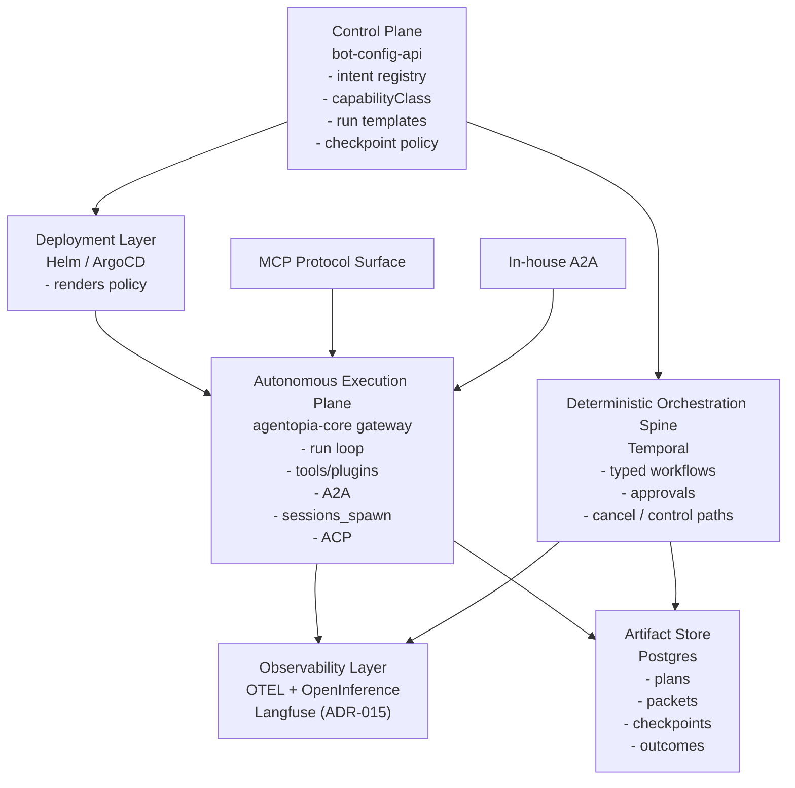
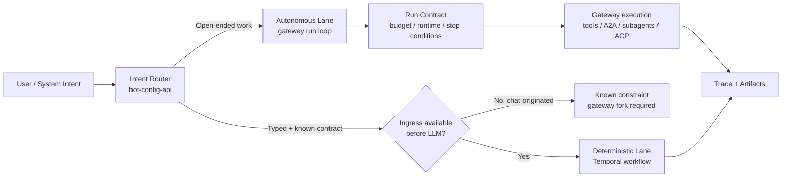
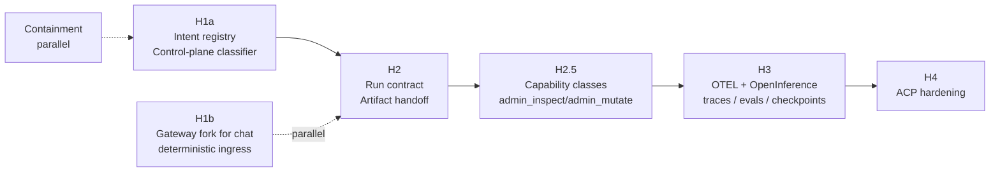

# Harness Architecture

**Status:** Architecture verdict — entrypoint document for implementation planning
**Owner:** Platform Architecture
**Scope:** `agentopia-core`, `agentopia-protocol`, `agentopia-infra`

---

## 1. Executive Summary

Agentopia's harness is a **hybrid, Agentopia-owned system**. The platform does not adopt a third-party agent framework as its primary harness. Instead, Agentopia builds the domain-specific control primitives itself (intent router, run contract, capability classes, artifact taxonomy, checkpoint policy matrix, and the R1/R2/R3 safety rails), keeps in-house what already works (A2A, `sessions_spawn`, ACP harness), and integrates mature external systems selectively where they genuinely outperform what we would build (Temporal for durable orchestration; MCP as a tool/context protocol; OpenTelemetry + OpenInference for traces; **Langfuse (MIT core) as the trace/eval backend per [ADR-015](../../adrs/015-h3-02-trace-backend-langfuse). Production service design drafted in [H3 Observability Production Design](./h3-observability-production-design) — phase-α shape specified, production steady-state target specified with open gaps; document still Draft**).

The harness is not a single new service. It is a contract enforced at the right layer: `bot-config-api` as control plane, Temporal as the deterministic orchestration spine, `agentopia-core` gateway as the autonomous execution plane, and a trace/eval pipeline that every harnessed run emits into.

This document is the concise verdict. It does not replace the runtime-facts baseline, the partial-harness-control baseline, or the deep-dive research document; it is the entrypoint that points to them.

### 1.1 Topology Overview

## 2. Architecture Verdict

1. **Agentopia builds its own harness.** No agent framework is adopted as the primary orchestrator. Pattern adoption is allowed (Claude Agent SDK subagent isolation, OpenAI Agents SDK run-loop contract); framework adoption is not.
2. **The harness has three ownership tiers.** Control plane in `bot-config-api`. Deterministic orchestration in Temporal. Autonomous execution in the `agentopia-core` gateway.
3. **Existing strengths are preserved.** In-house A2A (orchestrator↔specialist threads with turn limits and checkpoints), `sessions_spawn` (bounded subagent spawn), and the ACP harness lane remain in place and are brought under the unified run contract.
4. **Observability is integrated, not built.** OpenTelemetry wire format + OpenInference semantic conventions; Langfuse (MIT core) as the backend per [ADR-015](../../adrs/015-h3-02-trace-backend-langfuse). Production service design at [H3 Observability Production Design](./h3-observability-production-design) specifies phase-α shape and the production target (single-node, restore-from-backup, HA explicitly deferred); document is still Draft pending operational hardening criteria (§14.5).
5. **Tool/context protocol is MCP.** Continue expanding the existing `mcp-bridge` surface. MCP is not the harness; it is the protocol at the tool-call boundary.
6. **The approved runtime-facts baseline is binding.** `admin_mutate` remains an Admin-class tool with a closed action enum, cap=1/turn, and audit-log sink. Capability classes (Conversant ⊂ Worker ⊂ Orchestrator ⊂ Admin) remain the single tool-surface policy. No part of this document overrides either.

## 3. Core Components

| Component | Owner | Role |
|---|---|---|
| Intent-router / typed front-door registry | `bot-config-api` control plane | Classifies each entry path as deterministic or autonomous; authoritative source for capability class per bot |
| Run-contract schema | `agentopia-core` + shared with control plane | Typed `{run_id, goal_type, runtime, capability_class, wall_clock_budget, tool_budget, stop_conditions, expected_artifact_shape, escalation_policy, trace_id}` carried by every autonomous run |
| Deterministic orchestration spine | Temporal | Workflow = deterministic orchestrator; Activity = LLM / tool / external call. Already in production for delivery body |
| Autonomous execution plane | `agentopia-core` gateway | Per-turn run loop, plugin hooks, tool catalog, capability-class filter, R1/R2/R3 safety rails, ambient runtime-fact injection |
| Sub-agent runtimes | `agentopia-core` (`sessions_spawn`, ACP harness) | Bounded delegated execution; Claude-style invariant: only final message returns; children cannot spawn children |
| Agent↔agent collaboration | In-house A2A (JSON-RPC) | Orchestrator-driven threads with turn limits, checkpoints, idempotency, recovery |
| Tool / context protocol | MCP via `mcp-bridge` extension | External and internal tool exposure; not the harness |
| Artifact store | Postgres (existing) | Plans, task packets, checkpoint summaries, evaluator findings, final outcomes |
| Traces + evals | OpenTelemetry + OpenInference → Langfuse (MIT core, ADR-015) | One trace per harnessed run; spans for LLM calls, tool calls, subagent spawns, checkpoints. See [production design](./h3-observability-production-design). |
| Safety rails | `agentopia-core` | R1 per-tool-per-turn cap (primary, generic); R2 per-class `maxToolCalls` budget; R3 loop-detection-on by default |
| Human checkpoints | Workflow/thread-native primitives + control-plane policy matrix | Apply approval at the correct boundary: workflow/work-item via Temporal and control-plane APIs, A2A/relay via thread checkpoints, sensitive autonomous tool calls via the generic approval sidecar |

## 4. Deterministic vs Autonomous Workflow

The harness distinguishes two execution modes and routes intents between them.

**Deterministic lane.** Typed intents with known business contracts. The LLM is not the front door. Ingress is a typed call (HTTP / API / workflow signal). Execution is a Temporal workflow with deterministic orchestrator code and non-deterministic activities. Examples that belong here today: workflow cancel when invoked from operator tooling, approval transitions triggered inside the workflow layer.

**Autonomous lane.** Open-ended work where the action sequence cannot be predicted in advance. The LLM drives the loop under a run contract. Examples: direct specialist chat, A2A thread work, orchestrator coordination, ACP harness sessions for external/coding tasks. Every autonomous run carries a run contract and emits a trace.

The **classifier** — which intent goes to which lane — lives in the control plane and is small Agentopia-owned code.

HITL is a **shared policy layer**, not a single mandatory hop. The current architecture already has valid checkpoint insertion points at the workflow/work-item boundary and at the A2A / relay thread boundary. The missing generic primitive is the autonomous tool boundary in the gateway run loop. The harness therefore standardises **decision semantics and policy ownership**, while allowing checkpoint insertion at the boundary that best matches the object under review.

### 4.1 Lane Decision Flow

## 5. Build vs Integrate Decisions

| Decision | What we do |
|---|---|
| **Build in-house** (domain-specific, small, high-value) | Intent router, typed front-door registry, run-contract schema, capability-class enum and enforcement, artifact taxonomy, checkpoint policy matrix, R1/R2/R3 safety rails, `admin_inspect` / `admin_mutate` tools |
| **Extend what already works** | Temporal (stays the durable orchestration spine; extend to typed front doors where non-chat ingress exists today); in-house A2A; `sessions_spawn`; ACP harness; `mcp-bridge`; `governance-bridge` `execution_class` pattern; proxy-routed-provider reconcile pattern |
| **Integrate mature OSS / standards** | OpenTelemetry + OpenInference (instrumentation); Langfuse MIT core (trace/eval backend, ADR-015); MCP (protocol); ACP (align to Zed spec where feasible); AGENTS.md (documentation convention per repo) |
| **Reject as primary harness** | OpenAI Agents SDK, Claude Agent SDK, AutoGen, LangGraph-as-orchestrator, CrewAI, OpenHands, Goose, Permit.io |
| **Reference only (pattern adoption)** | Claude Agent SDK's subagent isolation ("only final message returns; children cannot spawn children"); OpenAI Agents SDK run-loop contract (final-output rule + max-turns); Temporal AI patterns |

Detailed rationale lives in [Harness System — Deep-Dive Debate](./harness-system-deep-dive-debate.md). The verdict above is what this document locks.

## 6. Near-Term Implementation Shape

Phasing, aligned with the existing [Agent Harness Control Plane milestone](../../milestones/agent-harness-control-plane.md) and corrected for the chat-ingress constraint documented in p0.5.

- **Containment** (parallel, already scoped by the runtime-facts baseline §12). System-prompt edit to remove the `session_status` instruction; chart `tools.allow` drops `session_status`; `loopDetection.enabled: true`; `maxToolCalls: 12` for existing bots. Must ship before any bot is recreated.
- **Phase H1a — control-plane classifier.** Typed-intent registry in `bot-config-api`; per-path classification report; non-chat typed front doors moved into Temporal workflows. Control-plane-only; no runtime change.
- **Phase H1b — gateway-fork ingress (depends on milestone #25).** Deterministic ingress for chat-originated typed intents (delivery-start is the canonical case) requires the gateway fork. Parallel to H2/H2.5/H3 once the fork lands.
- **Phase H2 — run contract + artifact handoff.** Schema published; attached to every autonomous run path (specialist chat, A2A, subagent, ACP); artifacts persisted in Postgres; `reconcile-capability` endpoint modelled on `reconcile-routing`.
- **Phase H2.5 — capability class implementation.** `capability-classes.ts`, chart renders `tools.allow` from `.Values.capabilityClass`, `admin_inspect` / `admin_mutate` split with audit sink (Phase 2.5 gate), `session_status` removed from agent-callable registration.
- **Phase H3 — traces / evals / checkpoints.** Instrument gateway with OTEL + OpenInference; stand up Langfuse per ADR-015 against the service design at [h3-observability-production-design](./h3-observability-production-design) (phase α first; production target is single-node with restore-from-backup — HA explicitly deferred; promotion criteria at §14.5 of that document); checkpoint policy matrix live for irreversible actions; unify workflow-, thread-, and tool-boundary approval semantics without forcing all approvals into one hop; one task class with eval coverage.
- **Phase H4 — ACP hardening.** ACP restricted to Orchestrator/Admin classes; runs emit the same run-contract and traces as direct specialist runs; alignment to Zed's ACP spec where feasible.

### 6.1 Implementation Sequence

## 7. Known Constraints

1. **Chat-originated deterministic ingress is blocked on the gateway fork.** Per [p0.5](../p0.5-deterministic-delivery-start.md) (CLOSED/DEFERRED, 2026-03-22): Option C2 was rejected after spike failure; separate-ingress investigation concluded the gateway owns the Telegram connection via the OpenClaw framework as an opaque binary with no intercept point. Separate ingress requires a gateway fork (milestone #25) and is deferred. Delivery-start is the canonical example and remains soft / prompt-compliance-based under the permanent dual-lane model until the fork lands. Any claim that the target architecture solves chat-originated deterministic ingress today is wrong.
2. **Admin mutation is a tool, not a workflow ingress.** `admin_mutate` is an Admin-class tool per the approved runtime-facts baseline. A deterministic-workflow admin-mutation alternative is documented in the deep-dive §10.4 as a possible future ARB topic; it is not part of this architecture's current direction.
3. **Safety rails are mandatory for every tool, not only for session-like tools.** R1 is a generic hook, not a per-tool patch. No future tool-addition review may rely on prompt compliance as safety.
4. **Temporal owns durability, not LangGraph.** LangGraph stays where it is — a planner inside a Temporal activity. Promoting LangGraph checkpointing to the platform layer is out of scope.
5. **Observability work is integration, not invention.** OTEL + OpenInference + an OSS backend is the chosen path. No bespoke trace/eval backend will be built.

## 8. Relationship To Other Harness Docs

| Document | Role |
|---|---|
| [Runtime Facts, Capability Classes, and Runaway Tool Prevention](./runtime-facts-capability-classes-baseline.md) | Approved baseline for ambient self-knowledge, `session_status` removal, capability classes, `admin_inspect` / `admin_mutate` split, R1/R2/R3 rails. Binding on this architecture. |
| [Orchestrated Multi-Agent Platform with Partial Harness Control](./orchestrated-multi-agent-platform-partial-harness-control.md) | Current-state assessment: what Agentopia already has, what it doesn't, why the next milestone exists. |
| [Harness System — Deep-Dive Debate](./harness-system-deep-dive-debate.md) | Research and reasoning for the build-vs-integrate choices this document verdicts. Primary-source citations and rejected shortcuts live there. |
| [Agent Harness Control Plane & Bounded Autonomy](../../milestones/agent-harness-control-plane.md) | Milestone definition and phase structure (H1–H4) that this architecture implements. |

## 9. Final Verdict

Agentopia's harness is built in-house where the work is domain-specific, extended where existing subsystems already do the right thing, and integrates external systems only where they are clearly mature and provider-agnostic. The runtime-facts baseline remains binding. Chat-originated deterministic ingress is a real constraint that this architecture acknowledges and plans for through H1b, not a gap this document pretends to solve.

This is the architecture direction for implementation planning. Remaining open ARB choices (AGENTS.md adoption scope; any future deterministic admin-mutation debate) do not block progress on Phases H1a, H2, H2.5, H3, or H4. The trace backend question was resolved on 2026-04-23 in [ADR-015](../../adrs/015-h3-02-trace-backend-langfuse).
