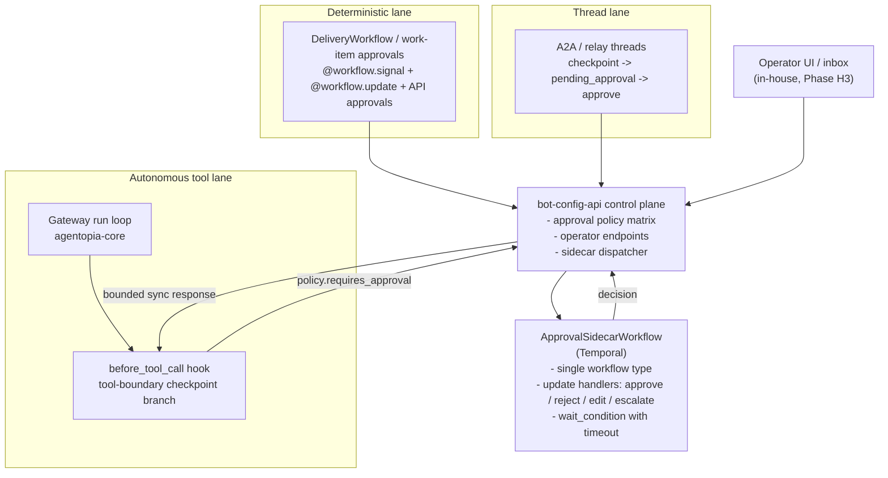

# HITL / Checkpoint Feasibility Debate

**Status:** Research document — input to an ARB decision on whether Human-in-the-Loop (HITL) / checkpoint primitives fit the approved harness architecture
**Owner:** Platform Architecture
**Audience:** ARB + engineering leads for `agentopia-core`, `agentopia-protocol`, `agentopia-infra`
**Canonical home:** this document, shared docs repo
**Sister documents:**
- [Harness Architecture](./harness-architecture.md) (verdict this memo must satisfy)
- [Runtime Facts, Capability Classes, and Runaway Tool Prevention](./runtime-facts-capability-classes-baseline.md) (binding baseline)
- [Orchestrated Multi-Agent Platform with Partial Harness Control](./orchestrated-multi-agent-platform-partial-harness-control.md)
- [Harness System — Deep-Dive Debate](./harness-system-deep-dive-debate.md)
- [Agent Harness Control Plane & Bounded Autonomy](../../milestones/agent-harness-control-plane.md)
- [p1 — Execution Authorization](../p1-execution-authorization.md)
- [a2a — Full Design](../a2a-full-design.md)
- [p0.5 — Deterministic Delivery Start Front Door](../p0.5-deterministic-delivery-start.md)

---

## 1. Executive Summary

Agentopia can support a production-quality Human-in-the-Loop / checkpoint system **without a greenfield runtime rewrite**, but the fit is not uniform across lanes and today's approval primitives are intentionally split across more than one subsystem. The deterministic lane already runs a production HITL pattern — Temporal signals + updates + `wait_condition` — inside `DeliveryWorkflow`, with a domain-rich operator decision set that exceeds the canonical {approve, reject, edit, escalate} taxonomy documented across primary sources. The A2A / relay lane already has a second production approval primitive at the thread layer — `ThreadStatus.pending_approval`, the `/api/v1/threads/{thread_id}/approve` endpoint, and an integration test covering checkpoint → pending → approve → resume. The workflow/control-plane layer also already exposes approval-style handoff at the work-item boundary via `POST /work-item/{packet_id}/approve`, which is the correct shape for user-story / milestone / downstream-packet approvals. Approval and resume, therefore, are not missing on this platform; what is missing is a **unified policy and decision contract** that spans these insertion points, plus a generic approval primitive at the autonomous tool-call boundary.

At the autonomous tool-call boundary specifically, `before_tool_call` is already `async` and can `await` external calls — the hook is not synchronous. What it cannot do today is represent a pending-approval outcome, distinguish an operator edit from a plugin rewrite, report an escalation or a timeout explicitly, or survive a gateway restart while an approval is in flight: its result contract is `{params, block, blockReason}` and nothing persists behind the `await` except whatever the called service stores. The refactor required is therefore a **richer hook result contract plus durable state behind the wait** (Temporal Event History, per §7), not a sync→async retrofit.

The verdict is therefore **feasible, lane-specific**. Agentopia should treat HITL as a **shared policy layer with multiple insertion points**, not as one mandatory hop for every workflow. Workflow-level checkpoints stay where they already fit (Temporal workflow updates/signals and work-item approvals). Thread-level checkpoints stay where they already fit (A2A / relay thread pause-and-resume). The missing generic primitive is the autonomous tool-call boundary: for that lane, the cleanest v1 is to teach `before_tool_call` to **route sensitive tool calls to an approval-sidecar workflow and `await` its update response with a bounded timeout**, falling back to a policy-defined default (deny or escalate) on timeout. Unification is about shared policy semantics, decision schema, and operator experience — not about forcing every existing approval to migrate into one workflow type immediately.

`admin_mutate` remains an Admin-class tool per the approved runtime-facts baseline. This document does not override that decision; it describes how `admin_mutate` invocations are routed through the tool-boundary approval-sidecar when the action class demands human approval. Deterministic admin-mutation ingress remains a debated alternative (deep-dive §10.4), not a baseline.

The canonical primary-source research closes out one debate cleanly: LangGraph's `interrupt()` and Temporal's Signals are **not competing primitives at the same layer**. LangGraph's interrupt is an application-level flow-control construct; Temporal's signal is a durability transport. Agentopia already owns durability via Temporal (delivery), so the HITL approach layers on top of that, not alongside. Adopting LangGraph as a parallel durability store is explicitly rejected.

The final recommendation in §14 is a three-phase HITL rollout (D-lane first, A-lane sidecar second, policy-matrix + timeout + reauthorization third), aligned with the approved milestone phases H3 / H4 and the existing containment workstream.

Verdict: `HITL_FEASIBILITY_READY`.

## 2. Problem Framing

The harness baseline commits Agentopia to "human checkpoints at irreversible boundaries" but does not resolve where those checkpoints live or how they compose across lanes. The concrete questions the ARB must answer before implementation planning begins:

- Is there a single durable primitive for "this run is paused, waiting for a human" that works for deterministic workflows, autonomous specialist chat, A2A threads, and subagent / ACP runs?
- Does the current `before_tool_call` hook shape support approval interception without a deep runtime refactor?
- What is the decision set — binary approve/deny, or the richer {approve, reject, edit, escalate}, or something domain-specific?
- How is approver identity authenticated, given that Temporal signals do not carry signer identity natively?
- What happens when an approval times out — deny, escalate, auto-approve with audit?
- Is the control plane already shaped to own a checkpoint policy matrix?

This memo answers each question with a concrete code citation or primary-source reference.

## 3. External HITL / Checkpoint Patterns

Research across the primary-source landscape ([full source list at end of this section](#references-research-sources)) converges on a single conceptual model: **persist state → emit interrupt → await external decision → resume with payload**. The differences across frameworks are the durability guarantee and where state lives.

### 3.1 LangGraph

`interrupt()` inside a node raises a `GraphInterrupt` exception that suspends execution and returns the interrupt payload to the caller. Resumption uses `graph.invoke(Command(resume=...))`, and the node re-executes from its beginning — a footgun for any pre-interrupt side-effects. "To use an interrupt, you must enable a checkpointer, as the feature relies on persisting the graph state" ([langchain-ai.github.io/langgraph/concepts/human_in_the_loop](https://langchain-ai.github.io/langgraph/concepts/human_in_the_loop/)). Durability is scoped to LangGraph's checkpointer (MemorySaver, SQLite, Postgres, Redis, Mongo); keyed by `thread_id`.

Canonical patterns: approve/reject, edit state, review tool call, validate input, time-travel ([docs.langchain.com/oss/python/langgraph/interrupts](https://docs.langchain.com/oss/python/langgraph/interrupts)).

### 3.2 Temporal

Signals are "asynchronous write requests that cause changes in the running Workflow" with an immediate server ack and no awaitable return value ([docs.temporal.io/encyclopedia/workflow-message-passing](https://docs.temporal.io/encyclopedia/workflow-message-passing)). Updates are the newer sync-response variant: "synchronous, tracked write requests where the sender of the Update can wait for a response on completion" ([docs.temporal.io/sending-messages](https://docs.temporal.io/sending-messages)). Durable pause is `workflow.wait_condition` on state mutated by signals/updates; the workflow can "wait for approval for hours, days or indefinitely while consuming no compute resources" ([docs.temporal.io/ai-cookbook/human-in-the-loop-python](https://docs.temporal.io/ai-cookbook/human-in-the-loop-python)).

Critical gap: **signals do not carry signer identity.** Auth is enforced at the gRPC/namespace layer; signer attribution must be added in the signal payload or in the API fronting the workflow ([docs.temporal.io/cloud/security](https://docs.temporal.io/cloud/security)).

### 3.3 OpenAI Agents SDK

`needs_approval` on a tool triggers an interruption that must be resolved with `RunState.approve()` or `RunState.reject()` ([openai.github.io/openai-agents-python/human_in_the_loop](https://openai.github.io/openai-agents-python/human_in_the_loop/)). Durability is caller-managed: `RunState.to_json()` serialises the pending state; the caller persists it.

### 3.4 Claude Agent SDK

`canUseTool` callback and `PreToolUse` hook return `"allow"` or `"deny"` ([docs.claude.com/en/docs/agent-sdk/permissions](https://docs.claude.com/en/docs/agent-sdk/permissions)). Permission modes: `default`, `acceptEdits`, `plan`, `bypassPermissions`. No `"ask"` or `"defer"` value; the "ask" behaviour is achieved by wrapping the callback in a UI that returns allow/deny based on the user's click. No built-in durability — in-process only.

### 3.5 Inngest / Restate

Inngest: `step.waitForEvent` with optional CEL/field match ([inngest.com/docs/reference/functions/step-wait-for-event](https://www.inngest.com/docs/reference/functions/step-wait-for-event)). Restate: awakeables with journaled resume ([restate.dev/what-is-durable-execution](https://www.restate.dev/what-is-durable-execution)). Both frame the pattern as the same suspend/resume primitive as Temporal.

### 3.6 Canonical decision set

LangChain: `approve`, `reject`, `edit` (with edited action), natural-language response ([docs.langchain.com/oss/python/langchain/human-in-the-loop](https://docs.langchain.com/oss/python/langchain/human-in-the-loop)). OpenAI's *Practical Guide to Building Agents* names two oversight axes: high-risk-action gating and failure-based escalation. Primary-source taxonomy: **{approve, reject, edit, escalate}** plus an implicit `timeout/defer`.

### 3.7 Operator UI reality

**No OSS project provides a production-grade runtime approval inbox for agent actions.** What exists:

- Workflow-engine UIs (Temporal Web UI, Inngest Dev Server) let operators send signals but lack routing/RBAC for approvals.
- Eval platforms (LangSmith annotation queues, Langfuse, Arize Phoenix) collect post-hoc feedback, not runtime approvals.
- The industry default is a custom UI layered on top of the durability primitive.

### 3.8 Key contradictions flagged by research

1. **LangGraph interrupt vs Temporal Signal are NOT competitors.** LangGraph's `interrupt()` is app-level flow control; Temporal's signal is a durability transport. They compose (LangGraph on top of Temporal is a documented pattern). Any Agentopia ARB discussion that frames them as alternatives is wrong.
2. **Claude SDK's binary allow/deny is weaker than the others.** A reported quirk ([anthropics/claude-code#28812](https://github.com/anthropics/claude-code/issues/28812)) — returning `"allow"` from a `PreToolUse` hook replaces the native permission prompt rather than passing through — is a real semantic gap to avoid if Agentopia adopts an analogous shape.
3. **LangGraph's node-restart-on-resume is a correctness footgun.** Side-effects before an `interrupt()` run twice unless wrapped in a `task` or made idempotent. Not a concern for Agentopia if Temporal remains the durability layer.
4. **Signal identity is everyone's problem.** No framework handles signer auth natively; it is enforced at the API/UI layer fronting the workflow engine. Agentopia will inherit this constraint; the existing `bot-config-api` operator endpoints are the correct identity surface.

#### References (research sources)

- LangGraph: [concepts/human_in_the_loop](https://langchain-ai.github.io/langgraph/concepts/human_in_the_loop/), [interrupts](https://docs.langchain.com/oss/python/langgraph/interrupts), [persistence](https://docs.langchain.com/oss/python/langgraph/persistence), [time-travel](https://docs.langchain.com/oss/python/langgraph/use-time-travel)
- Temporal: [workflow-message-passing](https://docs.temporal.io/encyclopedia/workflow-message-passing), [sending-messages](https://docs.temporal.io/sending-messages), [AI HITL cookbook](https://docs.temporal.io/ai-cookbook/human-in-the-loop-python), [learn tutorial](https://learn.temporal.io/tutorials/ai/building-durable-ai-applications/human-in-the-loop/), [cloud security](https://docs.temporal.io/cloud/security)
- OpenAI Agents SDK: [human_in_the_loop](https://openai.github.io/openai-agents-python/human_in_the_loop/), [RunState](https://openai.github.io/openai-agents-js/openai/agents/classes/runstate/), [Practical Guide](https://cdn.openai.com/business-guides-and-resources/a-practical-guide-to-building-agents.pdf)
- Anthropic: [Building Effective Agents](https://www.anthropic.com/research/building-effective-agents), [Agent SDK permissions](https://docs.claude.com/en/docs/agent-sdk/permissions), [Agent SDK hooks](https://platform.claude.com/docs/en/agent-sdk/hooks)
- Inngest / Restate: [step.waitForEvent](https://www.inngest.com/docs/reference/functions/step-wait-for-event), [durable AI loops](https://www.restate.dev/blog/durable-ai-loops-fault-tolerance-across-frameworks-and-without-handcuffs)
- UI: [Langfuse annotation queues](https://langfuse.com/docs/evaluation/evaluation-methods/annotation-queues), [LangSmith annotation queues](https://docs.langchain.com/langsmith/annotation-queues), [Arize Phoenix annotations](https://arize.com/docs/phoenix/cookbook/annotations/using-human-annotations-for-eval-driven-development), [Temporal Web UI](https://docs.temporal.io/web-ui)

## 4. Current Agentopia HITL-Relevant Inventory

### 4.1 Production HITL already exists in `DeliveryWorkflow`

`agentopia-protocol/bot-config-api/src/temporal_workflows/delivery_workflow.py` is the canonical Temporal HITL implementation on the platform today. The primitives used are exactly those the research identifies as state-of-the-art:

| Primitive | Where | Role |
|---|---|---|
| `@workflow.signal` | `on_pr_opened`, `on_pr_synchronized`, `on_pr_closed_without_merge`, `on_pr_merged`, `on_review_submitted`, `on_a2a_task_failed`, others | External async events push into the workflow |
| `@workflow.update` | `update_operator_submit`, `update_operator_approve`, `update_operator_accept`, `update_operator_close`, `update_operator_retry_review`, `update_operator_force_approve_rework`, `update_operator_send_back`, `update_operator_cancel`, `update_operator_force_reconcile` | Operator-initiated sync-response decisions |
| `@workflow.query` | `query_workflow_status` | Inspect state without modifying it |
| `workflow.wait_condition` | Multiple points (`wait_dev`, `wait for review_approved`, `wait for pr_merged`, `wait for cancelled`) | Durable pause until a state flag flips |

The decision set implemented in `DeliveryWorkflow`'s update handlers is **richer than the canonical {approve, reject, edit, escalate}** and has been in production for the delivery lane:

- `submit` (worker declares work done)
- `approve` (reviewer approves)
- `accept` (post-approval acceptance)
- `close` (terminal close)
- `cancel` (hard cancel; reversible until terminal state)
- `retry_review` (re-dispatch reviewer from `REVIEW_STALLED`)
- `force_approve_rework` (override from `REWORK_REJECTED`, **requires reason**)
- `send_back` (route back to `IN_DEV` from `REWORK_REJECTED`)
- `force_reconcile` (audit-only escape hatch)

This is a domain-specific instantiation of a generic pattern. `OperatorCommand` carries `actor_id` and `reason`, which is the identity attribution Temporal signals do not do natively.

### 4.2 Operator endpoints already exist in `bot-config-api`

`agentopia-protocol/bot-config-api/src/routers/workflow.py` exposes:

- `POST /command` — `execute_workflow_command` (dispatches operator decisions into the workflow via signal/update)
- `GET /status/{workflow_id}` — `get_workflow_status`
- `GET /projects/{workflow_id}/status/summary` — summary view
- `POST /register-gate` — gate registration (precursor to a policy matrix)
- `POST /work-item/{packet_id}/approve` — approve a work item and create downstream handoff with verified approver identity
- `POST /evidence/artifact`, `POST /evidence/record`, `GET /evidence/work-item/{id}`, `GET /evidence/check-stale` — artifact/evidence handoff (relevant to HITL artifact flow in §9)
- `POST /bind-actor`, `POST /register-role`, `GET /roles`, `GET /bindings`, etc. — actor identity + role binding

The identity surface required by Temporal's signal-auth gap is therefore already present at the API layer: operator decisions land via HTTP, authenticated by the fronting service, and the `actor_id` is stamped into the signal/update payload. This same surface is already capable of hosting story / milestone / downstream-packet approvals at the workflow/work-item boundary; HITL is not limited to a single tool-call interception point.

### 4.3 A2A / relay checkpoint pause-and-approve is already implemented and durable at the thread layer

An earlier draft of this document said A2A's approval durability was "unverified." That was too weak. The implementation exists, is durable at its own layer, and has an integration test covering the full checkpoint → pending → approve → resume flow. Evidence:

- **Thread state machine with `pending_approval`.** `bot-config-api/src/services/thread_service.py` models threads with a `ThreadStatus` enum including `pending_approval`; per-thread state lives under `/openclaw-state/shared-memory/threads/{thread_id}/` with `meta.json`, `summary-epoch-{k}.json`, and rotating session keys. Writes are atomic (`_write_atomic`), and the service carries a per-`thread_id` lock for same-process mutual exclusion.
- **Operator endpoints for checkpoint and approval.** `bot-config-api/src/routers/threads.py` exposes `POST /api/v1/threads/{thread_id}/checkpoint` (sets `status=pending_approval`, rotates session key, writes the epoch summary, optionally persists to mem0) and `POST /api/v1/threads/{thread_id}/approve` (transitions back to `active` with optional `guidance`, or rejects). Turns posted while a thread is in `pending_approval` are rejected with HTTP 409 by `_post_turn` / turn-delivery validation.
- **Auto-checkpoint on cadence.** The same router calls `_do_auto_checkpoint` as a background task when `turn_count % auto_checkpoint_every == 0`, which means a thread reaching N turns enters `pending_approval` without an operator or bot action.
- **Integration test covers the full flow.** `bot-config-api/src/tests/test_a2a_integration.py::test_checkpoint_approve_then_resume` creates a thread, posts a turn, issues a checkpoint, asserts `pending_approval`, asserts that a new turn in that state is rejected with HTTP 409 ("not active"), posts the approval, asserts the thread returns to `active`, and asserts that a subsequent turn completes. A sibling test `test_auto_checkpoint_writes_epoch_summary_to_efs` verifies that the epoch summary is written to the shared filesystem after the background task runs.
- **Relay extension honours the same status.** `agentopia-protocol/gateway/extensions/relay/index.ts` participates in this status model; turn routing respects the thread's active / pending_approval status as set by the control plane.

What this means for feasibility: **A2A/relay already has an approval + resume primitive that is durable at its own layer** (shared-memory thread directory plus an HTTP approval endpoint with guidance). The gap that remains is not "implementation missing" — it is **unification into the generic harness-wide HITL model**: the A2A approval flow uses its own status enum, its own endpoints, and its own state directory rather than the shared `ApprovalSidecarWorkflow` + policy-matrix + decision-schema proposed in §7. Bringing A2A under the unified model is a reconciliation of two working subsystems, not a greenfield build. Options: (a) keep A2A's per-thread state as authoritative and have the sidecar workflow mirror its lifecycle; (b) migrate A2A's approval transitions to emit into the sidecar and let Temporal hold authoritative state; (c) leave A2A on its own layer and treat the two primitives as peers, connected via shared decision-schema and shared operator UI. All three are viable; the choice belongs to Phase S (§14).

### 4.4 `before_tool_call` hook is already async — the real gap is the result contract

An earlier draft of this document framed `before_tool_call` as "synchronous and does not await human decisions." That framing is inaccurate and is corrected here. The hook is already `async`:

- `PluginHookBeforeToolCall` returns `Promise<PluginHookBeforeToolCallResult | void>` ([`agentopia-core/src/plugins/types.ts` line 750](https://github.com/ai-agentopia/agentopia-core)).
- The dispatcher at `agentopia-core/src/agents/pi-tools.before-tool-call.ts:168-177` performs `await hookRunner.runBeforeToolCall(...)`, so an async hook that needs to call out to an external service — including `bot-config-api` — is directly supported today. The `executeBeforeToolCall` function itself is `async`.

The real limitation is the **shape of the hook result contract**, not its execution model:

```ts
// plugins/types.ts line 530
export type PluginHookBeforeToolCallResult = {
  params?: Record<string, unknown>;
  block?: boolean;
  blockReason?: string;
};
```

Three fields. Nothing else. What is missing for a production HITL model is therefore not async-await capability, but:

1. **No pending-approval state.** The hook returns a single terminal decision. There is no representation of "this tool call is paused pending a human decision" that the runner and the run-contract layer can reason about while other work continues, and no correlation id (beyond the existing `toolCallId`) for a long-lived approval that can outlive the current hook invocation.
2. **No richer resume outcomes.** `params` can be overwritten, which functionally covers "edited args", but the semantic — "the operator edited this tool call" — is not distinguished from "a plugin rewrote this tool call for its own reasons" in either the hook result or the downstream trace. There is no explicit `escalated` outcome, and no structured timeout/expiry outcome.
3. **No reconnect / restart recovery contract.** If the gateway pod restarts while a hook is awaiting an external decision, the in-flight `await` is lost. The hook contract does not specify how a restarted run should rejoin a still-pending approval; this is a state-model gap, not an async one.
4. **No durable record at the hook layer.** Because the hook is a pure function returning a terminal value, an approval decision and its authoring operator identity are not automatically persisted from the hook's perspective; persistence must live outside the hook (today the pattern is activity / external store, and the hook's job is to route to it and wait on the result).

The hook context carries `sessionKey`, `sessionId`, `runId`, `toolCallId`, `executionClass` — exactly the ids an approval sidecar needs. **The feasibility constraint the ARB must accept is therefore not "async is missing" but "the hook result contract needs to be extended to represent pending, edited, escalated, and timeout outcomes, and the state of an in-flight approval needs to live durably outside the hook (in Temporal, per §7) so that restarts, timeouts, and operator-side reconnects are well-defined."** This is a modest refactor, not a runtime rewrite — the hook can already `await` a control-plane call; what it needs is a richer decision schema and a durable state behind the wait.

### 4.5 `execution_class` stamping already distinguishes lanes

Per `docs/architecture/p1-execution-authorization.md`, the runtime stamps `workflow_dispatch` vs `general_chat` on every request. Action classes are defined: `consultation_read`, `execution_write`, `review_write`, `admin_write`, `audit_read`. This is the right classification surface to drive an approval policy matrix — the hardest conceptual work is already done.

### 4.6 Subagent / ACP runs

`sessions_spawn` and the ACP harness do not currently participate in a unified approval model. Subagents inherit the parent's approval state implicitly (Claude-SDK-style isolation). The ACP lane is treated as an advanced runtime. Bringing both under the unified approval-sidecar pattern is a Phase H4 concern, not a v1 requirement.

## 5. Feasibility Assessment by Layer

### Table A — Current support matrix

| Capability / primitive | Current support in Agentopia | Evidence | Suitability for HITL | Notes |
|---|---|---|---|---|
| Durable pause/resume primitive | **Strong** — Temporal `wait_condition` + signals + updates in production for delivery | `delivery_workflow.py` (lines 308, 355, 437, 456, 467, 558, 574, 737, 802, etc.) | 🟢 Direct fit for deterministic lane | This is already the industry-canonical HITL primitive per Temporal's own AI cookbook |
| Operator decision transport | **Strong** — HTTP endpoints fronting signal/update dispatch | `bot-config-api/src/routers/workflow.py` | 🟢 Identity gap (Temporal signals don't carry signer) is closed at the API layer |
| Operator decision set | **Strong, domain-rich** — richer than canonical {approve, reject, edit, escalate} | `DeliveryWorkflow` update handlers (§4.1) | 🟢 Template for generic approval-sidecar workflow |
| Runtime tool-call interception | **Partial** — hook is async and can `await` external calls; result contract is the gap | `pi-tools.before-tool-call.ts` lines 168-177 (async `await` present); `plugins/types.ts` line 530 (`{params, block, blockReason}` only) | 🟡 Supports async gating today; needs richer result schema (pending / edited / escalated / timeout) and durable state behind the wait — not a sync→async refactor |
| Action-class stamping | **Strong** — `execution_class` + action classes already defined | `p1-execution-authorization.md`; governance-bridge propagates `execution_class` | 🟢 Policy-matrix input is already in place |
| A2A / relay thread checkpoint | **Implemented and durable at thread layer; unification gap only** | `services/thread_service.py` (`ThreadStatus.pending_approval`, per-thread dir + atomic writes); `routers/threads.py` (`/checkpoint`, `/approve`, auto-checkpoint); `tests/test_a2a_integration.py::test_checkpoint_approve_then_resume` (full flow test) | 🟢 Primitive works; what remains is unification with the generic HITL model in §7, not basic build-out |
| Subagent HITL | **Absent** | `subagent-announce.ts` / `acp-spawn.ts` do not hook into an approval primitive | 🔴 v1 solvable by parent-level enforcement; native subagent HITL is Phase H4 |
| ACP HITL | **Absent** | ACP harness has lifecycle controls but no approval primitive | 🔴 Same as subagent — policy-routed through the parent's run contract |
| Approval policy matrix (config) | **Absent** | `register-gate` endpoint exists but no generic action-class → approval-required mapping | 🟡 Shape of endpoint is right; matrix + enforcement need to be defined |
| Operator approval UI | **Absent** (as a runtime inbox) | Some per-project status UI exists; no generic approval inbox | 🔴 No OSS project fills this gap; build in-house on existing operator endpoints |

## 6. Candidate Architecture Options

### Option 1 — Temporal-native HITL everywhere

Every harnessed run spawns a Temporal workflow; every approval gate becomes a `workflow.wait_condition` on a signal/update. Works well for the deterministic lane (proven). For the autonomous lane, this would require wrapping every specialist chat turn in a Temporal workflow, which is heavy and distorts the current gateway architecture.

### Option 2 — LangGraph-native HITL everywhere

Adopt `interrupt()` + LangGraph checkpointer. Rejected immediately:
- Introduces a second durability store alongside Temporal (fragmentation).
- LangGraph's node-restart-on-resume is a correctness footgun for tool-calling side-effects.
- Agentopia already uses LangGraph as a planner **inside** a Temporal activity; promoting it to the platform HITL layer inverts that correct layering.
- Primary-source research (§3.8): LangGraph and Temporal are complementary at different layers, not alternatives. Adopting LangGraph HITL would mean abandoning Temporal durability for HITL specifically, then re-stitching two checkpointers.

### Option 3 — Hybrid: preserve current workflow/thread checkpoints, add Temporal sidecar for generic tool approvals

The deterministic lane keeps using Temporal signals/updates natively (as `DeliveryWorkflow` already does). The A2A / relay lane keeps using the existing thread-level `pending_approval` primitive. The workflow/work-item layer keeps using existing control-plane approval endpoints. The autonomous tool-call boundary does **not** turn every tool call into a workflow; instead, `before_tool_call` routes sensitive action classes to a **short-lived approval-sidecar workflow** and awaits the sidecar's update response with a bounded timeout. The sidecar workflow is the new generic primitive for approvals that do not already have a natural home in the current architecture. Unification happens at the policy-matrix, decision-schema, and operator-UI layers, not by collapsing all approvals into one execution hop.

### Option 4 — In-process approval only (no durability)

Approval lives entirely in the gateway process; if the gateway restarts, the pending approval is lost. Rejected — violates the baseline requirement that HITL must be durable across restarts.

### Table B — Option comparison

| Option | Where approval lives | Durability | Runtime fit | Implementation complexity | Risks | Recommendation |
|---|---|---|---|---|---|---|
| 1 — Temporal-native everywhere | Temporal workflow per run | Excellent | Poor for specialist chat (overwraps) | High (wrap every run) | Distorts autonomous-lane model; heavy infra for small-latency turns | Reject as universal |
| 2 — LangGraph-native everywhere | LangGraph checkpointer | Good | Poor (fragments durability) | High (replace or shim) | Two durability stores; resume-side-effect footgun | **Reject** |
| 3 — Hybrid: existing workflow/thread checkpoints + Temporal sidecar for tool approvals | Existing Temporal/work-item/thread primitives plus a Temporal sidecar workflow where no primitive exists today | Excellent | Best fit for current architecture | Medium (gateway hook extension; sidecar workflow; policy unification) | Requires clear policy semantics across multiple insertion points | **Adopt** |
| 4 — In-process only | Gateway memory | None | Good | Low | Loses approvals on restart; fails audit | Reject |

## 7. Recommended HITL Architecture for Agentopia

### 7.1 Shared policy layer, lane-specific checkpoint primitives

Agentopia should not force every approval through one hop. The current architecture already has three valid checkpoint insertion points, and the recommended design preserves them:

- **Workflow / work-item boundary** — keep using existing control-plane + Temporal workflow approval shapes where the business object is already a workflow or packet.
- **Thread boundary** — keep using the A2A / relay `pending_approval` thread primitive where the unit of review is an inter-agent thread epoch.
- **Tool-call boundary** — add a generic approval-sidecar workflow only where the current architecture has no durable approval primitive yet: sensitive autonomous tool calls in the gateway run loop.

Unification happens in the **policy matrix**, **decision schema**, **identity/audit rules**, and **operator experience**, not by replacing every existing approval substrate on day one.

### 7.2 Shape of the approval-sidecar workflow

Single Temporal workflow type, `ApprovalSidecarWorkflow`, owned by `bot-config-api`. Contract:

- **Inputs (typed):** `{ approval_id, origin: {run_id, capability_class, tool_name?, action_class?, lane}, proposed_action, context_summary, policy_rule, timeout_seconds, default_on_timeout }`.
- **State:** `{ status: PENDING|APPROVED|REJECTED|EDITED|ESCALATED|EXPIRED, decision_payload?, decided_by_actor_id?, decided_at?, reason? }`.
- **Update handlers (sync response):** `approve`, `reject`, `edit` (with `edited_action`), `escalate` (with target role). Domain-rich extensions (`force_approve_with_reason`, `send_back`) allowed when a specific action class requires them.
- **Query handlers:** `get_status` for the operator UI and for the gateway to re-confirm on reconnect.
- **Run loop:** a single `workflow.wait_condition(lambda: status != PENDING, timeout=timeout_seconds)` with a timeout that drives the `EXPIRED` transition and the `default_on_timeout` behaviour.

This is a small workflow — maybe 150-200 lines by analogy with `DeliveryWorkflow` — but it is the **generic tool-boundary HITL primitive**, not a mandate to replace current workflow-level or thread-level approvals immediately.

### 7.3 Deterministic lane

Already works via Temporal signals/updates in the delivery workflow. The platform generalises `DeliveryWorkflow`'s operator decision pattern into a template that other deterministic workflows and workflow-adjacent objects (workflow cancel, approval transitions, work-item approval / downstream handoff) can reuse directly. No autonomous-lane concepts leak here.

### 7.4 Thread-level checkpointing

Keep the existing A2A / relay thread checkpoint path for thread review:

- `checkpoint` moves a thread to `pending_approval`
- `/approve` resumes or rejects it
- optional `guidance` lets the human steer the next turn

This is already the right primitive when the review unit is "the thread should pause here and a human should decide whether to continue." It should not be reimplemented through the tool-call sidecar in v1. The unification requirement is shared semantics and operator visibility, not substrate replacement.

### 7.5 Autonomous tool boundary — `before_tool_call` routing

The gateway's `before_tool_call` hook gains a new branch for action classes whose policy requires human approval:

```
if policy.requires_approval(execution_class, action_class, tool_name):
    approval_id = generate(run_id, tool_call_id)
    start_approval_sidecar(approval_id, proposed_action, timeout)
    status = await_sidecar_decision(approval_id, timeout)   ← new await primitive
    if status == APPROVED: return { blocked: false, params: maybe_edited_params }
    if status == EDITED: return { blocked: false, params: edited_params, reason: "operator edit" }
    if status == REJECTED: return { blocked: true, reason: "operator rejected: ..." }
    if status == ESCALATED: return { blocked: true, reason: "escalated to role ..." }
    if status == EXPIRED: return apply_default_on_timeout(policy)
```

The bounded `await_sidecar_decision` is the one new runtime primitive. It is a bounded HTTP call from the gateway to `bot-config-api`, which in turn polls or long-polls the Temporal sidecar via Update. The gateway does not itself speak Temporal client protocol — it calls the control plane's HTTP layer. This preserves the existing ownership boundary (the gateway is not a Temporal client).

### 7.6 Long-running run reauthorization

A harnessed run that exceeds a configured wall-clock budget triggers a reauthorization approval-sidecar (same shape, different action class: `reauthorize`). The caller (A2A checkpoint, subagent long-tail, ACP session) issues the same sidecar request; the decision flow is identical. Timeout default on reauthorization is `REJECTED` (fail-safe, not auto-continue).

### 7.7 Architecture diagram



## 8. Approval / Checkpoint Decision Matrix

The v1 policy matrix, expressed in the control plane. Rows are action classes; columns are the enforcement posture.

### Table C — Action-class × approval decision matrix

| Action class | Lane | Requires approval (v1)? | Allowed decisions | Rationale | Likely primitive |
|---|---|---|---|---|---|
| `consultation_read` | autonomous | **No** | — | Read-only; no artifact; R1/R2 caps handle abuse | None |
| `audit_read` | autonomous | **No** | — | Read-only inspection; must remain fluid | None |
| Work-item approval / downstream handoff | workflow / orchestrator | **Yes** where the packet transition is a control-plane milestone | approve / reject / edit / send_back | Story / milestone / downstream packet approval already has a natural workflow/work-item home | Existing `/work-item/{packet_id}/approve` + workflow handlers |
| `execution_write` (delivery worker tools) | deterministic | Already gated by `workflow_dispatch` | workflow-native approval via `update_operator_approve`, `update_operator_send_back` | Delivery lane already owns this per p1 | Temporal workflow handlers (existing) |
| `review_write` | deterministic | Already gated | `update_operator_approve`, `update_operator_retry_review` | Reviewer role + workflow context | Existing `DeliveryWorkflow` |
| A2A / relay thread checkpoint | thread | **Yes** when a thread reaches review boundary / auto-checkpoint threshold | approve / reject / approve with guidance | Human reviews the thread epoch, not an individual tool call | Existing thread `/checkpoint` + `/approve` |
| `admin_write` (`admin_mutate` tool actions) | autonomous (Admin class) | **Yes** | approve / reject / edit / escalate; **reason required for any destructive action** | Irreversible or high-impact per runtime-facts baseline §1.5 | Approval-sidecar workflow |
| Cross-session `sessions_send` | autonomous (Orchestrator+) | **Yes** for first send to a new session; **No** for ongoing thread | approve / reject | Prevents accidental blast; threaded turns inherit approval | Approval-sidecar workflow, cached per thread |
| `sessions_spawn` (new subagent) | autonomous (Orchestrator+) | **Yes** when the new subagent has an elevated capability class | approve / reject / escalate | Subagent elevation is a privilege boundary | Approval-sidecar workflow |
| ACP spawn | autonomous (Orchestrator+ / Admin) | **Yes** | approve / reject / escalate | Advanced external runtime; always human-gated in v1 | Approval-sidecar workflow |
| Long-running run reauthorization | any autonomous | **Yes** on wall-clock exceedance | approve (extend budget) / reject (terminate) / escalate | Prevents silent runaway; fail-safe default is terminate | Approval-sidecar workflow |
| Any write to shared state via MCP | autonomous | **Yes** if the MCP server is marked `writes_shared_state: true` | approve / reject / edit | MCP allowlist per bot declares this property | Approval-sidecar workflow |

Policy lives in `bot-config-api` as config, not code. Additions to the matrix do not require a runtime change, but they may map to different insertion points depending on the lane and object under review.

## 9. State, Persistence, and Resume Model

### 9.1 What is persisted, where

- **Workflow-level approval state** (delivery/operator updates, workflow transitions) → existing Temporal Event History for those workflows. Authoritative for workflow-bound approvals.
- **Thread-level approval state** (`pending_approval`, guidance, epoch summaries) → existing A2A thread state under shared-memory thread directories plus thread metadata. Authoritative for thread-bound approvals until/unless Phase S changes that.
- **Approval-sidecar state** (status, decision payload, actor, reason, timestamps) → Temporal Event History. Authoritative for tool-boundary and generic sidecar-backed approvals.
- **Approval matrix** (action class → requires_approval, allowed_decisions, timeout, default) → Postgres, owned by `bot-config-api`. Versioned.
- **Per-run approval pointers** (for a given `run_id`, which approval_ids have fired) → Postgres `approvals` table, keyed by `run_id + tool_call_id`. Lets a reconnecting gateway recover pending state.
- **Artifact attachments to an approval** (proposed patch, summary, evidence) → existing `/evidence/*` surface in `bot-config-api/routers/workflow.py` (Table A, §4.2).

### 9.2 Resume semantics

If the gateway restarts mid-wait on a tool-boundary approval, it reconnects and **queries the approval_id's status** via the control plane (which queries Temporal). If still `PENDING`, the gateway re-awaits. If terminal, the gateway applies the recorded decision. Workflow-bound approvals and thread-bound approvals keep their existing resume semantics in their own layers. The shared contract is in the decision schema and policy matrix; substrate-specific resume remains lane-appropriate until a later consolidation is explicitly chosen.

### 9.3 Idempotency

Approval creation is idempotent on `(run_id, tool_call_id)`. Re-emitting the same sidecar request returns the existing approval_id. This matches Temporal's own "Workflow ID reuse" idempotency pattern and the existing idempotency-key discipline in `DeliveryWorkflow`'s `_is_duplicate(delivery_id)` checks.

## 10. Tool / Workflow / Runtime Integration Points

| Integration point | Change shape | Difficulty | Owner |
|---|---|---|---|
| `before_tool_call` new policy branch | Add a policy lookup + sidecar dispatch + bounded await plus richer hook result semantics | Medium — hook is already async; work is in contract extension + recovery semantics | `agentopia-core` |
| Approval-sidecar workflow | New Temporal workflow type | Low — ~200 LoC by analogy with `DeliveryWorkflow` | `bot-config-api` |
| Control-plane approval endpoints | Extend `routers/workflow.py` with `/approvals/*` | Low — pattern matches existing `/command`, `/status`, `/evidence` endpoints | `bot-config-api` |
| Approval policy matrix | New config schema + Postgres table + CRUD in `bot-config-api` | Low | `bot-config-api` |
| Operator approval UI | New UI page reading the control-plane endpoints; built on `agentopia-ui` | Medium | `agentopia-ui` |
| A2A checkpoint integration | Decide whether A2A `PENDING_APPROVAL` stays authoritative, mirrors sidecar, or converges on shared sidecar semantics | Medium — design reconciliation of two working primitives, not basic durability verification | `agentopia-core` A2A code + `bot-config-api` |
| Subagent / ACP integration | Parent's `before_tool_call` and run-contract checkpoints enforce; subagent itself is not a separate HITL participant in v1 | Low (policy-routed through parent) | `agentopia-core` |
| Capability-class enforcement at tool boundary | Unchanged from the runtime-facts baseline; approval is an **additional** gate after class filtering | N/A — no change | Existing |

## 11. Gaps and Required Refactors

1. **Richer hook result contract and durable suspend/resume behind the tool boundary.** The `before_tool_call` hook is already `async` and can `await` external calls; the gap is the result contract. `PluginHookBeforeToolCallResult` exposes `{params, block, blockReason}` only. A production tool-boundary HITL model needs additional outcomes — pending-approval, edited (distinguishable from plugin-rewrite), escalated (with target role), expired (with timeout-default behaviour) — and a durable state behind any in-flight approval so that a gateway restart does not drop it. The durable state lives in Temporal (per §7); the hook's refactor is to represent these outcomes and to reconnect to an in-flight approval after a restart using the existing `toolCallId` / `runId` correlation ids.
2. **Unification semantics, not one-hop replacement.** Agentopia already has working approvals at workflow level and thread level. What is missing is unification into the platform-wide model proposed in §7 — a shared decision schema, a shared approval-policy matrix, and a single operator UI. The Phase S work in §14 chooses between (a) sidecar mirrors thread lifecycle, (b) A2A emits into sidecar as authoritative state, (c) two primitives as peers with shared schema+UI. A spike is warranted to pick the option, not to verify whether approval works today (it does).
3. **Approval-matrix schema and versioning.** The matrix is policy, not code. Versioning, migration, and reconciliation should follow the `reconcile-routing` / `reconcile-capability` control-plane pattern already established.
4. **Operator UI — no OSS ships this.** Budgeting an in-house UI on top of existing `bot-config-api` endpoints is unavoidable. Temporal Web UI can send signals/updates but is not a routed approval inbox.
5. **Signer identity discipline.** Temporal signals do not carry signer identity. Approver `actor_id` must be enforced at the `bot-config-api` API boundary and recorded in the sidecar state. The existing `OperatorCommand.actor_id` pattern in `DeliveryWorkflow` is the template.
6. **Subagent/ACP HITL is policy-routed, not natively supported.** In v1, a subagent does not independently request approvals; the parent's policy decides. Native subagent HITL is Phase H4.

## 12. Risks / Rejected Shortcuts

1. **Rejected: adopt LangGraph interrupt as the HITL layer.** Introduces a second durability store. Node-restart-on-resume is a known footgun. The research (§3.8) explicitly says LangGraph and Temporal compose at different layers.
2. **Rejected: pause entire gateway runs in Temporal.** Wrapping every specialist chat turn in a Temporal workflow would massively increase cost and latency. The sidecar-per-approval model keeps the gateway run loop fast.
3. **Rejected: in-process approval with no durability.** Fails audit requirements and the harness baseline's durability expectation.
4. **Rejected: binary `allow`/`deny` only (Claude SDK shape).** Less expressive than {approve, reject, edit, escalate}. Edit in particular is load-bearing for reviewer workflows.
5. **Rejected: pretend chat-originated deterministic ingress is solved by HITL.** This is the p0.5 gateway-fork problem. HITL does not replace deterministic ingress; it augments autonomous-lane runs that should enter through a typed front door but currently cannot.
6. **Rejected: silently move `admin_mutate` into a Temporal deterministic ingress to solve admin approval.** The approved runtime-facts baseline keeps `admin_mutate` as an Admin-class tool. Admin mutations needing human approval route through the approval-sidecar workflow (autonomous-lane HITL), not through a new deterministic Temporal front door. Deterministic admin-mutation ingress remains a future-ADR debated alternative (deep-dive §10.4).
7. **Rejected: "we can add approvals later" as a plan.** The decision set, state schema, and policy matrix are cheap to define upfront; retrofitting them after autonomous runs are in production is expensive.

## 13. Open Questions

1. **A2A / relay unification choice.** A2A's `pending_approval` state and `/approve` endpoint already work and are tested (§4.3). Phase S (§14) must pick between three unification paths: (a) the sidecar mirrors A2A's thread lifecycle and A2A stays authoritative; (b) A2A's approval transitions emit into the sidecar and Temporal holds authoritative state, with a compatibility shim on the existing `/api/v1/threads/{thread_id}/approve` endpoint; (c) keep A2A and the sidecar as peers connected via a shared decision schema and a shared operator UI, with no migration of state. Each option is implementable; the decision affects migration cost and the long-term shape of the thread state directory. The same question exists, in milder form, for work-item approvals: they already fit the workflow/control-plane layer and should not be forced through the sidecar unless evidence later shows value.
2. **Timeout defaults by action class.** For `admin_write` the fail-safe default should be `REJECTED`. For long-running reauthorization, the default should also be `REJECTED` (terminate the run). For `sessions_send`, `EDITED` with a redacted payload may be an acceptable default. These should be finalised in the approval-matrix first commit.
3. **Edit-decision shape.** When an operator chooses `edit`, the structure of `edited_action` must be typed per action class. Leave as a per-action-class schema defined in the approval-matrix row, not a generic JSON blob.
4. **Approval caching within a thread.** For `sessions_send`: an initial approval of a thread should probably auto-approve subsequent turns to the same session for some bounded window. Policy decision for the matrix first commit.
5. **Escalation target selection.** When decision = `escalate`, the matrix row should specify which role is the next step (reviewer → Admin, Worker → Orchestrator, etc.). This is matrix data, not runtime logic.
6. **Operator UI scope.** Phased: read + decide in v1 (Phase H3); edit payloads in v1 if schema is ready; annotation / post-hoc feedback in Phase H3+ (Langfuse-style annotation queues may help here, but as a separate eval surface — not the approval inbox).
7. **MCP writes-shared-state flag.** Who maintains the `writes_shared_state` flag per MCP server? Likely the `mcp-bridge` extension config; decision deferred to the MCP integration workstream.

## 14. Final Recommendation

**HITL is feasible for Agentopia with the current stack, recommended architecture Option 3 (preserve current workflow/thread checkpoints; add Temporal sidecar for generic tool approvals).** Implementation is scoped to Phase H3 of the Agent Harness Control Plane milestone. The deterministic lane is already shipping a production HITL pattern; the thread lane is already shipping a production checkpoint/resume pattern; the platform-wide step is to unify policy semantics and operator experience, and to add the missing generic primitive at the autonomous tool boundary.

Recommended phasing, aligned with the milestone:

- **Phase D (deterministic/workflow-layer alignment, parallel to H2 / H2.5).** Keep `DeliveryWorkflow` and work-item approvals as valid insertion points. Define the shared decision schema, the state schema, and the policy-matrix data model in `bot-config-api`, and introduce `ApprovalSidecarWorkflow` only for generic approvals that do not already have a natural workflow/work-item home. Zero gateway changes.
- **Phase A (autonomous-lane tool wiring, Phase H3).** Extend `before_tool_call` with the policy lookup + sidecar dispatch + bounded await. Ship for `admin_write` and ACP spawn first (the smallest safe scope); extend to cross-session `sessions_send` and long-running reauthorization once operator UI exists.
- **Phase UI (operator inbox, Phase H3).** Build on top of `agentopia-ui` using the control-plane `/approvals/*` endpoints. No OSS substitute exists.
- **Phase C (checkpoint policy matrix, Phase H3 close).** Finalise default timeouts per action class, escalation targets, edit schemas. Reconcile existing bots through a new `reconcile-approvals` endpoint modelled on `reconcile-routing`.
- **Phase S (subagent / ACP / A2A / thread/work-item unification, Phase H4).** After v1 stabilises, extend native participation to subagent and ACP runs, and choose how much A2A thread approvals and work-item approvals should converge on the shared sidecar versus remain lane-local under a shared policy contract.

No runtime-facts baseline decisions are overridden. No other approved docs are reopened. The two non-trivial surprises in the research — Temporal's signer-identity gap and Claude SDK's binary decision shape — are both handled by design (API-layer identity; {approve, reject, edit, escalate} decision set).

Verdict: `HITL_FEASIBILITY_READY`.
