When an operator submits a delivery objective, Agentopia orchestrates planning, development, review, and merge through a structured workflow — not a single monolithic agent call.

Each stage has explicit ownership, and AI reasoning is kept separate from workflow evidence and governance decisions.

---

## The Delivery Flow

```mermaid
sequenceDiagram
    participant OP as Operator
    participant CP as Control Plane
    participant RS as Reasoning Service
    participant WF as Workflow Engine
    participant DEV as Worker Agent
    participant QA as Reviewer Agent
    participant GH as GitHub

    OP->>CP: Submit objective
    CP->>WF: Start durable workflow

    rect rgb(40, 40, 60)
    Note over CP,RS: Planning Phase
    CP->>RS: Request delivery plan
    RS-->>CP: Structured plan (scope, criteria, packets)
    CP->>CP: Accept plan or use deterministic fallback
    CP->>GH: Create milestone + issue
    end

    rect rgb(40, 60, 40)
    Note over WF,DEV: Development Phase
    WF->>DEV: Dispatch work packet
    DEV->>GH: Create branch, implement, open PR
    end

    rect rgb(60, 40, 40)
    Note over WF,QA: Review Phase
    WF->>QA: Dispatch review request
    QA->>GH: Submit structured review
    par Shadow Analysis
        CP->>RS: Request reviewer-shadow analysis
        RS-->>CP: Reasoning output (non-blocking)
    end
    end

    alt Approved
        WF->>GH: Merge PR, close issue
    else Changes requested
        WF->>DEV: Rework with reviewer feedback
        WF->>QA: Re-review (rework-aware)
    end

    WF->>WF: Evaluate release gate
    WF-->>OP: Delivery complete
```

---

## Stage-by-Stage Breakdown

### 1. Objective Intake

The operator submits a delivery objective through the workflow UI. The objective includes a target repository and a description of what should be built or fixed.

The control plane validates the target against an allowlist, reserves an idempotent delivery request, and starts a durable workflow.

### 2. Planning

The control plane requests a delivery plan from the reasoning service. The reasoning service decomposes the objective into:

- A milestone title and issue
- Work packets with explicit scope and acceptance criteria
- Role assignments

The control plane evaluates the plan. If the reasoning service is unavailable or returns an invalid plan, the control plane uses a deterministic fallback — hardcoded milestone titles and generic acceptance criteria. The workflow never stalls because the reasoning service is down.

**Key principle:** The reasoning service suggests a plan. The control plane decides whether to use it.

GitHub milestones and issues are always created by the control plane, not by the reasoning service. The reasoning service has no GitHub access.

### 3. Task Routing and Dispatch

The workflow engine routes work packets to eligible worker agents based on role bindings, capabilities, and current load. Workers receive their tasks through an authorized dispatch channel that carries execution context.

Only dispatched agents can perform code-modifying operations. Agents in conversation mode cannot write code, even if they have the same underlying LLM.

### 4. Development

The assigned worker agent creates a branch, implements the objective, and opens a pull request. The PR is linked to the workflow's issue and milestone.

The workflow waits for a signal that the PR is ready — it does not poll or assume completion.

### 5. Review

When the PR is ready, the workflow dispatches a review request to a reviewer agent. The reviewer inspects the diff, evaluates acceptance criteria, and submits a structured review on GitHub.

In parallel (non-blocking), the control plane can run a **reviewer-shadow analysis** through the reasoning service. This produces a structured reasoning output — verdict, findings, criteria evaluation — but it does not affect the primary review. Shadow analysis is observational: it provides data for operator inspection and future evaluation, not workflow control.

### 6. Rework

If the reviewer requests changes, the workflow enters a rework cycle:

1. The worker receives specific feedback from the review
2. The worker pushes fixes to the same PR
3. The reviewer re-reviews — with awareness of prior review comments and what was addressed

The reasoning service's rework path includes reconciliation: it compares the current diff against prior review comments and identifies which issues were addressed vs. which remain.

Rework cycles have configurable limits. If the limit is reached, the workflow escalates to the orchestrator.

### 7. Merge and Gate

When the reviewer approves:
- The control plane merges the PR
- The associated issue is closed
- The milestone is updated
- A release gate evaluates quality signals (CI status, review approval, evidence completeness)

Gate evaluation is deterministic — it checks facts (did CI pass? was the PR approved? does the head SHA match?), not LLM judgments.

---

## Reasoning vs. Evidence

A core architectural principle: **reasoning suggestions and workflow evidence are kept separate.**

| Concern | Who decides | Deterministic? |
|---|---|---|
| Delivery plan content | Reasoning service suggests, control plane accepts/rejects | Plan: no. Accept/reject: yes. |
| GitHub milestone/issue creation | Control plane | Yes |
| Work packet assignment | Control plane (routing algorithm) | Yes |
| PR review verdict | Reviewer agent (on GitHub) | No (LLM-driven) |
| Shadow review analysis | Reasoning service | No (LLM-driven) |
| Workflow state transitions | Workflow engine | Yes |
| Merge/close decisions | Control plane (gate evaluation) | Yes |

The reasoning service returns structured data. The control plane binds that data to workflow state — or ignores it and falls back to deterministic defaults. The reasoning service cannot merge a PR, close an issue, or transition a workflow state.

---

## Deterministic Fallback

Every AI-powered stage has a deterministic fallback:

| Stage | AI path | Fallback |
|---|---|---|
| **Planning** | Reasoning service decomposes objective | Generic plan: objective as title, standard acceptance criteria |
| **Reviewer shadow** | Reasoning service analyzes diff | Shadow skipped; primary reviewer operates normally |
| **Review verdict** | Reviewer agent submits to GitHub | Workflow waits for any valid GitHub review event |

Fallbacks activate automatically when:
- The reasoning service is unreachable
- The reasoning service returns an invalid response
- A feature flag disables the AI path

No operator intervention is required. The workflow continues with reduced AI enrichment, not with a crash.

---

## Feature Flags and Rollback

Operators can control AI-powered stages independently:

| Control | Effect when disabled |
|---|---|
| **Planning via reasoning service** | Deterministic fallback plan used. No service call. |
| **Reviewer shadow** | Shadow analysis skipped. Primary review unaffected. |
| **Reasoning service deployment** | Service removed from cluster. All callers fall back automatically. |

Rollback is immediate: disable the flag, and the next workflow invocation uses the deterministic path. No data migration, no state repair.

---

## What Makes This Different

Most AI coding tools run a single agent loop: prompt → code → done. Agentopia structures delivery as a governed workflow with explicit stages, role separation, and architectural boundaries:

- **Planning is not prompting.** The planner produces structured work packets with typed scope and acceptance criteria — not a chat message that says "go build this."
- **Review is not a second LLM call.** Reviewer agents inspect actual GitHub diffs and submit structured reviews with file-level findings. Shadow analysis provides parallel reasoning but cannot override the reviewer.
- **Merge is not automatic.** A deterministic gate evaluates CI results, review approval, and SHA consistency before merging. The gate does not ask an LLM "should we merge?"
- **Fallback is not failure.** When AI reasoning is unavailable, the workflow continues with deterministic defaults. Reduced enrichment, not a crash.

---

## Future Direction

Areas under active development or evaluation (not yet shipped):

- **Human-in-the-loop checkpoints** — operator approval gates at planning and pre-merge stages
- **Shadow vs. primary adjudication** — comparing reviewer-shadow analysis against primary reviewer verdicts for evaluation and calibration
- **Multi-packet delivery** — planning that decomposes objectives into multiple parallel work packets (currently limited to single-packet scope)
