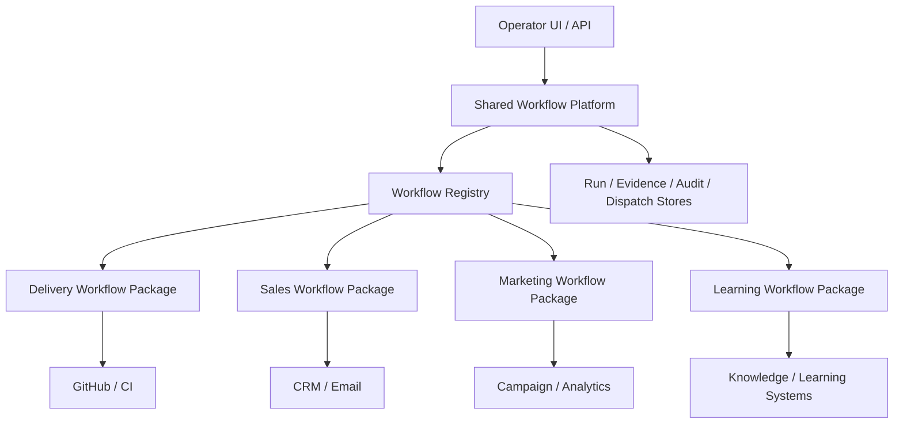

**Status**: Target architecture note — backlog input, not an implementation plan
**Date**: 2026-04-04
**Type**: Architecture target
**Scope**: Evolve Agentopia from a delivery-first workflow engine into a reusable multi-workflow platform

---

## 1. Summary

Agentopia already has a real workflow foundation:

- durable orchestration
- dispatch and governance primitives
- evidence and gate foundations
- operator-driven lifecycle control

But the current production wiring is still optimized around **one primary workflow domain: software delivery**.

That is acceptable for today. It is not the correct long-term architecture if Agentopia is expected to support additional workflow families such as:

- sales workflows
- marketing workflows
- learning or research workflows
- support or operations workflows

The target state is **not** “one giant workflow engine with more phases”.
The target state is a **shared workflow platform** with multiple domain workflows implemented as separate packages on top of common runtime contracts.

---

## 2. Current Reality

Today, Agentopia is **multi-workflow-capable in theory, but single-workflow-optimized in practice**.

### What is reusable already

- Temporal client wrapper
- run/evidence/gate foundations
- role and dispatch foundations
- workflow conversations and audit trail
- operator command/control primitives

### What is still delivery-centric

- Temporal worker registration is centered on `DeliveryWorkflow`
- workflow start paths hardcode `DeliveryWorkflow`
- signal routing is GitHub-delivery-oriented (`PR opened`, `review submitted`, `merged`)
- workflow state semantics are delivery-specific (`QA_APPROVED`, `MERGE_READY`, `pr_number`)
- Temporal activities are concentrated in a shared monolithic module

This means a second workflow domain can be added, but it will likely require touching shared code in ways that raise regression risk for the delivery path.

---

## 3. Target Architecture

The target architecture should separate Agentopia into **platform layers** and **workflow-domain layers**.

### 3.1 Shared Workflow Platform

This layer is generic and should not know whether the workflow is delivery, sales, marketing, or learning.

It owns:

- workflow run lifecycle
- persistence of runs and events
- evidence registry
- gate evaluation
- operator actions and overrides
- dispatch transport
- observability, audit, and policy hooks

Examples of shared concepts:

- `workflow_id`
- `workflow_type`
- `run_state`
- `evidence`
- `gate_result`
- `dispatch_record`
- `operator_action`

### 3.2 Workflow Registry

Agentopia should introduce a **workflow registry** as the contract between the platform and each workflow domain.

The registry should resolve, per `workflow_type`:

- workflow class
- input model
- task queue
- signal adapter
- update/query adapter
- activity set
- state projection rules

This removes direct hardcoding of `DeliveryWorkflow` from start, signal, and worker registration paths.

### 3.3 Domain Workflow Packages

Each workflow family should live in its own package, for example:

- `workflows/delivery/`
- `workflows/sales/`
- `workflows/marketing/`
- `workflows/learning/`

Each package should own:

- workflow definition
- domain state model
- domain activities
- domain signals/events
- domain gate inputs
- domain scenario tests

The domain package should not need to edit unrelated workflow packages.

### 3.4 Domain Adapters

Each workflow family will typically integrate with different external systems.

Examples:

- delivery → GitHub, CI, PR reviews
- sales → CRM, email, lead enrichment
- marketing → campaign planner, analytics, content systems
- learning → document sources, quiz/checkpoint systems, memory stores

These adapters should be isolated per domain.

The delivery event model must not become the default workflow event model for every future domain.

---

## 4. Layer Boundaries

The system should follow this separation:

### Shared layer rules

The shared layer may define:

- common workflow status model
- common gate contract
- common dispatch and notification interfaces
- common operator override semantics

The shared layer must **not** define:

- PR-specific states as universal workflow states
- GitHub review semantics as universal review semantics
- delivery-only success criteria as global workflow rules

---

## 5. What Must Be Workflow-Specific

These elements should belong to each workflow domain, not the shared core:

- state names beyond a small shared lifecycle shell
- event and signal schema
- required evidence types
- gate conditions
- artifact types
- domain adapters
- retry/rework semantics
- success criteria

For example:

- `MERGE_READY` belongs to delivery, not to sales
- `APPROVAL_GRANTED` may exist in several domains, but the evidence behind it differs by domain
- `review` in delivery is not the same object as `approval` in marketing or `checkpoint` in learning

---

## 6. Conflict Prevention

To keep new workflows from colliding with existing ones, Agentopia should enforce these structural rules:

### Rule 1: No new workflow may be started by hardcoding a workflow class name

All start paths should go through the workflow registry.

### Rule 2: No new workflow may reuse another domain's state model

Each domain owns its own state object and domain-specific transitions.

### Rule 3: No shared monolithic activity module for all domains

Shared utilities are fine.
Domain activities should be grouped by workflow package.

### Rule 4: Signals must be routed by workflow type

The platform should resolve incoming events through a workflow-type-aware adapter, not assume GitHub delivery semantics.

### Rule 5: Scenario tests must be domain-local

Each workflow package should carry its own mandatory scenario pack so one domain does not silently break another.

---

## 7. Minimum Refactor Before Adding Workflow #2

Before Agentopia adds a second serious workflow domain, these changes should happen first:

1. Introduce `workflow_type` as a first-class field in run metadata
2. Add a workflow registry for start/signal/query resolution
3. Split delivery-specific workflow code into a domain package
4. Split delivery activities from the generic Temporal activity surface
5. Make worker registration workflow-type aware
6. Define a small shared lifecycle shell and leave domain states outside it

Without this refactor, every new workflow will push more logic into shared delivery-centric paths and make the system harder to reason about.

---

## 8. Recommended Shared Lifecycle Shell

Agentopia should keep the shared lifecycle minimal.

Suggested platform-level lifecycle:

- `CREATED`
- `PLANNING`
- `EXECUTING`
- `WAITING`
- `BLOCKED`
- `COMPLETED`
- `CANCELED`
- `ESCALATED`

Domain-specific states should be nested under that shell.

Examples:

- delivery: `IN_DEV`, `IN_REVIEW`, `MERGE_READY`
- sales: `LEAD_TRIAGED`, `OUTREACH_READY`, `FOLLOWUP_PENDING`
- marketing: `BRIEF_APPROVED`, `ASSETS_PENDING`, `CAMPAIGN_LIVE`
- learning: `MODULE_ASSIGNED`, `CHECKPOINT_PENDING`, `REVIEW_COMPLETE`

This keeps the platform uniform without forcing all workflows into delivery vocabulary.

---

## 9. Backlog Direction

This target architecture does **not** need to be implemented immediately.

Recommended sequencing:

1. Stabilize delivery workflow quality and governance first
2. Refactor the workflow platform around `workflow_type` and registry
3. Extract delivery into a clean domain package
4. Only then add the second workflow domain

The key principle is simple:

**Do not scale a delivery-specific implementation by copy-pasting it into other business domains.**

Scale Agentopia by separating the workflow platform from workflow domains.

---

## 10. Final Position

Agentopia should evolve into a **multi-domain workflow platform**, not remain a **single delivery workflow with extra branches**.

The architectural bar for that transition is:

- shared platform contracts
- workflow registry
- domain workflow packages
- domain adapters
- isolated scenario testing

Until those exist, Agentopia can add more workflows, but each new one will increase coupling and regression risk.
