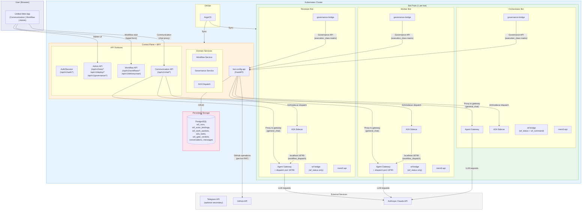
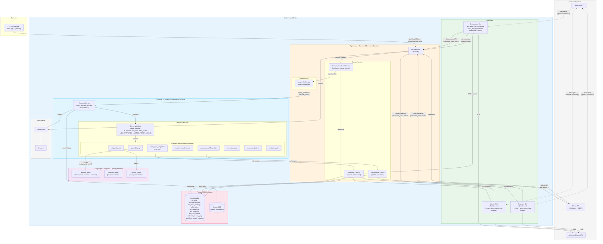
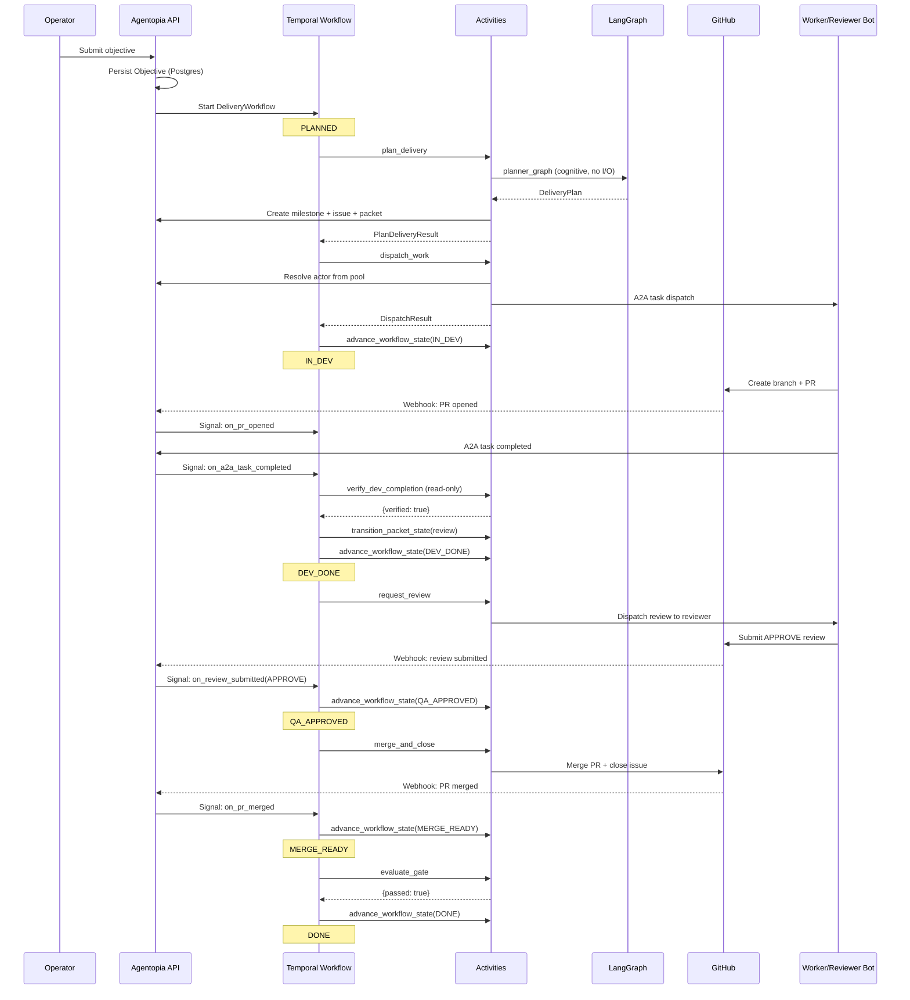

# Agentopia Architecture Overview

> High-level architecture for the Agentopia autonomous multi-bot delivery platform.
> Aligned with: `docs/milestones/p1-web-app-primary-dual-lane-mvp.md`
> Last updated: 2026-03-30

---

## 1. P1 Target Architecture (Web-App Primary)

> **Note:** P1 implementation is in progress (2026-03-30). The unified web app, auth/session layer, Communication API, and Workflow API all exist in code. Workflow-scoped conversation is being added. The `start_delivery` model tool has been removed (Boundary 1 enforced). See P1 milestone doc for remaining scope.



### Dual-lane product model

The system supports two interaction modes, real at every layer:

| Mode | UX | API surface | Backend path | Governance |
|---|---|---|---|---|
| **Communication** | Chat with selected bot | `/api/v1/chat/{bot_id}/*` | bot-config-api → gateway (general_chat) | consultation_read only |
| **Workflow** | Start delivery, track progress, workflow-scoped conversation | `/api/v1/workflows/*`, `/api/v1/delivery/start` | bot-config-api → Temporal → sidecar → gateway (workflow_dispatch) | execution_write, review_write via sidecar |

Communication and Workflow are not cosmetic tabs — they hit different API surfaces, follow different backend paths, and enforce different governance rules.

### 3 execution boundaries

| Boundary | Control point | Runtime dependency |
|---|---|---|
| **1. Orchestrator delivery start** | Workflow UI form → typed API. `start_delivery` tool removed from model surface. | NO |
| **2. Worker/reviewer normal chat** | Governance defaults to general_chat → denies writes. | NO |
| **3. Worker/reviewer sidecar execution** | Dispatch port 18790 + executionClass propagation → governance allows writes. | YES |

### What is implemented

- **Typed delivery start**: `POST /api/v1/delivery/start` with `DeliveryTargetRef`. Called by Workflow UI form (web app). `start_delivery` model tool removed (Boundary 1).
- **Temporal workflow**: DeliveryWorkflow with 9 signals, 6 updates, 3 queries. State machine: PLANNED → IN_DEV → DEV_DONE → QA_APPROVED → MERGE_READY → DONE
- **Sidecar dispatch**: Sidecar → dispatch port 18790 (localhost-only) → gateway with `executionClass: workflow_dispatch`. Task lifecycle API with correlation tracking
- **Governance**: 28 API tools classified into 5 action classes. `execution_class × action_class` authorization matrix. Fail-closed for unknown.
- **LangGraph**: Planner, reviewer, routing graphs. Run inside Temporal activities (ephemeral, no I/O)
- **A2A consultation**: Bot-to-bot relay for questions, brainstorming. Separate from delivery dispatch
- **Role contracts**: Orchestrator (`wf_status` + `wf_command`), worker (`wf_status` only), reviewer (`wf_status` only). `start_delivery` removed from model surface.
- **Persistence**: Runs, bindings, packets, A2A tasks, gate verdicts, objectives, activation records, conversations, workflow messages in Postgres. Auto-migration on startup.
- **Bot activation**: 4 gates (SOUL, binding, MCP, tools). Deployment validation. Only ACTIVE bots eligible for delivery routing
- **Auth/session layer**: `admin_user` principal, BFF session, httpOnly cookie, route guards. `require_auth`, `require_dual_auth` dependencies.
- **Communication API** (`/api/v1/chat/*`, WS): Chat proxy, conversation persistence. WebSocket for real-time streaming.
- **Workflow API** (`/api/v1/workflows/*`): List, detail, artifacts, workflow-scoped conversation endpoints.
- **Unified web app**: agentopia-ui with Communication lane + Workflow lane + Admin sections. React 19 + Vite.
- **Review system**: SCM-bound and workflow-scoped reviewer coexistence. Metadata-based dispatch filtering. GitHub webhook integration.
- **Telegram integration**: Optional secondary interaction surface (web app is primary).

### Known system gaps

- **Execution authorization (Boundary 3)**: `executionClass` propagation implemented in code across `agentopia-core` and governance-bridge. Runtime verification pending (P1 #259).
- **Delivery completion semantics**: Sidecar marks "completed" on any LLM text response, not artifact verification.
- **No auto-escalation**: `wait_dev` blocks indefinitely if worker fails. Manual cancel required.
- **Delivery start API trust**: Product entrypoint, not hardened boundary. Dual-auth guard accepts session cookie or service token.

---

## 2. Target Architecture (Hybrid Stack)



### Hybrid stack decision

| Layer | Owns | Does NOT own |
|---|---|---|
| **Agentopia** | Domain state (Postgres), role contracts, governance auth, GitHub execution | Orchestration durability, planning, long-running coordination |
| **Temporal** | Durable orchestration lifecycle, signals, retry/timeout, activity scheduling | Business rules, domain state, LLM reasoning |
| **LangGraph** | Planning, review analysis, actor routing (ephemeral cognitive) | Durable execution, persistence, orchestration lifecycle |

---

## 3. Autonomous Delivery Lifecycle



---

## 4. Layer Ownership

```
┌─────────────────────────────────────────────────────────────┐
│                    OWNERSHIP MODEL                           │
├──────────────┬──────────────────────────────────────────────┤
│              │                                              │
│  AGENTOPIA   │  Domain state (canonical):                   │
│  (Postgres)  │  - Objectives, Workflows, Packets            │
│              │  - Bindings, Evidence, Gate Verdicts          │
│              │  - A2A Tasks, Artifact Mapping                │
│              │  Role contracts + governance enforcement      │
│              │  GitHub API execution (per-bot PAT)           │
│              │                                              │
├──────────────┼──────────────────────────────────────────────┤
│              │                                              │
│  TEMPORAL    │  Orchestration lifecycle (durable):           │
│  (Event      │  - Workflow state machine execution           │
│   History)   │  - Signal/update handling                     │
│              │  - Timer/timeout management                   │
│              │  - Activity scheduling + retry                │
│              │  - Event sourcing (replay-safe)               │
│              │                                              │
├──────────────┼──────────────────────────────────────────────┤
│              │                                              │
│  LANGGRAPH   │  Cognitive decisions (ephemeral):             │
│  (In-memory, │  - Planning decomposition                    │
│   no persist)│  - Review analysis                           │
│              │  - Actor routing selection                    │
│              │  - Runs ONLY inside Temporal activities       │
│              │  - NO I/O, NO service imports                 │
│              │                                              │
├──────────────┼──────────────────────────────────────────────┤
│              │                                              │
│  GITHUB      │  External artifacts (source of truth):       │
│  (External)  │  - Issues, PRs, Reviews, Milestones          │
│              │  - CI/CD check results                        │
│              │  - Webhook events → Agentopia → Temporal      │
│              │                                              │
└──────────────┴──────────────────────────────────────────────┘
```

---

## 5. Implementation Status

| Milestone | Scope | Status |
|---|---|---|
| **Rounds 1-5** | Persistence, refactor, Temporal, activities, workflow, LangGraph, pool, monitoring | **DONE** |
| **Wave E L2** | Gateway-native A2A: sidecar, task lifecycle API, dispatch transport | **DONE** |
| **Wave E LangGraph** | LangGraph standalone service planning | **DONE** |
| **P0 #26** | Production contract foundation: typed start, review fallback, activation | **IN PROGRESS** — Phase 1+2 code merged. Permanent dual-lane model adopted. |
| **P0.5 #28** | Deterministic delivery start front door | **CLOSED/DEFERRED** — C2 rejected. Permanent dual-lane model adopted. |
| **P1 #27 (old)** | Execution authorization enforcement (runtime-centric) | **SUPERSEDED** — rebased to P1 #30 |
| **P1 #30 (new)** | Web-App Primary Dual-Lane MVP | **ACTIVE** — 11 issues. See [p1-rebase-web-primary-dual-lane.md](./p1-rebase-web-primary-dual-lane.md) |
| **#25** | Agent Runtime — Fork & Customize OpenClaw | Epic — umbrella for runtime fork work |
| **Wave F #22** | Multi-step planning, human-in-loop, streaming | 1/6 closed |
| **Wave G #23** | Multi-packet, collaborative conversation, graph branching | 0/4 |

### Current Active Work — P1 #30 Phases
1. **Phase 1**: Auth session layer + Communication API + Workflow API extensions + Workflow conversation API
2. **Phase 2**: Workflow start surface (Boundary 1) — remove `start_delivery` from model, SOUL update
3. **Phase 3**: Sidecar propagation fix (Boundary 3) — re-verify + fix runtime executionClass chain
4. **Phase 4**: Unified frontend (app shell, Communication UI, Workflow UI, admin link)
5. **Phase 5**: E2E proof (5 scenarios through web UI)

### Delivery start path resolution
- **Old gap**: LLM may not call `start_delivery` tool — depended on model compliance
- **Resolved by rebase**: `start_delivery` removed from model surface. Delivery start is now Workflow UI form → typed API. Model-mediated start eliminated. Start-path integrity is product-surface-controlled.

---

## 6. Related Documents

| Document | Purpose |
|---|---|
| [p1-rebase-web-primary-dual-lane.md](./p1-rebase-web-primary-dual-lane.md) | **CANONICAL** — P1/P2 milestone rebase, dual-lane product model, boundaries, release gate |
| [p1-execution-authorization.md](./p1-execution-authorization.md) | Execution authorization architecture — sections 2.1–2.5 remain canonical (matrix, action/execution classes) |
| [canonical-object-model.md](./canonical-object-model.md) | 13-object delivery model with ownership |
| [state-ownership-matrix.md](./state-ownership-matrix.md) | 4-layer state ownership (Agentopia/Temporal/LangGraph/GitHub) |
| [hybrid-integration.md](./hybrid-integration.md) | Agentopia + Temporal + LangGraph integration contract |
| [../contracts/delivery-start-contract.md](../contracts/delivery-start-contract.md) | Typed delivery start API — updated for web-app-primary model |
| [../contracts/review-verification.md](../contracts/review-verification.md) | Review fallback verification semantics |
| [../contracts/bot-activation.md](../contracts/bot-activation.md) | Activation states, gates, routing enforcement |
| [../a2a-protocol/a2a-solution-protocol.md](../a2a-protocol/a2a-solution-protocol.md) | A2A protocol design |
| [P0.5-deterministic-delivery-start-front-door.md](./P0.5-deterministic-delivery-start-front-door.md) | CLOSED/DEFERRED — superseded by web-app-primary Workflow start surface |
| [../design-waves/](../design-waves/) | Historical wave deliverables (A through E) |
| [../operations/](../operations/) | Runbooks, UAT guide, memory hygiene |
