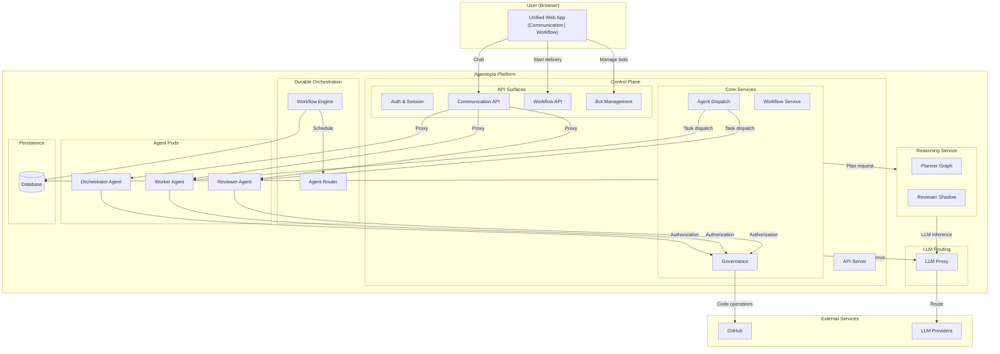
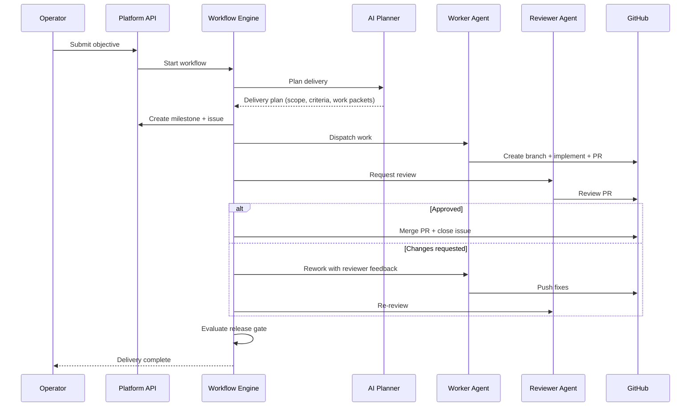

Agentopia is an autonomous multi-bot delivery platform. It orchestrates teams of AI agents — orchestrators, workers, and reviewers — to plan, build, review, and merge software changes with minimal human intervention.

---

## System Architecture

---

## Dual-Lane Interaction Model

The platform supports two distinct interaction modes, separated at every layer:

### Communication Lane

Conversational interaction with any agent. Users chat with bots through the web app — asking questions, discussing approaches, brainstorming solutions. This lane is read-only with respect to code: agents can discuss code but cannot create branches, push files, or submit pull requests.

### Workflow Lane

Structured delivery orchestration. Users submit objectives through a typed form, and the platform autonomously plans, assigns, executes, reviews, and merges the work. This lane has write access to code repositories, governed by execution authorization policies.

| Aspect | Communication | Workflow |
|---|---|---|
| **Purpose** | Conversation, consultation, Q&A | Autonomous code delivery |
| **Code access** | Read-only | Full write (governed) |
| **Entry point** | Chat interface | Workflow start form |
| **Agent interaction** | Direct chat | Orchestrated dispatch |
| **Governance** | Consultation tools only | Full execution authorization |

---

## Execution Boundaries

Three boundaries ensure that code-modifying operations only happen through authorized workflow dispatch:

1. **Delivery start boundary** — Delivery can only be initiated through the Workflow UI form. The model cannot start deliveries through conversation.

2. **Communication read-only boundary** — Agents chatting in Communication mode cannot create branches, push files, or submit pull requests. Governance denies write operations outside of workflow dispatch.

3. **Sidecar execution boundary** — Workers and reviewers performing delivery tasks receive their work through a trusted dispatch channel that carries execution authorization. Only this channel enables write operations.

---

## Delivery Lifecycle

When an operator submits a delivery objective, the platform orchestrates the full lifecycle:

### Workflow Phases

| Phase | What happens | Agents involved |
|---|---|---|
| **Planning** | AI decomposes objective into structured work packets with scope and acceptance criteria | Planner (LLM) |
| **Dispatch** | Work packet routed to an eligible worker agent based on role binding | Router |
| **Development** | Worker creates branch, writes code, submits pull request | Worker |
| **Review** | Reviewer inspects PR, submits structured review with findings | Reviewer |
| **Rework** | If changes requested, worker receives specific feedback and fixes code | Worker |
| **Merge** | Approved PR is merged, issue closed, milestone updated | Platform |
| **Gate** | Release gate evaluates evidence, artifacts, and quality signals | Platform |

---

## Role System

Agents operate under role contracts that govern their authority:

### Orchestrator
Manages the delivery lifecycle. Can start workflows, monitor progress, evaluate release gates, and close milestones. Coordinates between workers and reviewers.

### Worker
Executes development tasks. Can create branches, write code, and submit pull requests — but only through authorized workflow dispatch, not through conversation.

### Reviewer
Inspects code quality. Can review pull requests, submit structured findings, approve or request changes. Provides specific, actionable feedback that workers can act on.

Role contracts are enforced at the governance layer — they define what tools each role can access, not just what the agent's prompt says.

---

## SA Knowledge Base

SA bots can access client-provided domain knowledge at inference time. This enables grounded, cited answers from architecture specs, API references, project standards, and other client documents.

### How it works

1. **Operator ingests documents** — uploads PDF, markdown, HTML, text, or code files into client-scoped knowledge bases via the operator UI or API
2. **Gateway plugin retrieves** — at inference time, a `knowledge-retrieval` gateway plugin (priority 10, before mem0) queries bot-config-api for relevant chunks matching the user's question
3. **Context injection** — retrieved chunks are injected into the LLM context as XML domain-knowledge blocks with [N] citation references
4. **Answer contract** — the D7 answer contract instructs the LLM to cite sources, never fabricate citations, and disclose when no domain documentation is available

### Scope isolation

Knowledge is scoped per client: `{client_id}/{scope_name}`. Each bot subscribes to specific scopes at creation time. The gateway plugin sends only the bot's identity — bot-config-api resolves subscribed scopes server-side. Cross-client knowledge leakage is prevented by design.

### Document lifecycle

Documents are tracked by SHA-256 hash. Re-uploading unchanged content is a no-op. Modified content triggers a two-phase replace: new chunks are committed atomically before old chunks are superseded. Deleted documents are tombstoned, not silently removed.

### Architecture decisions

Seven ADRs (008-014) lock the architecture: tenancy/isolation, governance, runtime retrieval, provenance, ingestion lifecycle, external import (deferred), and quality/evaluation. See [SA Knowledge Base Milestone](/milestones/production-sa-knowledge-base) for details.

**Current status**: Implemented. Automated verification complete. Live pilot evaluation pending (#307).

---

## Technology Stack

| Layer | Technology | Purpose |
|---|---|---|
| **Web App** | React, Vite, Tailwind | Unified operator interface |
| **API Server** | Python, FastAPI | Control plane, BFF, governance |
| **Workflow Engine** | Temporal | Durable orchestration with signals, retries, timeouts |
| **Reasoning Service** | LangGraph (dedicated service) | Objective decomposition, review shadow analysis |
| **Agent Runtime** | OpenClaw-based gateway | LLM orchestration, tool execution, memory |
| **Agent Communication** | A2A Protocol (JSON-RPC) | Agent-to-agent task dispatch and consultation |
| **Semantic Memory** | Qdrant + Neo4j | Vector search + knowledge graph per agent |
| **Domain Knowledge** | Qdrant + Postgres | Client-scoped document ingestion, retrieval, provenance tracking |
| **LLM Proxy** | Custom Rust proxy | Multi-provider routing, token tracking, rate limiting |
| **Persistence** | PostgreSQL | Workflows, packets, bindings, evidence, audit trail |
| **Deployment** | Kubernetes, ArgoCD, Helm | GitOps-managed infrastructure |
| **Observability** | Prometheus, Grafana | Metrics, SLO alerts, dashboards |

---

## Key Design Decisions

### Multi-plane architecture

The platform separates concerns across four planes:

- **Control plane** — owns domain state, governance enforcement, feature flags, deterministic fallback, and external API execution (GitHub milestones, issues, merges). This is the source of truth for workflows, work packets, role bindings, and audit records.
- **Workflow engine** — owns durable orchestration lifecycle. Handles state machine execution, signal routing, timeout management, and activity scheduling with guaranteed delivery.
- **Reasoning plane** — owns AI-powered planning and review analysis. Runs as a dedicated service with its own LLM calls and validation logic. Returns structured reasoning output that the control plane can accept or fall back from. Has no persistence, no GitHub access, and no workflow state.
- **LLM routing layer** — centralizes all server-side LLM inference through a multi-provider proxy. Handles credential management, provider routing, Codex account rotation, and failover. No backend or reasoning service holds provider credentials directly.

This separation means reasoning suggestions never bypass governance. The control plane decides whether to use AI planning output or fall back to deterministic defaults — the reasoning service cannot force a workflow transition or create artifacts on its own.

### Governance-first execution

Every tool invocation by every agent passes through an authorization layer that checks the agent's role and execution context. This is not prompt-based guidance — it is runtime enforcement. An agent cannot bypass governance by being cleverly prompted.

### Agent isolation

Each agent runs in its own pod with isolated storage, memory, and credentials. Agents communicate through structured protocols (A2A), not shared state. This enables independent scaling, deployment, and lifecycle management per agent.

---

## Further Reading

- [Multi-Bot System Architecture](architecture-multiple-bot) — detailed multi-bot deployment model
- [A2A Protocol Design](a2a-full-design) — agent-to-agent communication protocol
- [Execution Authorization](p1-execution-authorization) — dual-lane enforcement architecture
- [Governed PR Review](governed-pr-review-workflow) — automated code review workflow
- [Worker Pool Routing](worker-pool-routing-improvement-plan) — capability-aware dispatch evolution
- [SA Knowledge Base](/milestones/production-sa-knowledge-base) — domain knowledge ingestion, retrieval, and citation
