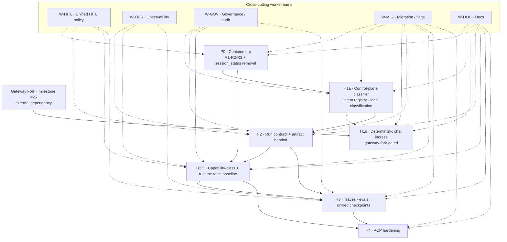

# Agent Harness — Implementation Plan

> **Status:** Planning — binding on downstream execution, non-binding on architecture.
> **Scope:** Implementation planning only. This document does **not** re-open architectural decisions. It turns the already-accepted architecture and milestone into execution work.
> **Companion docs:** [Harness Architecture](../architecture/harness-control/harness-architecture), [Runtime Facts & Capability Classes Baseline](../architecture/harness-control/runtime-facts-capability-classes-baseline), [Agent Harness Control Plane milestone](./agent-harness-control-plane).

---

## 1. Executive Summary

The Agent Harness turns today's "autonomous gateway + partial Temporal control" into a governed multi-lane runtime: deterministic front doors for structured workflows, bounded autonomous runs for chat, a unified run contract with structured artifacts, a capability-class-bound tool surface, and platform-level traces / evals / checkpoints. HITL is not a separate milestone — it is a cross-cutting workstream with three production insertion points (DeliveryWorkflow, work-item approvals, A2A/relay threads) that must be unified by a shared policy layer, **not** collapsed into a single mandatory hop.

The implementation plan is organized into seven phases — **Containment (parallel), H1a (control-plane classifier), H1b (deterministic chat ingress, gateway-fork-dependent), H2 (run contract + artifacts), H2.5 (capability-class + runtime-facts baseline enforcement), H3 (traces / evals / checkpoints), H4 (ACP hardening)** — plus five cross-cutting workstreams (HITL, Observability, Governance, Migration, Docs). Each phase has bounded scope, explicit deliverables, defined acceptance gates, and honest dependencies on in-flight repo work (milestone #25 gateway fork, existing DeliveryWorkflow signals/updates, `before_tool_call` plugin hook, A2A thread checkpoints).

The plan is deliberately **not** a greenfield rewrite. It is an evolution: preserve the DeliveryWorkflow approval surface already in production, promote the existing `before_tool_call` hook into a pluggable checkpoint interception point, harden the A2A/relay thread-checkpoint layer, and only add new primitives (intent registry, run contract, ApprovalSidecarWorkflow, OpenInference instrumentation, capability-class renderer) where refactors are genuinely required. The final verdict is `HARNESS_IMPLEMENTATION_PLAN_WRITTEN`.

---

## 2. Planning Scope

### In scope
- Sequencing, dependencies, and acceptance gates for each harness phase.
- Work packages concrete enough to be turned into GitHub issues without re-deliberation.
- Cross-repo ownership: `agentopia-core` (gateway / plugin runtime), `agentopia-protocol` (bot-config-api / Temporal workflows), `agentopia-infra` (Helm charts / ArgoCD), `docs`.
- Integration with existing production surfaces: DeliveryWorkflow signals/updates, work-item approvals, A2A thread checkpoints, `before_tool_call` plugin hook, tool-loop detection, Helm chart `capabilityClass`.
- HITL as a cross-cutting workstream inside each phase — not a standalone milestone.

### Out of scope
- Re-opening accepted architecture (capability ladder, `admin_inspect`/`admin_mutate` split, runtime-facts R1/R2/R3, A2A retained in-house).
- Greenfield replacement of the current gateway or Temporal layer.
- Business-model decisions (tenant isolation, billing, multi-org).
- Specific vendor selection outside two explicitly scoped work packages (Phoenix vs Langfuse trace backend; ACP runtime hardening surface).
- Chat-originated deterministic ingress prior to the gateway fork (milestone #25) landing — planned here, but gated.

---

## 3. Inputs / Binding Documents

The following documents are **binding inputs**. This plan must not contradict them; where it appears to, the binding document wins and this plan must be corrected.

| # | Document | Binding on |
|---|---|---|
| B1 | [Harness Architecture](../architecture/harness-control/harness-architecture) | Lane taxonomy, topology, control-plane vs autonomous-plane vs deterministic-spine separation |
| B2 | [Runtime Facts & Capability Classes Baseline](../architecture/harness-control/runtime-facts-capability-classes-baseline) | Capability ladder, R1/R2/R3, `admin_inspect`/`admin_mutate` contract, per-class tool sets |
| B3 | [Orchestrated Multi-Agent Platform — Partial Harness Control](../architecture/harness-control/orchestrated-multi-agent-platform-partial-harness-control) | Current-state assessment; what already exists vs what is missing |
| B4 | [Harness System Deep-Dive Debate](../architecture/harness-control/harness-system-deep-dive-debate) | Rationale, H1a/H1b split, delivery-start current state, maturity matrix |
| B5 | [HITL / Checkpoint Feasibility Debate](../architecture/harness-control/hitl-checkpoint-feasibility-debate) | Three insertion points, ApprovalSidecarWorkflow primitive, shared-policy-layer verdict |
| B6 | [Agent Harness Control Plane milestone](./agent-harness-control-plane) | Phase names, milestone-level deliverables, H1a/H1b split |

### Binding rules restated (do not re-debate here)

1. **Capability ladder is strict-cumulative:** Conversant ⊂ Worker ⊂ Orchestrator ⊂ Admin. `admin_mutate` is Admin-only and capped at 1 call / turn.
2. **`admin_mutate` is not an ingress verb.** It remains an Admin-class tool; deterministic admin-mutation ingress is a documented-but-not-approved alternative.
3. **No chat-originated deterministic ingress** until the gateway fork (milestone #25) lands. H1b is gated on it.
4. **`session_status` is not agent-callable.** It becomes a control-plane fact only.
5. **A2A retained in-house.** ACP is the advanced-runtime lane; it does not replace A2A.
6. **`before_tool_call` is already async.** The gap is result-contract shape, not sync→async migration.
7. **HITL has three production insertion points today** (DeliveryWorkflow, work-item approvals, A2A threads). Target is a shared policy layer, not collapsing them.

---

## 4. Planning Principles

- **Evolution over rewrite.** Promote existing primitives (DeliveryWorkflow approvals, `before_tool_call`, thread checkpoints, Helm `capabilityClass`) before introducing new ones.
- **Separation of planes.** Control plane (bot-config-api) carries intent and policy. Deterministic spine (Temporal) carries durable state. Autonomous plane (gateway) carries bounded runs. No plane may own decisions that belong to another.
- **Capability-class as the unit of policy.** Tool sets, caps, prompts, and traces all key off `capabilityClass`. No per-tool ad-hoc whitelists once H2.5 lands.
- **One run contract.** Every autonomous run — regardless of ingress — produces the same artifact shape, referenced by the same ID, handed off the same way.
- **Platform traces, not per-agent.** OTEL + OpenInference emit from the gateway runtime; product features read from one backend.
- **HITL is a pluggable policy, not a hop.** Insertion points may coexist; the policy layer decides which fires for a given run, not the topology.
- **Migration is staged behind flags.** No phase ships a global behavioral change without an in-flight shadow/parity window.
- **No scope-creep via "while we're in there."** Every work package maps to exactly one phase. Refactors that span phases get their own package.

---

## 5. Workstream Overview

The plan is structured into **phases** (time-ordered execution bundles) and **workstreams** (cross-cutting concerns that thread through multiple phases).

### Phases
| # | Phase | Goal | Gated on |
|---|---|---|---|
| P0 | Containment | Stop the bleeding: enforce runtime-facts R1/R2/R3, remove `session_status` from agent surface, fix contradicting system-prompt lines. Parallel with everything else. | Nothing. |
| H1a | Control-plane classifier | Typed-intent registry + lane-classification service in bot-config-api; emits `runContract.intent` + `runContract.lane` on every run start. Standalone. | P0 landed far enough to ship without fighting runaway loops. |
| H1b | Deterministic chat ingress | Route qualifying chat intents into Temporal deterministic workflows instead of autonomous turns. | Gateway fork (milestone #25) + H1a. |
| H2 | Run contract + artifact handoff | Unified `RunContract` schema, artifact taxonomy, persistence layer, handoff semantics across lanes. | H1a. |
| H2.5 | Capability-class + runtime-facts baseline | Promote `capabilityClass` to first-class control-plane field; render tool sets per class; implement `admin_inspect`/`admin_mutate`; enforce R1/R2/R3 at runtime. | P0 (R1/R2/R3 primitives), H2 (run contract carries class). |
| H3 | Traces / evals / checkpoints | OTEL + OpenInference wiring, trace backend selection, eval harness, unified checkpoint policy matrix. | H2 (traces key off run contract). |
| H4 | ACP hardening | Policy + runtime contract alignment for ACP lane; no effect on A2A. | H2, H2.5. |

### Workstreams
| # | Workstream | Threads through |
|---|---|---|
| W-HITL | Unified HITL policy layer (workflow / work-item / thread / tool-boundary) | P0, H2, H2.5, H3 |
| W-OBS | Observability — traces, evals, dashboards | H2, H2.5, H3 |
| W-GOV | Governance — audit, actor binding, evidence surface | H1a, H2, H2.5, H3 |
| W-MIG | Migration — flags, shadow windows, deprecation plan | Every phase |
| W-DOC | Documentation — keep `docs/` consistent with every phase | Every phase |

---

## 6. Phase Plan

Every phase entry uses the same shape: **Goal · Repos · Deliverables · Dependencies · Known blockers · Acceptance · Non-goals**. Work-package IDs (e.g. `WP-P0-01`) resolve in §7.

### Phase P0 — Containment (parallel; no dependencies)
- **Goal.** Remove the worst containment gaps today — runaway loops, `session_status` as an agent-callable tool, contradicting system-prompt lines — without waiting for architectural phases to land.
- **Repos.** `agentopia-core`, `agentopia-infra`.
- **Deliverables.** R1 per-tool-per-turn cap (`WP-P0-01`); R2 per-class `maxToolCalls` defaulting (`WP-P0-02`); R3 loop detection **on** by default with per-class thresholds (`WP-P0-03`); remove `session_status` from the agent-visible tool catalog (`WP-P0-04`); fix system-prompt self-contradiction lines at [system-prompt.ts:65-77] (`WP-P0-05`).
- **Dependencies.** None.
- **Known blockers.** None code-wise; needs owner sign-off on R2 defaults per class.
- **Acceptance.** (a) No agent-visible path can call `session_status`; (b) default bot config enforces R1/R2/R3 at the runtime layer; (c) chat loop regression tests confirm loop-detection halts within threshold; (d) prompt lint rule rejects regressions of the contradicting lines.
- **Non-goals.** Do not introduce `capabilityClass` enforcement here — that belongs to H2.5. P0 only ships the mechanisms; enforcement defaults are class-aware but read from static per-bot config until H2.5.

### Phase H1a — Control-plane classifier & typed-intent registry
- **Goal.** Make intent typed, named, and classified at the control plane, and emit that classification on every run — regardless of whether the run ends up autonomous or deterministic.
- **Repos.** `agentopia-protocol` (bot-config-api), `docs`.
- **Deliverables.** Typed-intent registry schema (`WP-H1a-01`); lane-classification service with test fixtures (`WP-H1a-02`); deterministic entry-path inventory (`WP-H1a-03`); emit `intent` + `lane` fields on run start (`WP-H1a-04`).
- **Dependencies.** P0's R1/R2/R3 mechanisms should be landed so adding a classifier doesn't land alongside active runaway loops.
- **Known blockers.** None; all in the control plane.
- **Acceptance.** (a) Every chat / A2A / delivery run has a resolved `intent` and `lane` attached before autonomous execution starts; (b) classifier shadow-logs on 100 % of production runs for ≥ 7 days with < 1 % unresolved-intent rate; (c) entry-path inventory lists every production ingress with its intent and current lane.
- **Non-goals.** Do **not** route chat into Temporal yet — that is H1b. H1a only classifies; routing stays unchanged.

### Phase H1b — Deterministic chat ingress (gateway-fork-dependent)
- **Goal.** Route qualifying chat-originated intents into Temporal deterministic workflows, using the classifier from H1a and the forked gateway from milestone #25.
- **Repos.** `agentopia-core` (gateway fork path), `agentopia-protocol` (workflows), `agentopia-infra`.
- **Deliverables.** Gateway-side ingress dispatch (`WP-H1b-01`); deterministic workflow registrations for classified intents (`WP-H1b-02`); fallback policy for unresolved classifications (`WP-H1b-03`); migration flag + per-bot allow-list (`WP-H1b-04`).
- **Dependencies.** **Hard:** gateway fork milestone #25 merged and deployed. **Hard:** H1a emitting `intent`+`lane` in production.
- **Known blockers.** Milestone #25 is the critical path. This phase may not start implementation work until #25 has a stable ingress seam.
- **Acceptance.** (a) At least one production chat intent flows end-to-end through Temporal with a durable run ID; (b) fallback path never regresses existing autonomous chat; (c) per-bot rollout flag gates enablement.
- **Non-goals.** No new ingress verbs. No `admin_mutate` via chat. No mass-migration of intents — one pilot + allow-list.

### Phase H2 — Run contract & artifact handoff
- **Goal.** One `RunContract` schema that every run — autonomous, deterministic, A2A, delivery — reads and writes. One artifact taxonomy. One handoff surface.
- **Repos.** `agentopia-protocol`, `agentopia-core`, `docs`.
- **Deliverables.** `RunContract` schema + versioning (`WP-H2-01`); artifact taxonomy + persistence layer (`WP-H2-02`); propagation through gateway → plugin runtime → Temporal → A2A threads (`WP-H2-03`); handoff semantics between lanes (`WP-H2-04`).
- **Dependencies.** H1a (intent + lane are fields on the contract).
- **Known blockers.** Persistence choice (object store vs dedicated artifact service); decide via ADR inside `WP-H2-02`.
- **Acceptance.** (a) A single run ID resolves the same artifact manifest from every plane; (b) DeliveryWorkflow and autonomous chat both emit artifacts under the same taxonomy; (c) handoff between lanes is observable end-to-end in a single trace.
- **Non-goals.** Do not unify HITL checkpoints under the contract here — that is H3. H2 only ensures the contract *carries* checkpoint references, not that the policy is unified.

### Phase H2.5 — Capability-class + runtime-facts baseline enforcement
- **Goal.** Promote `capabilityClass` from a Helm value into a first-class control-plane field, render tool sets from it, implement `admin_inspect`/`admin_mutate` per the baseline, and enforce R1/R2/R3 at runtime.
- **Repos.** `agentopia-protocol`, `agentopia-core`, `agentopia-infra`, `docs`.
- **Deliverables.** `capabilityClass` field in bot-config-api schema with migration (`WP-H2.5-01`); class → tool-set rendering in Helm chart driven by control-plane emission (`WP-H2.5-02`); `admin_inspect` (read-only) implementation (`WP-H2.5-03`); `admin_mutate` (closed enum, cap 1/turn, audited) implementation (`WP-H2.5-04`); R1/R2/R3 enforcement keyed off class (`WP-H2.5-05`); deprecate hand-written `tools.allow` once rendering is class-driven (`WP-H2.5-06`).
- **Dependencies.** P0 for R1/R2/R3 primitives; H2 for run-contract-carried class.
- **Known blockers.** Existing hand-written `tools.allow` at [configmap-config.yaml:183] must be migrated, not edited by hand; migration needs a shadow-diff window.
- **Acceptance.** (a) Every bot has a `capabilityClass` resolved at deploy time; (b) `tools.allow` is 100 % rendered, 0 % hand-written; (c) `admin_inspect`/`admin_mutate` deployed to at least one Admin-class bot with audit trail; (d) R1/R2/R3 caps read from class, not per-bot static values.
- **Non-goals.** No new capability classes beyond the four-rung ladder. No promotion of `admin_mutate` out of Admin.

### Phase H3 — Traces / evals / unified checkpoint policy
- **Goal.** Platform-level observability and HITL unification: OTEL + OpenInference traces, one trace backend, eval harness, and a checkpoint policy matrix that covers workflow, thread, and tool-boundary checkpoints behind one decision surface.
- **Repos.** `agentopia-core`, `agentopia-protocol`, `agentopia-infra`.
- **Deliverables.** OTEL + OpenInference instrumentation (`WP-H3-01`); trace-backend selection — Phoenix vs Langfuse — via an explicit ADR (`WP-H3-02`); eval harness keyed off `RunContract` (`WP-H3-03`); checkpoint policy matrix (`WP-H3-04`); promote `before_tool_call` to a pluggable checkpoint interception with expanded result contract — `pending`/`edited`/`escalated`/`timeout` (`WP-H3-05`); ApprovalSidecarWorkflow generic primitive (`WP-H3-06`); unify workflow / work-item / thread approval semantics behind the policy matrix (`WP-H3-07`).
- **Dependencies.** H2 (traces and checkpoints key off the contract).
- **Known blockers.** `before_tool_call` result shape today is `{params, block, blockReason}`; expanding it is a breaking change for existing plugins — needs staged migration.
- **Acceptance.** (a) A single trace spans gateway → plugin → Temporal → A2A with OpenInference semantic conventions; (b) eval suite runs nightly against production contracts; (c) every HITL insertion point reads the same policy matrix; (d) `before_tool_call` supports the four new outcome types behind a flag with parity against existing plugins.
- **Non-goals.** Do not collapse insertion points into a single hop. Do not deprecate DeliveryWorkflow approvals.

### Phase H4 — ACP hardening
- **Goal.** Align ACP lane with the run contract, capability classes, and trace backend. No impact on A2A.
- **Repos.** `agentopia-protocol`, `agentopia-core`, `docs`.
- **Deliverables.** ACP policy surface aligned with capability classes (`WP-H4-01`); ACP runtime contract aligned with `RunContract` (`WP-H4-02`); trace instrumentation parity with H3 (`WP-H4-03`).
- **Dependencies.** H2, H2.5, H3.
- **Known blockers.** ACP maturity upstream; may require shimming.
- **Acceptance.** (a) ACP-routed runs carry the same `RunContract` IDs and classes; (b) traces cover ACP with equal fidelity; (c) no A2A regression.
- **Non-goals.** Do not build ACP-only primitives. Do not replace A2A.

---

## 7. Detailed Work Packages

Each work package is scoped to fit one PR-sized unit unless the description says otherwise. Every WP names the binding doc section(s) it must not violate. "Leverage" marks where existing code is promoted rather than rewritten.

### P0 — Containment

| ID | Title | Repo(s) | Leverage | Notes |
|---|---|---|---|---|
| WP-P0-01 | Implement R1 per-tool-per-turn cap | `agentopia-core` | Existing plugin runtime | Per B2 §R1; default cap values per class frozen here. |
| WP-P0-02 | Implement R2 per-class `maxToolCalls` | `agentopia-core` | Existing runtime config path | Conversant=8 / Worker=12 / Orchestrator=40 / Admin=40 per B2. |
| WP-P0-03 | Enable R3 loop detection by default with per-class thresholds | `agentopia-core` | `tool-loop-detection.ts` exists; default is `enabled: false` — flip to `true` | genericRepeat stays warn-only until H2.5. |
| WP-P0-04 | Remove `session_status` from agent-visible catalog | `agentopia-core`, `agentopia-infra` | `tool-catalog.ts`, Helm `tools.allow` | Control-plane reads session status directly; agent never calls it. |
| WP-P0-05 | Fix contradicting system-prompt lines | `agentopia-core` | `system-prompt.ts` | Lines 65-77 contradict containment posture; align and add prompt-lint guard. |

### H1a — Control-plane classifier

| ID | Title | Repo(s) | Leverage | Notes |
|---|---|---|---|---|
| WP-H1a-01 | Typed-intent registry schema | `agentopia-protocol` | New — no existing surface | Versioned; default-deny for unknown intents in later phases. |
| WP-H1a-02 | Lane-classification service | `agentopia-protocol` | New | Deterministic first, LLM-assist later only if needed. |
| WP-H1a-03 | Deterministic entry-path inventory | `agentopia-protocol`, `docs` | Existing ingress survey | Required so H1b knows candidate ingress surfaces. |
| WP-H1a-04 | Emit `intent` + `lane` on run start | `agentopia-protocol`, `agentopia-core` | Existing run-start hooks | Shadow-log mode first; enforcement deferred. |

### H1b — Deterministic chat ingress

| ID | Title | Repo(s) | Leverage | Notes |
|---|---|---|---|---|
| WP-H1b-01 | Gateway-side ingress dispatch | `agentopia-core` | Requires gateway fork (#25) | Must not regress autonomous chat default path. |
| WP-H1b-02 | Deterministic workflow registration for pilot intents | `agentopia-protocol` | DeliveryWorkflow patterns | One pilot intent first. |
| WP-H1b-03 | Fallback policy for unresolved classifications | `agentopia-core`, `agentopia-protocol` | H1a classifier | Fall-through to autonomous lane is default. |
| WP-H1b-04 | Per-bot allow-list + rollout flag | `agentopia-infra`, `agentopia-protocol` | Existing bot-config schema | Flag off by default. |

### H2 — Run contract + artifact handoff

| ID | Title | Repo(s) | Leverage | Notes |
|---|---|---|---|---|
| WP-H2-01 | `RunContract` schema + versioning | `agentopia-protocol`, `docs` | Existing delivery-run IDs | Carries `intent`, `lane`, `capabilityClass`, checkpoint refs. |
| WP-H2-02 | Artifact taxonomy + persistence layer (ADR) | `agentopia-protocol`, `agentopia-infra` | Existing thread artifact paths | ADR decides object store vs dedicated service. |
| WP-H2-03 | Contract propagation through all planes | `agentopia-core`, `agentopia-protocol` | Plugin runtime context, Temporal activity contexts | Parity check against shadow runs. |
| WP-H2-04 | Handoff semantics between lanes | `agentopia-protocol` | A2A thread layer | Same contract across autonomous ↔ deterministic handoff. |

### H2.5 — Capability-class + runtime-facts baseline

| ID | Title | Repo(s) | Leverage | Notes |
|---|---|---|---|---|
| WP-H2.5-01 | `capabilityClass` as first-class control-plane field | `agentopia-protocol` | Existing Helm `.Values.capabilityClass` | Migrate, don't duplicate. |
| WP-H2.5-02 | Class → tool-set rendering in Helm chart | `agentopia-infra` | `configmap-config.yaml` template | Replace hand-written `tools.allow`. |
| WP-H2.5-03 | `admin_inspect` (read-only) | `agentopia-core` | — | Closed enum of read verbs; audited. |
| WP-H2.5-04 | `admin_mutate` (closed enum, cap 1/turn) | `agentopia-core`, `agentopia-protocol` | Existing session-status mutation paths as reference | Admin-only; every call audited with actor binding. |
| WP-H2.5-05 | R1/R2/R3 keyed off class | `agentopia-core` | P0 primitives | Read caps from class, not per-bot static. |
| WP-H2.5-06 | Deprecate hand-written `tools.allow` | `agentopia-infra` | — | Shadow-diff window before removal. |

### H3 — Traces / evals / unified checkpoints

| ID | Title | Repo(s) | Leverage | Notes |
|---|---|---|---|---|
| WP-H3-01 | OTEL + OpenInference instrumentation | `agentopia-core`, `agentopia-protocol` | Existing logging spans where present | Semantic conventions from OpenInference. |
| WP-H3-02 | Trace-backend ADR: Phoenix vs Langfuse | `docs` | Self-hosted constraint from CLAUDE.md | OSS + K8s-native; decide before WP-H3-01 wiring lands. |
| WP-H3-03 | Eval harness keyed off `RunContract` | `agentopia-protocol` | Existing delivery evals | Nightly; contract-bound. |
| WP-H3-04 | Checkpoint policy matrix | `agentopia-protocol`, `docs` | DeliveryWorkflow, work-item, thread checkpoints | Three insertion points remain; policy decides which fires. |
| WP-H3-05 | Expand `before_tool_call` result contract | `agentopia-core` | `PluginHookBeforeToolCallResult` already async | Add `pending` / `edited` / `escalated` / `timeout`; staged migration flag. |
| WP-H3-06 | ApprovalSidecarWorkflow generic primitive | `agentopia-protocol` | Existing `@workflow.update` patterns from DeliveryWorkflow | Reusable across tool-boundary and workflow-boundary HITL. |
| WP-H3-07 | Unify approval semantics across insertion points | `agentopia-protocol`, `agentopia-core` | DeliveryWorkflow / work-item / thread surfaces | Shared policy layer; do **not** collapse the hops. |

### H4 — ACP hardening

| ID | Title | Repo(s) | Leverage | Notes |
|---|---|---|---|---|
| WP-H4-01 | ACP policy aligned with capability classes | `agentopia-protocol` | H2.5 class model | Same ladder applies. |
| WP-H4-02 | ACP runtime contract aligned with `RunContract` | `agentopia-core`, `agentopia-protocol` | H2 contract | Parity only. |
| WP-H4-03 | ACP trace instrumentation parity | `agentopia-core` | H3 instrumentation | Same semantic conventions. |

---

## 8. Cross-Repo Ownership Matrix

Each cell is **P** (primary owner), **S** (secondary / integration), or — (no direct work). Primary owner drives the PR; secondary reviews and integrates.

| Concern | `docs` | `agentopia-core` | `agentopia-protocol` | `agentopia-infra` |
|---|:---:|:---:|:---:|:---:|
| Typed-intent registry & classifier (H1a) | S | — | **P** | — |
| Deterministic chat ingress (H1b) | S | **P** | S | S |
| Run contract schema (H2) | S | S | **P** | — |
| Artifact taxonomy + persistence (H2) | S | S | **P** | S |
| Contract propagation (H2) | — | **P** | S | — |
| `capabilityClass` control-plane field (H2.5) | S | S | **P** | S |
| Class → tool-set rendering (H2.5) | — | S | S | **P** |
| `admin_inspect` / `admin_mutate` (H2.5) | S | **P** | S | — |
| R1/R2/R3 runtime enforcement (P0, H2.5) | — | **P** | S | S |
| `session_status` removal (P0) | — | **P** | — | S |
| OTEL + OpenInference (H3) | S | **P** | S | — |
| Trace backend ADR (H3) | **P** | S | S | S |
| Eval harness (H3) | S | S | **P** | — |
| Checkpoint policy matrix (H3) | S | S | **P** | — |
| `before_tool_call` expanded contract (H3) | — | **P** | S | — |
| ApprovalSidecarWorkflow (H3) | S | S | **P** | — |
| HITL unification (H3 + W-HITL) | S | S | **P** | — |
| ACP hardening (H4) | S | **P** | S | — |
| Migration flags / rollout (W-MIG) | S | S | **P** | S |

---

## 9. Dependency Graph

---

## 10. Acceptance Criteria / Exit Gates

A phase exits only when every gate below is met — documented, observed, and signed off.

| Phase | Exit gate |
|---|---|
| P0 | R1/R2/R3 on by default in prod; `session_status` unreachable from agent surface; prompt-lint guard landed; zero runaway-loop incidents for 7 consecutive days. |
| H1a | Classifier emits on 100 % of production runs with < 1 % unresolved rate for 7 consecutive days; entry-path inventory published in `docs/`. |
| H1b | One pilot chat intent flowing through Temporal end-to-end under feature flag; fallback path verified via regression suite; per-bot allow-list working. |
| H2 | One run ID resolves identical artifacts from all planes in a cross-plane trace; DeliveryWorkflow + autonomous chat emit under the same taxonomy. |
| H2.5 | 100 % of bots have `capabilityClass` resolved at deploy; 0 hand-written `tools.allow` entries remaining; `admin_inspect` + `admin_mutate` deployed on ≥ 1 Admin-class bot with audit trail; R1/R2/R3 read from class. |
| H3 | Single cross-plane trace viewable in trace backend; nightly eval suite green; checkpoint policy matrix wired through DeliveryWorkflow + work-item + thread + tool-boundary insertion points. |
| H4 | ACP runs carry `RunContract`; ACP traces parity with H3; zero A2A regression. |

---

## 11. Rollout / Migration Notes

- **Feature flags everywhere.** Every phase ships behind a flag. Default off until an in-flight shadow/parity window is complete.
- **Shadow-first for classifiers & contracts.** H1a classifier and H2 run contract ship in shadow-log mode first — record decisions, do not act on them.
- **Class migration is per-bot.** H2.5 migrates bots one capability class at a time. Admin-class bots migrate last.
- **`tools.allow` migration.** H2.5 diffs rendered vs hand-written `tools.allow` during shadow window; removal of hand-written entries only after zero-diff for ≥ 7 days.
- **`before_tool_call` contract expansion is opt-in.** Existing plugins keep the `{params, block, blockReason}` shape; expanded shape gated behind a per-plugin flag until every plugin migrates.
- **Trace backend selection precedes instrumentation.** WP-H3-02 must land before WP-H3-01 begins wiring — switching backends mid-instrumentation is cost we avoid.
- **Deprecations are announced, not silent.** Hand-written `tools.allow`, `session_status` agent surface, and legacy `wfBridgeRoleKey` references get an explicit deprecation entry in `docs/` with a removal date.
- **No multi-phase PRs.** Every PR maps to exactly one work package. Cross-phase dependencies resolve through flag sequencing, not PR bundling.

---

## 12. Risks / Planning Constraints

- **Gateway fork timeline (milestone #25).** H1b is hard-gated. If #25 slips, H1b slips — do **not** fall back to a pre-fork hack that would contradict binding rule #3.
- **`before_tool_call` result-contract breaking change.** WP-H3-05 must stage carefully; a naive flip will break in-flight plugins.
- **Trace backend lock-in.** OSS + K8s-native constraint narrows the field but both Phoenix and Langfuse have operational trade-offs; the ADR (WP-H3-02) is the single decision point.
- **Capability-class migration blast radius.** H2.5 touches every bot's tool surface. Shadow-diff window is mandatory, not optional.
- **HITL unification misreading.** The shared policy layer must not be mistaken for a single mandatory hop — three insertion points remain production surfaces. A plan that collapses them is **non-conforming**.
- **ACP upstream maturity.** H4 depends on external ACP evolution; shim as needed, do not stall H1–H3 waiting.
- **Organizational throughput.** Seven phases + five workstreams assume sustained capacity; the plan does not itself allocate calendar time.
- **Scope creep via "while we're in there."** Planning principle §4 restated as a hard rule for reviewers: refactors that span phases get their own WP or get rejected.

---

## 13. Open Planning Questions

These are **planning** questions — not architecture questions. Each must resolve before its gate phase starts.

1. **Trace backend — Phoenix or Langfuse?** (Gate: start of H3 — WP-H3-02.) OSS + K8s-native; evaluate on operational cost, OpenInference support, multi-tenant readiness.
2. **Artifact persistence — object store or dedicated service?** (Gate: start of H2 — WP-H2-02.) Decide via ADR.
3. **Pilot intent for H1b.** Which single chat intent migrates first through Temporal? Must be low-blast-radius and high-determinism.
4. **R2 default caps.** Baseline sets Conversant=8 / Worker=12 / Orchestrator=40 / Admin=40 — are those the numbers we ship on day 1, or do we start lower and raise?
5. **`before_tool_call` outcome semantics.** Naming and exact shape of `pending` / `edited` / `escalated` / `timeout` — decide before WP-H3-05.
6. **Actor-binding scope for `admin_mutate`.** Per-call actor required (yes, per baseline); remaining question is delegation — can a workflow actor invoke `admin_mutate` on behalf of a human, and if so under what evidence requirement?
7. **Eval harness test corpus sourcing.** Production-traffic replay, synthetic, or hybrid?
8. **ACP runtime hardening surface.** What subset of ACP are we committing to at H4 vs deferring?

---

## 14. Final Verdict

`HARNESS_IMPLEMENTATION_PLAN_WRITTEN`

This plan turns the accepted harness architecture into execution. It preserves in-production primitives, inserts new ones only where refactors are genuinely required, and sequences seven phases plus five cross-cutting workstreams behind explicit gates. HITL is a workstream with three insertion points, not a separate milestone. `admin_mutate` remains Admin-only. Chat-originated deterministic ingress remains gated on the gateway fork. Every phase exits on observed acceptance criteria, not calendar dates.
