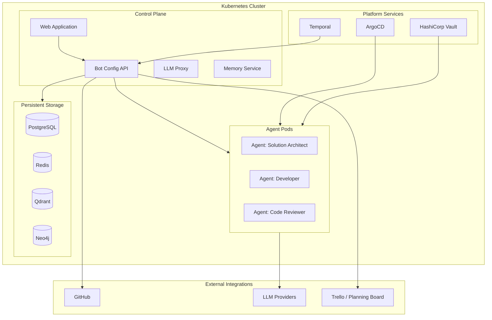

## Deployment Model

Agentopia runs on Kubernetes — deployable on any cloud provider or on-premises infrastructure.

## Infrastructure Requirements

| Component | Purpose | Requirement |
|---|---|---|
| **Kubernetes** | Container orchestration | Any K8s 1.28+ (EKS, GKE, AKS, k3s, on-prem) |
| **PostgreSQL** | Workflow state, agent bindings, audit | PostgreSQL 16+ |
| **Redis** | Caching, rate limiting | Redis 7+ |
| **Qdrant** | Semantic memory search | Qdrant 1.16+ |
| **Neo4j** | Entity relationship graph | Neo4j 5+ Community |
| **Temporal** | Workflow orchestration | Temporal 1.25+ |
| **HashiCorp Vault** | Secret management | Vault 1.18+ |
| **ArgoCD** | GitOps deployment | ArgoCD 2.x |

All dependencies are open-source and Kubernetes-native. No vendor lock-in.

## Integration Points

### GitHub
- Bot-managed repositories: branches, PRs, reviews, issues, milestones
- Webhook integration for event-driven workflow advancement
- GitHub Actions for automated review triggers
- Per-bot GitHub access tokens with scoped permissions

### LLM Providers
- **Anthropic Claude** (Opus, Sonnet) — primary reasoning and code generation
- **OpenAI** (GPT-4.1, GPT-5) — alternative provider
- **Fireworks AI** (Kimi K2.5) — cost-optimized alternatives
- **OpenRouter** — multi-model gateway for additional providers
- Per-agent model selection — each agent can use a different provider

### Planning Boards
- Trello integration for stakeholder visibility
- One-way projection: workflow status syncs to planning cards
- Board/list mapping configurable per team

## Security Architecture

| Layer | Mechanism |
|---|---|
| **Secret management** | HashiCorp Vault — all API keys, tokens, credentials |
| **Execution authorization** | Role-based + execution-class matrix per tool call |
| **Network isolation** | Sidecar dispatch via localhost-only port (not network-exposed) |
| **Audit logging** | Every governance tool call logged with actor, role, decision |
| **Session management** | Cookie-based BFF sessions with configurable expiry |

## Live Environments

Agentopia ships with separate environments for development and production validation:

| Environment | URL | Purpose |
|---|---|---|
| **Dev** | `dev.agentopia.vn` | Active development — latest builds, feature flags on |
| **UAT** | `uat.agentopia.vn` | Pre-production validation — production-like config, stable builds |

Each environment runs as an independent Kubernetes namespace with its own services, storage, and LLM routing. Environments are promoted independently via ArgoCD.

## Scaling Model

| Dimension | How it scales |
|---|---|
| **Agents** | Each agent is an independent pod — add agents by deploying new pods |
| **Concurrent workflows** | Temporal handles workflow scheduling and durability |
| **LLM throughput** | LLM proxy with provider failover and rate limit handling |
| **Memory** | Per-agent persistent volumes + shared vector/graph databases |
| **Repositories** | No limit — agents can work across any number of GitHub repositories |
