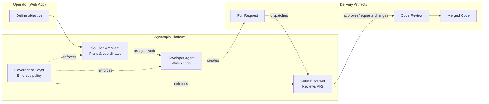

# Agentopia

**Enterprise AI workforce platform that transforms software delivery through autonomous, governed multi-agent collaboration.**

Agentopia deploys specialized AI agents — solution architects, developers, code reviewers, QA analysts — that work together as a coordinated team. Each agent operates within strict governance boundaries, producing auditable, traceable software artifacts.

<CardGroup cols={3}>
  <Card title="Autonomous Delivery" icon="rocket">
    From objective to merged PR — planned, developed, reviewed, and delivered by AI agents
  </Card>
  <Card title="Governed Execution" icon="shield-check">
    Role-based access control, execution authorization, and audit trails at every step
  </Card>
  <Card title="Human-in-the-Loop" icon="user-check">
    Operators retain full visibility and control through a web-based command center
  </Card>
</CardGroup>

---

## The Problem

Software teams spend significant effort on repetitive delivery tasks: creating branches, writing boilerplate, reviewing PRs for common issues, managing release workflows. AI assistants help with individual tasks, but lack the coordination, governance, and persistence needed for end-to-end delivery.

**Agentopia solves this by providing a complete AI workforce** — not just individual assistants, but a governed team of specialized agents that collaborate through structured protocols.

---

## How It Works

1. **Operator defines an objective** — "Build a contact page for our web app"
2. **Solution architect plans** — creates milestone, issues, and work breakdown
3. **Developer agent executes** — creates branch, writes code, opens PR
4. **Code reviewer evaluates** — reads code, identifies issues, posts structured review
5. **Workflow advances** — through deterministic phases until delivery is complete

Every step is governed, auditable, and visible to the operator in real time.
