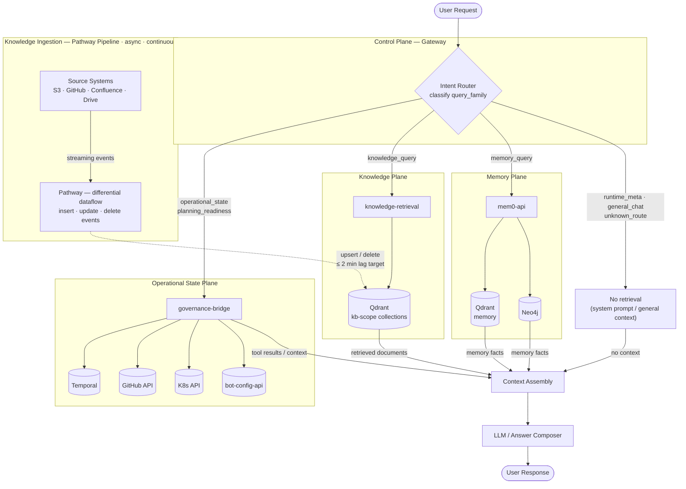

# Agentopia RAG Initiative

## Initiative Direction

> **This initiative has two independent workstreams:**
> 1. **Control-plane hardening** — formal intent routing so every query family reaches the correct source of truth
> 2. **Knowledge-plane streaming** — automated ingestion and freshness pipeline for the knowledge plane, with Qdrant as the serving layer
>
> These are additive. The control plane and knowledge data plane concerns must not collapse into each other.
>
> **Knowledge data plane recommendation status**: Pathway is the current preferred candidate for the knowledge ingestion layer. A mixed-architecture approach — combining multiple open-source components with Agentopia-owned routing and source-of-truth policy — remains under active discussion. The final component selection is not locked until the architecture review and P3 pilot results are complete.

---

## Why This Initiative

Two structural gaps exist in the current system:

**Gap 1 — Routing.** The current control plane classifies query intent using heuristic keyword matching. The coverage is incomplete: query families that do not match the keyword list fall through to the wrong handler. The result is that knowledge retrieval fires on queries whose answers should come from live operational state, and vice versa. This is a routing design problem, not a retrieval quality problem. The retrieval baseline (nDCG@5=0.925) is independently strong.

**Gap 2 — Freshness.** Knowledge staleness is bounded by operator action. A source document changed in S3, GitHub, or Confluence is not reflected in Qdrant until a human manually triggers an ingest. No automated polling or streaming exists. Effective lag: hours to days.

Pathway addresses Gap 2. A formalized intent router addresses Gap 1. Both must be implemented for the system to behave correctly across all query families.

---

## System Overview

Two independent flows run concurrently. **Solid arrows** = real-time query/response path. **Dotted arrows** = async background data pipeline.

**Reading the diagram:**

| Path | What it represents |
|---|---|
| User Request → Intent Router → plane → Context Assembly → LLM → User Response | Real-time query routing. Every query is classified into a family and directed to the primary source for that family. Source returns context or tool results — not a final answer. The LLM composes the final response. |
| `unknown_route` → No retrieval → Context Assembly → LLM | Queries that cannot be classified with sufficient confidence. No plane is queried. LLM responds from general context only. |
| Source Systems → Pathway → Qdrant (dotted) | Async knowledge ingestion. Runs continuously in the background. Independent of query routing. |

**Backing stores are context providers, not answer emitters.** Governance tools, Qdrant collections, and memory stores return tool results or retrieved documents to Context Assembly. The LLM / Answer Composer holds the final response authority. Raw tool output never reaches the user directly.

---

## Query Family Model

Every query a bot receives belongs to one of six families. The correct behavior — which plane to query as the primary source, which source of truth to trust, what to do if that source is unavailable — is defined per family. **The architecture must be correct for all families, not optimized for a specific example query.**

| Family | Description | Source of Truth | Allowed Planes | Disallowed Planes | Fallback |
|---|---|---|---|---|---|
| `operational_state` | Live system state: deployment status, bot liveness, active config | Temporal, K8s API, bot-config-api | Operational State Plane | Knowledge, Memory | Report tool unavailability; do not infer from documents |
| `planning_readiness` | Work status, milestone completeness, sprint planning, readiness judgments | GitHub issues/milestones, Temporal workflow history | Operational State Plane | Knowledge, Memory | Report tool unavailability; do not estimate readiness from documents |
| `knowledge_query` | Domain knowledge from documents: API docs, policies, product content | Source systems → Pathway → Qdrant | Knowledge Plane | Operational State, Memory | Respond without knowledge context; note explicitly that no matching document was found |
| `memory_query` | User-session history, past conversation facts, personal preferences | Session JSONL, mem0 extracted facts, Neo4j entity graph | Memory Plane | Knowledge, Operational State | Respond from general context; note no relevant memory found |
| `runtime_meta` | Bot capabilities, available tools, identity, SOUL description | SOUL.md (bot system prompt), gateway plugin config | Control Plane self-description | All retrieval planes | System prompt already contains this; no retrieval needed |
| `general_chat` | Conversational exchange requiring no specific retrieval | LLM general knowledge | None (direct LLM response) | N/A | N/A |
| `unknown_route` | Query cannot be classified with sufficient confidence into any named family | — | None — no retrieval triggered | All retrieval planes | LLM responds from general context only | N/A |

**Uncertain classification policy**: When the intent router cannot classify a query with sufficient confidence, it assigns `unknown_route`. No retrieval plane is queried. Defaulting unclassified queries to `knowledge_query` is explicitly prohibited — it recreates the current failure mode where non-knowledge queries enter KB retrieval.

**Freshness expectations by family:**
- `operational_state`, `planning_readiness`: real-time (live API call at query time)
- `knowledge_query`: ≤ 2 minutes after source change (Pathway SLO target)
- `memory_query`: as of last session write
- `runtime_meta`, `general_chat`: as of bot deployment

---

## Goals

**Control-plane goals:**
- Define query families formally and route each family to its correct source of truth
- Reduce misroute rate to ≤ 5% across all families
- Ensure `operational_state` and `planning_readiness` queries never trigger knowledge-plane retrieval
- Ensure `knowledge_query` never returns live operational state

**Knowledge-plane goals:**
- Reduce knowledge freshness gap: source change → Qdrant update ≤ 2 minutes
- Enable connector-driven ingestion (S3, GitHub, Google Drive, Confluence) without operator-triggered upload
- Maintain nDCG@5 ≥ 0.95 (current production: 0.925) through the migration

**Shared:**
- Preserve Qdrant as the retrieval serving layer — no serving architecture change
- Every component must be observable: freshness lag, route correctness, retrieval quality, latency

## Non-Goals

- Replacing Qdrant as the vector serving layer
- Building a custom retrieval engine from scratch
- Collapsing live operational state into the knowledge plane (Qdrant)
- LLM-driven multi-hop reasoning (not in scope for this initiative)
- Real-time sub-second ingestion (Pathway at 30s poll is the target)
- Solving every query routing edge case in Phase 1 — routing is incrementally improved against measured baselines

---

## Architecture Planes

| Plane | Purpose | Source of Truth | Handles Families |
|---|---|---|---|
| **Control Plane** | Classify query family, route to correct source, compose final context | Gateway plugin chain | All (routing only) |
| **Operational State Plane** | Live system state: workflow status, bot config, deployment state | Temporal, K8s API server, bot-config-api | `operational_state`, `planning_readiness` |
| **Knowledge Plane** | Versioned domain knowledge from source documents | Source systems → Pathway → Qdrant | `knowledge_query` |
| **Memory Plane** | User-session episodic facts and entity graph | Session JSONL → mem0-api → Qdrant + Neo4j | `memory_query` |

Each plane has a different source of truth and must not contaminate the others. See `architecture.md` for the full isolation invariant and per-family routing rules.

---

## Document Map

| Document | Covers |
|---|---|
| [architecture.md](architecture.md) | Query family model, 4-plane architecture, control-plane routing (current vs target), Pathway data pipeline, source-of-truth table, diagrams |
| [implementation-plan.md](implementation-plan.md) | 7-phase implementation program covering both control-plane and knowledge-plane workstreams |
| [migration-plan.md](migration-plan.md) | Knowledge-plane migration only: current batch ingest → Pathway streaming, cutover sequence, rollback paths |
| [evals-and-slos.md](evals-and-slos.md) | SLOs for all 5 dimensions: route correctness (per family), retrieval quality, freshness, contamination, latency |

---

## Relation to Existing Docs

| Existing Doc | Relation |
|---|---|
| `docs/architecture/super-rag-blueprint.md` | Gap analysis (2026-03-31). This initiative is the implementation response. |
| `docs/architecture/super-rag-debate.md` | Analysis establishing that retrieval failures are control-plane routing failures, not retrieval quality failures. Motivates the control-plane workstream. |
| `agentopia-super-rag/docs/architecture.md` | Current retrieval plane architecture. Pathway does NOT change this — it changes what feeds into Qdrant. |
| `agentopia-super-rag/docs/evaluation.md` | Eval framework, W-series outcomes, production baseline. |
| `agentopia-knowledge-ingest/` | The service whose connector layer is being replaced by Pathway. Normalizer and orchestrator will be deprecated after migration. |

---

## Background and Rationale

### Why the current system is insufficient

The current control plane uses heuristic keyword matching to decide which plugins handle a query. This approach has incomplete coverage: plural query forms, multi-language queries, and query forms not matching the keyword list are misrouted. When a query about live operational state is misrouted to knowledge retrieval, the bot searches Qdrant for an answer that does not exist there, returns low-confidence or no results, and may fabricate an answer from retrieved context that is not authoritative for that query family.

Separately, knowledge freshness is bounded by operator response time. No source watching or automated polling exists. Documents changed in source systems are not reflected in Qdrant until a human triggers an ingest.

Both gaps require implementation work. Neither is a quick fix.

### Candidate evaluation (knowledge-plane ingest)

Candidates are evaluated primarily on **architecture fit** and **business fit**. Deployment and operational cost are secondary tradeoffs, noted where relevant but not used as primary rejection criteria.

**Evaluation criteria (in priority order):**
1. **Architecture fit** — native insert/update/delete semantics; streaming freshness; compatible with Agentopia's existing Qdrant serving layer without requiring architecture collapse
2. **Business fit** — fits Agentopia's service boundary model (control plane separated from data plane); required source connector support; OSS licensing
3. **Extensibility** — incremental adoption path into existing service boundaries; observable and evaluable
4. **Deployment cost** — secondary tradeoff; noted but not determinative

| Candidate | Fit Assessment | Primary Reasoning |
|---|---|---|
| **Pathway** | **Current preferred direction** | Streaming-first differential dataflow with native insert/update/delete event semantics. Architecture fit: operates as a dedicated data-plane component that writes into Qdrant, preserving Agentopia's existing serving layer and service boundaries. Business fit: 350+ documented connectors; BSL-1.1 core / Apache connectors. Connector availability for GitHub, Google Drive, OneDrive requires verification against the current Pathway registry before P3 implementation. |
| Onyx | Architecture fit weak | Full-stack retrieval platform whose ingest and retrieval layers are tightly coupled. Using Onyx as an ingest-only component while retaining Qdrant as the serving layer is not a supported or documented configuration. Fits a different system shape than Agentopia — one where retrieval and serving are co-owned by the same platform. |
| LlamaIndex IngestionPipeline | Capability gap | Hash-based deduplication only. No delete propagation semantics. No continuous streaming — pipeline must be triggered externally. Does not satisfy the freshness or delete-propagation requirements without building a separate polling and scheduling wrapper around it. |
| Haystack DocumentWriter | Capability gap | Explicit delete API available, but no connector automation or scheduling. Would require wrapping with a polling orchestrator — rebuilding what Pathway provides natively. Better suited as a lower-level building block in a custom pipeline than as a standalone ingest solution. |
| RAGFlow | Architecture fit weak | Opinionated all-in-one retrieval platform designed for co-located ingest, retrieval, and serving. Agentopia requires explicit separation between the control plane, operational state plane, and knowledge plane — RAGFlow's architecture does not map clearly to this boundary model. Incremental adoption into Agentopia's existing service layout is not a documented path. Secondary: heavier deployment footprint than a purpose-built pipeline component. |

### Mixed-architecture position

The evaluation above compares candidates as standalone ingest solutions. The final architecture may adopt a **mixed approach** — combining multiple open-source components with Agentopia owning the control plane and source-of-truth policy:

- **Ingestion / freshness component** — handles source watching, change detection, insert/update/delete propagation (Pathway is the current preferred candidate; lighter alternatives are not ruled out)
- **Retrieval / index-serving component** — Qdrant (current, unchanged); HNSW index, scope filtering, collection isolation
- **Control plane** — Agentopia-owned gateway plugin chain; query family classification, routing policy, source-of-truth enforcement

A solution using Pathway for ingestion and Qdrant for serving is already a mixed architecture. The open question is whether further decomposition (e.g. a lighter ingestion library with a custom polling scheduler) better satisfies business requirements than Pathway's full pipeline model.

**Component selection is not final.** The preferred direction will be confirmed after the P0.1 connector availability audit (Pathway registry verification) and P3 pilot results.
