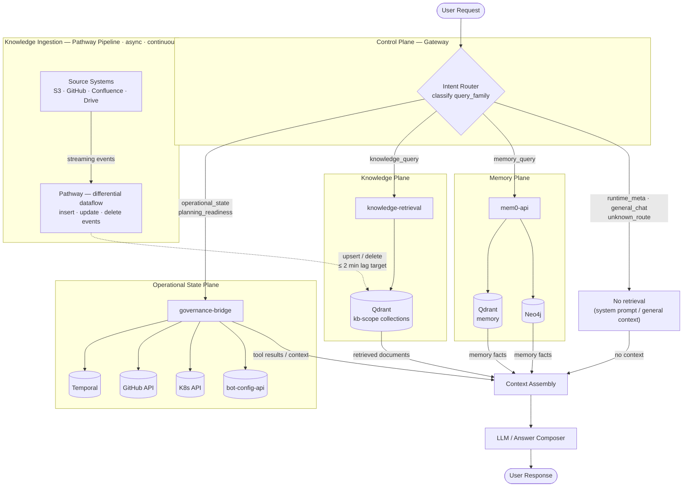
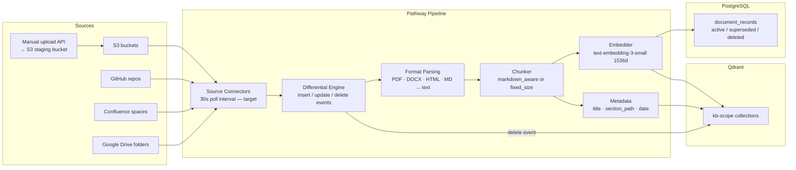
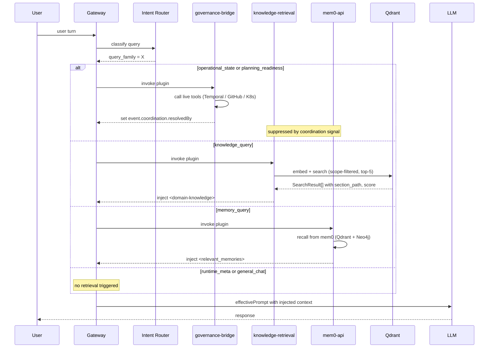

# Agentopia Agentic System — Target Architecture

## Overview

This document defines the target architecture for the Agentopia agentic system. The system operates across five planes, each with a distinct role and a single authoritative source of truth. Correct architecture requires three independently implemented concerns:

1. **Harness / control-plane formalization**: `bot-config-api` as the policy authority for route policy, tool bindings, scope authorization, and lifecycle metadata
2. **Query routing**: classifying each query into its family and directing it to the correct source of truth — implemented in the runtime execution plane (gateway), declared in the control plane
3. **Knowledge-plane data pipeline**: keeping document knowledge fresh via a streaming ingest pipeline (Pathway, or mixed architecture) into Qdrant

These concerns are additive and must not collapse into each other. The harness declares policy. The runtime executes it. The knowledge plane owns freshness and retrieval quality independently.

---

## 1. Query Family Model

Every user query belongs to one of six families. The target architecture defines, per family, what source of truth is authoritative, which planes are allowed to handle it, what happens when the primary source is unavailable, and what freshness expectation applies.

| Family | Description | Source of Truth | Allowed Planes | Disallowed Planes | Fallback | Freshness |
|---|---|---|---|---|---|---|
| `operational_state` | Live system state: bot liveness, deployment status, active configuration | Temporal, K8s API, bot-config-api | Operational State Plane | Knowledge, Memory | Acknowledge tool unavailability; do not infer from documents | Real-time (live API at query time) |
| `planning_readiness` | Work status, milestone completeness, readiness judgments, sprint state | GitHub issues/milestones, Temporal workflow history | Operational State Plane | Knowledge, Memory | Acknowledge tool unavailability; do not estimate from documents | Real-time (live API at query time) |
| `knowledge_query` | Domain knowledge from versioned documents: API docs, policies, product content, runbooks | Source systems → Pathway → Qdrant | Knowledge Plane | Operational State, Memory | Respond without knowledge context; state explicitly that no matching document was found | ≤ 2 minutes after source change (target; requires Pathway SLO to be established) |
| `memory_query` | User-session history, past conversation facts, expressed preferences | Session JSONL, mem0 extracted facts, Neo4j entity graph | Memory Plane | Knowledge, Operational State | Respond from general context; state that no relevant memory was found | As of last session write |
| `runtime_meta` | Bot capabilities, available tools, identity, SOUL description | SOUL.md (bot system prompt), gateway plugin config | Control Plane self-description | All retrieval planes | System prompt already contains this; no retrieval triggered | As of bot deployment |
| `general_chat` | Conversational exchange; no specific retrieval required | LLM general knowledge | None (direct LLM response) | N/A | N/A | N/A |
| `unknown_route` | Query cannot be classified with sufficient confidence into any of the above families | — | None — no retrieval triggered | All retrieval planes | LLM responds from general context only; no plane is queried; bot may acknowledge ambiguity | N/A |

**`unknown_route` policy**: When the intent router cannot classify a query with sufficient confidence, it must assign `unknown_route`. No retrieval is triggered — not knowledge-plane, not memory, not operational state. The LLM responds from its general context. Silently defaulting an unclassified query to `knowledge_query` is not acceptable: it recreates the current failure mode where operational and planning queries enter KB retrieval and return low-confidence or irrelevant results.

### Target Routing Rules (Phase 1+ — not current behavior)

The table below describes the target routing behavior after Phase 1 implementation. **This does not describe the current system.** Current behavior is heuristic keyword matching with known coverage gaps across all families. The delta between current and target is the implementation work in Phases 1–2.

| Family | Primary plugin | Retrieval triggered? | Coordination signal |
|---|---|---|---|
| `operational_state` | governance-bridge | No — live tool call | `event.coordination.resolvedBy = ["governance-bridge"]` |
| `planning_readiness` | governance-bridge | No — live tool call | `event.coordination.resolvedBy = ["governance-bridge"]` |
| `knowledge_query` | knowledge-retrieval | Yes — Qdrant search | None needed (default path) |
| `memory_query` | mem0-api | Yes — memory recall | None needed (default path) |
| `runtime_meta` | None — system prompt handles | No | Suppressed by `NON_KB_PATTERNS`, `NON_MEMORY_META_PATTERNS` |
| `general_chat` | None | No | All retrieval skipped |
| `unknown_route` | None | No — no retrieval triggered | All plugins suppressed |

---

## 2. Five-Plane Architecture

### Query Routing Flow



**Isolation invariant**: A query routed to a plane must not trigger retrieval from another plane. The Operational State Plane does not index documents into Qdrant. The Knowledge Plane does not serve live system state. The Memory Plane does not receive Pathway-managed documents.

**Execution model**: Each plane returns context or tool results to Context Assembly — not a final answer. The LLM / Answer Composer holds the final response authority. Raw backing-store output never reaches the user directly.

---

## 3. Plane Definitions

### 3.1 Control Plane (Harness Authority)

`bot-config-api` is the control plane authority. It is responsible for:
1. Bot identity and lifecycle (provisioning, ArgoCD CRD management, K8s Secret/ConfigMap management)
2. Route policy declaration: which plugin is the primary handler for each query family per bot (target — not yet formalized; see gap analysis in `harness-control-plane.md`)
3. Tool registry and bindings: which tools a bot may invoke, which roles may invoke which tools
4. Scope and tenant authorization: which knowledge scopes a bot may access (`bot_knowledge_bindings`, role registry `w0_actor_bindings`)
5. Ingest mode flags: `scope_ingest_mode` per scope (partial — Pathway migration flag)

**The control plane does not execute per-request logic.** It declares policy. The runtime execution plane executes within that policy.

For the full harness analysis — what bot-config-api currently owns vs what it should own, and the three ownership split options — see `harness-control-plane.md`.

### 3.1a Runtime Execution Plane (Gateway)

The gateway is the stateless runtime execution plane. It executes per-request within the policy the control plane declared. It is responsible for:
1. Receiving user messages (Telegram connector)
2. Assembling context before the LLM call (`before_agent_start` hooks: knowledge-retrieval, mem0-api, governance-bridge, wf-bridge)
3. Invoking tools (plugin chain execution, MCP bridge, A2A relay)
4. Calling the LLM (Anthropic API, Vault key per bot)
5. Enforcing coordination signals (`event.coordination.resolvedBy`) to suppress plugins that should not fire

The gateway has no authoritative state. Its plugin chain is currently configured via `configmap-config.yaml` (hardcoded). In the target state, the plugin chain is derived from the route policy declared by bot-config-api.

**Current state**: No query intent classifier exists in gateway. Plugin routing is heuristic (keyword patterns). This is Gap 1.
**Target state (Phase 1)**: Intent router classifies query family; route policy (declared by control plane) determines which plugin handles it.

#### 3.1b Query Routing — Current and Target State

**Current state (as implemented)**

The runtime execution plane (gateway) uses heuristic keyword matching. There is no formal query family classification and no route policy registry.

- **governance-bridge**: matches a fixed keyword list via regex. When matched, injects GitHub tool inventory and fires tool calls. Does not set a coordination signal that reliably suppresses other plugins.
- **knowledge-retrieval**: fires on all queries unless the query matches `NON_KB_PATTERNS` or `event.coordination.resolvedBy` is set. Pattern list has incomplete coverage.
- **mem0-api**: fires on all queries unless the query matches `NON_MEMORY_META_PATTERNS`. Pattern list has incomplete coverage.
- **Coverage gaps**: query forms outside the keyword list (plural forms, paraphrases, non-English variations, readiness-class questions not matching current patterns) are misrouted.

**Target state (Phase 1)**

The target routing model adds a formal intent router to the gateway execution plane, backed by a route policy declared in the control plane.

- An **intent router** runs before the plugin chain and assigns the query a `query_family` tag.
- The **route policy** (declared by bot-config-api, embedded in bot Helm values at deploy time) maps each query family to its primary plugin handler.
- governance-bridge is extended to fully handle `operational_state` and `planning_readiness` families.
- knowledge-retrieval skips for all families except `knowledge_query`.
- mem0-api skips for `operational_state`, `planning_readiness`, and `runtime_meta` families.
- `event.coordination.resolvedBy` is set consistently when governance-bridge resolves a query, suppressing downstream plugins.

**The intent router design (Phase 1 scope)**: The initial implementation uses enhanced heuristic patterns (extended keyword lists, precedence rules, confidence thresholds). An LLM-based classifier is a conditional Phase 1.5 option if heuristic coverage proves insufficient after the P1.4 gate measurement.

#### Control-plane routing decision (target — Phase 1+)

```
user query
    │
    ▼
Intent Router (assigns query_family + confidence score)
    │
    ├── sufficient confidence?
    │       │
    │       ├── YES:
    │       │     ├── operational_state ──► governance-bridge (live tool call)
    │       │     │                         sets event.coordination.resolvedBy
    │       │     ├── planning_readiness ─► governance-bridge (live tool call)
    │       │     │                         sets event.coordination.resolvedBy
    │       │     ├── knowledge_query ────► knowledge-retrieval (Qdrant search)
    │       │     ├── memory_query ───────► mem0-api (memory recall)
    │       │     ├── runtime_meta ───────► no retrieval (system prompt)
    │       │     └── general_chat ───────► no retrieval (direct LLM)
    │       │
    │       └── NO → unknown_route ───────► no retrieval; LLM from general context
    │                                        (do NOT default to knowledge_query)
```

#### Heuristic routing — transitional mechanism, not end-state

The Phase 1 initial implementation uses enhanced heuristic patterns (extended keyword lists, precedence rules, confidence thresholds via pattern match count or exclusion logic). This is the fastest path to improvement over the current state and is appropriate for Phase 1.

**Heuristic routing is explicitly a transitional mechanism.** It is not the intended long-term routing architecture.

If the Phase 1.4 eval gate (≤ 5% misroute, no family > 10%) is not achieved after two rounds of pattern iteration, the architecture must advance to a **confidence-scored classifier** before the Phase 1 exit gate can be declared passed. A classifier assigns a numeric confidence per family; queries below a threshold are assigned `unknown_route` rather than being force-assigned to a default family.

The upgrade decision is evidence-gated:
- P1.4 gate passes within two iterations → heuristic routing is sufficient; proceed to Phase 2
- P1.4 gate fails after two iterations → classifier design required; Phase 2 blocked until classifier achieves the gate

### 3.2 Operational State Plane

Answers questions about live system state: what is currently deployed, running, configured, or in-progress. This plane queries live APIs at request time — it does not cache answers in Qdrant.

**Sources (current)**:
- Temporal: workflow history, delivery status, activity results
- K8s API: bot CRD state, pod status, config
- GitHub API: issue status, milestone completion, PR state
- bot-config-api: bot configuration, scope bindings

**Coverage (current state)**: governance-bridge partially covers this plane via its keyword-triggered tool calls. Coverage is incomplete — not all `operational_state` and `planning_readiness` queries trigger the correct tool chain.

**Coverage (target state)**: governance-bridge extended to cover all queries classified as `operational_state` or `planning_readiness` by the intent router.

**Grounding rule**: bots must not fabricate answers about live state. If the governance-bridge tools are unavailable or return no result, the bot must acknowledge the limitation — not infer state from the Knowledge Plane.

### 3.3 Knowledge Plane — Target Architecture

Serves authoritative, versioned domain knowledge: client product documentation, API references, policies, runbooks, and curated guides.

**Service owner (target)**: `agentopia-rag-platform` — a new repo that consolidates the current split between `agentopia-knowledge-ingest` (ingest, upload API, connectors) and `agentopia-super-rag` (retrieval serving, Qdrant management, eval framework) into a single knowledge-plane owner. The consolidation is covered in `migration-plan.md`. The component descriptions below describe the target architecture that `agentopia-rag-platform` will own.

**Pathway** is the current preferred candidate for the knowledge data plane. A mixed-architecture remains under discussion — see the candidate evaluation in README.md. Pathway's responsibilities in the current preferred design:
- Continuous connector polling from source systems (S3, GitHub, Google Drive, Confluence — connector availability requires verification per source)
- Change detection via differential dataflow: inserts, updates, and deletes are native stream events
- Document processing: normalization, chunking, embedding
- Incremental upserts to Qdrant: only changed chunks are re-embedded
- Delete propagation: deleted source documents trigger chunk removal from Qdrant

**Qdrant** is the serving layer. Its role:
- HNSW vector index for cosine similarity search
- Scope-filtered search: `scope IN [resolved_scopes] AND status = "active"`
- Collection-per-scope isolation: collection name `kb-{sha256_hex[:16]}` of `{client_id}/{scope_name}`

**Ingest component and serving layer are complementary**: Whatever ingestion component is selected, Qdrant's HNSW index, payload filtering, and collection isolation are required for Agentopia's multi-tenant production serving and are not in scope for replacement. These are independent layers that must not be collapsed.

**Public reference**: Pathway, "Using Pathway as a Data Pipeline," https://pathway.com/developers/user-guide/introduction/streaming-and-static-modes

### 3.4 Memory Plane

Serves user-session episodic memory and extracted semantic facts. Scoped per bot + user.

**Sources**:
- Session JSONL: raw turn history (PVC, append-only)
- mem0-api: LLM-extracted facts stored in Qdrant `agentopia_memory` collection
- Neo4j: entity graph (people, products, configurations referenced across sessions)

The Memory Plane does not receive Pathway-managed documents. It is populated by session events only. Memory queries go to mem0-api, not to the knowledge-plane Qdrant collections.

---

## 4. Source-of-Truth Model

| Layer | Source of Truth | Storage | Mutable? | Pathway-managed? |
|---|---|---|---|---|
| Source document | Original file in source system | S3 / GitHub / Confluence | At source | Yes — Pathway connector monitors |
| Pathway processing state | Pathway internal state | Pathway PVC | Internal | Pathway-managed |
| Chunk vectors | Embeddings per document version | Qdrant `kb-{scope_hash}` collections | Immutable per version; replaced on update | Yes — Pathway upserts |
| Document lifecycle state | active / superseded / deleted | super-rag PostgreSQL `document_records` | Mutable | Pathway triggers state update |
| Freshness metadata | last-modification, last-indexing times | Pathway `statistics_query()` API | Pathway-managed | Yes |
| Scope-to-bot binding | Bot authorization scope list | K8s CRD annotations | Via K8s only | No |
| Manual operator uploads | Operator-initiated documents | S3 upload staging bucket | Immutable per version | Yes — S3 Pathway connector picks up |
| Session history | Episodic conversation turns | Session JSONL (PVC) | Append-only | No |
| Extracted user facts | Semantic memory | Qdrant `agentopia_memory` | LLM-managed | No |
| Entity graph | Relationship memory | Neo4j | LLM-managed | No |
| Bot SOUL / system prompt | Runtime identity and behavior | K8s ConfigMap (`agentopia-soul-{bot}`) | Updated via bot-config-api | No |
| Live operational state | Temporal, K8s, GitHub | Live APIs | Real-time | No |

**Key invariant**: The Operational State Plane (Temporal, K8s, GitHub) is never indexed into Qdrant. Manual uploads go through S3 → Pathway → Qdrant. There is no separate direct-to-Qdrant ingest path during normal operation.

---

## 5. Pathway Pipeline — Detail

### 5.1 Pipeline Architecture



Connector availability per source: S3 is confirmed in Pathway connector docs. GitHub, Google Drive, and OneDrive/SharePoint connectors are listed in the Pathway connector registry but specific API shape and production stability should be verified before implementation. Confluence connector is not first-party — see implementation-plan.md Phase 4.

### 5.2 Differential Dataflow Semantics

| Event | Source trigger | Pathway action | Qdrant result |
|---|---|---|---|
| Insert | New file appears in source | Chunk → embed → upsert | New vectors, `status=active` |
| Update | File modified (mtime or hash change) | Re-chunk and re-embed changed portion | Upsert new version; prior version marked `status=superseded` |
| Delete | File removed from source | Delete event emitted | Vectors for `document_id` removed |

Pathway computes only the diff. A change to a subset of a document triggers re-embedding of affected chunks only, not the full document.

**Public reference**: Pathway, "Key Concepts: Differential Dataflow," https://pathway.com/developers/user-guide/introduction/key-concepts#differential-dataflow

### 5.3 Freshness Metadata

Pathway exposes per-document freshness state via `DocumentStore.statistics_query()`:

```python
stats = document_store.statistics_query()
# stats[doc_id] = {
#   "last_modification_time": <unix_ts>,
#   "last_indexing_time": <unix_ts>,
#   "num_chunks": <int>
# }
indexing_lag = stats[doc_id]["last_indexing_time"] - stats[doc_id]["last_modification_time"]
```

This is the primary signal for the freshness SLO. **Target freshness lag ≤ 2 minutes is a design target, not a measured or guaranteed value.** It assumes 30s poll + processing time for typical document sizes. Large documents or high-volume change events may exceed this. Baseline measurement at P0.2 will establish the actual achieved lag.

**Public reference**: Pathway `statistics_query()`, https://pathway.com/developers/api-docs/pathway-xpacks-llm/document_store

### 5.4 State Persistence

Pathway persists its internal processing state to a PVC. On restart, it resumes from the last committed checkpoint — preventing re-embedding of already-indexed documents.

**Public reference**: Pathway, "Fault Tolerance," https://pathway.com/developers/user-guide/introduction/fault-tolerance

---

## 6. RAG Query Flow (Target)



**Note**: The Intent Router is the target state for Phase 1. In the current implementation, query family classification is approximated by governance-bridge keyword matching and the `NON_KB_PATTERNS` / `NON_MEMORY_META_PATTERNS` exclusion lists.

---

## 7. Manual Upload Path

Operator-uploaded documents enter via the upload API and route through S3 into the Pathway pipeline. There is no separate direct-to-Qdrant path for manual uploads in the target state.

```
Operator → Upload API (knowledge-ingest) → S3 staging bucket → Pathway S3 connector → Pathway pipeline → Qdrant
```

The upload API returns 202 (accepted; ingest is async). The operator queries indexing status via `GET /api/v1/upload/{document_id}/status`, backed by `statistics_query()`.

---

## 8. Retrieval Quality Baseline

Current production baseline (`agentopia-super-rag`, dense-only, `text-embedding-3-small`, top-5):

| Metric | Value | Source |
|---|---|---|
| nDCG@5 | 0.925 | `agentopia-super-rag/docs/evaluation.md` |
| MRR | 0.96 | same |
| P@5 | 0.84 | same |
| R@5 | 1.0 | same |

Pathway migration does not change the retrieval serving path. These metrics must be preserved through migration. Post-migration, the target is nDCG@5 ≥ 0.95 — this is an aspirational target, not a proven achievable value. It will be pursued incrementally via chunking and embedding improvements after the Pathway migration is stable.

W-series outcomes from `agentopia-super-rag/docs/evaluation.md` remain in effect:
- W1 (markdown-aware chunking): accepted, opt-in
- W2 (hybrid BM25+dense): frozen — requires new evidence of ≥ 3% nDCG@5 improvement to reopen
- W3a, W3b, W4: not approved

---

## 9. Service Ownership — Current and Target

| Service | Current Role | Target State |
|---|---|---|
| `agentopia-knowledge-ingest` | Upload API, S3 artifacts, orchestrator, connectors | **Deprecated** — ingest and connector layer migrated to `agentopia-rag-platform`; normalizer and orchestrator removed after Phase 7 |
| `agentopia-super-rag` | Retrieval serving (Qdrant), chunking, embedding, eval framework, document lifecycle | **Migrated** → serving and eval code moves to `agentopia-rag-platform` after Phase 4 |
| `agentopia-rag-platform` | _(does not exist yet — bootstrapped in Phase RB)_ | **New owner** — knowledge plane consolidation target. Owns: Pathway ingest pipeline, upload API, retrieval serving, Qdrant lifecycle, eval framework |
| `agentopia-protocol` (bot-config-api) | Scope binding, bot CRUD | **Minor** — `scope_ingest_mode` flag added per scope for migration |
| `agentopia-protocol` (gateway) | Runtime execution plane, plugin chain | **Yes** — intent router added; governance-bridge extended; `NON_KB_PATTERNS` extended |
| `agentopia-infra` | Helm charts, ArgoCD apps | **Yes** — `agentopia-rag-platform` Helm chart added; Pathway deployment, state PVC, connector secrets |

`agentopia-rag-platform` is the anchor for all knowledge-plane work from Phase 3 onwards. See `migration-plan.md` for the two-dimensional migration sequencing: (1) batch ingest → Pathway streaming, (2) `agentopia-knowledge-ingest` + `agentopia-super-rag` → `agentopia-rag-platform` consolidation.

---

## 10. Pathway Deployment Model

Pathway runs as a single-replica Kubernetes Deployment (stateful — single publisher per scope) in the `agentopia` namespace.

```
name: agentopia-pathway-pipeline
replicas: 1
volumes:
  - name: pathway-state (PVC — state persistence across restarts)
env:
  PATHWAY_POLL_INTERVAL_SECS: 30 (target)
  EMBEDDING_BASE_URL: <OpenRouter>
  QDRANT_URL: <qdrant service>
  POSTGRES_URL: <super-rag PostgreSQL>
  KNOWLEDGE_SOURCE_BUCKET: <S3>
```

State PVC is the only stateful dependency Pathway owns. Qdrant and PostgreSQL are shared services that Pathway writes to but does not own.
